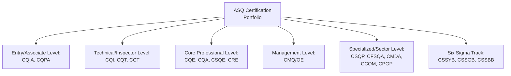

## Overview of Quality Certifications Including CQE CQA and CMQ OE

### Overview

Professional certification in quality management provides third-party validation of an individual's knowledge and competence against a defined Body of Knowledge (BOK), distinct from organizational management system certification (e.g., ISO 9001 certification of a company). The American Society for Quality (ASQ) is the predominant certifying body referenced in this space, offering a portfolio of role-specific credentials. This connects to the broader competence requirements under Clause 7.2 (Competence) — professional certification is one mechanism (though not the only one) organizations use to demonstrate and develop quality-related competence.

### ASQ Certification Portfolio Overview

**Key Points**

- Experience-tier requirements scale across the portfolio: CQIA and CQPA require two years of work experience or an associate's degree or two years of equivalent higher education, while CQI requires two years of work experience (three additional years if the candidate lacks a high school diploma or GED) [asq](https://asq.org/cert/resource/pdf/certification/2026-CBT-Exam-Application.pdf)
- CQT requires four years of higher education and/or work experience, with one year waived if certified through a quality technology program at a community college or vocational school [asq](https://asq.org/cert/resource/pdf/certification/2026-CBT-Exam-Application.pdf)
- CCQM, CRE, CQA, CQE, CSQE, and CSQP each require eight years of higher education and/or work experience, including three years in a decision-making position [asq](https://asq.org/cert/resource/pdf/certification/2026-CBT-Exam-Application.pdf)
- CMQ/OE requires ten years of higher education and/or work experience, including five years in a decision-making position — the most senior experience bar in the core portfolio [asq](https://asq.org/cert/resource/pdf/certification/2026-CBT-Exam-Application.pdf)
- "Decision making" is defined as having the authority to define, execute, or control projects/processes and being responsible for the outcome [asq](https://asq.org/cert/resource/pdf/certification/2026-CBT-Exam-Application.pdf)
- All required work experience must relate to one or more areas of the body of knowledge for that specific certification [asq](https://asq.org/cert/resource/pdf/certification/2026-CBT-Exam-Application.pdf)

### Certified Quality Engineer (CQE) — Detail

**Key Points**

- Positioned as a core professional-level credential, sharing the eight-years-of-experience-plus-three-in-decision-making eligibility tier with CQA, CSQE, CRE, CSQP, and CCQM
- Body of Knowledge domains typically span quality management/leadership, quality systems, product/process design, product/process control, continuous improvement, quantitative methods (statistics, SPC, DOE), and risk management — directly overlapping with the technical content covered throughout this curriculum's "Quality Tools and Statistical Methods" and "Operational Planning and Control" chapters
- The CQE is broadly positioned for professionals responsible for product/process quality assurance, quality control systems, and application of quantitative methods within manufacturing or technical operations contexts

### Certified Quality Auditor (CQA) — Detail

**Key Points**

- The CQA certification recognizes individuals who demonstrate knowledge and understanding of quality auditing principles, practices, and techniques, and is an internationally recognized credential demonstrating an individual's ability to audit a company's quality management system [resumecat](https://resumecat.com/blog/science-and-research-certifications)
- The exam consists of 150 multiple-choice questions with a three-hour time limit, covering auditing principles, techniques, tools, processes, regulations, and standards [resumecat](https://resumecat.com/blog/science-and-research-certifications)
- ASQ released an updated CQA Body of Knowledge based on a detailed job analysis study in which active CQAs validated which knowledge components remain relevant, applying starting April 2026 [qualitygurus](https://www.qualitygurus.com/category/asq)
- Content directly aligns with this curriculum's "Internal and External Auditing" chapter — audit principles, ISO 19011 alignment, audit program planning, evidence gathering, and findings documentation

### Certified Manager of Quality/Organizational Excellence (CMQ/OE) — Detail

**Key Points**

- The certification program is accredited by the ANSI National Accreditation Board (ANAB) under the ISO 17024 standard, providing impartial third-party validation that the program has met recognized national and international credentialing industry standards [asq](https://asq.org/cert/manager-of-quality)
- The exam fee is $585 for initial examination, with retakes at $385, and ASQ members save $100 on the initial examination fee — [Unverified] fee figures found across secondary sources varied somewhat (older or third-party pages cited different amounts), so candidates should verify current fees directly on ASQ's official certification page before budgeting [asq](https://asq.org/cert/manager-of-quality)
- The computer-delivered exam is a one-part, 180-multiple-choice-question exam offered in English only, with 165 questions scored and 15 unscored, and a total appointment time of four-and-a-half hours (exam time of 4 hours and 18 minutes) [asq](https://asq.org/cert/manager-of-quality)
- A paper-and-pencil version is also available: a one-part, 165-multiple-choice-question, four-hour exam offered in English and Mandarin in certain locations [asq](https://asq.org/cert/manager-of-quality)
- All examinations are open book, and each participant must bring their own reference materials [asq](https://asq.org/cert/manager-of-quality)
- A new Body of Knowledge is effective July 1, 2026, alongside the previously used 2019 edition, and ASQ has indicated that while the core structure of the updated BOK remains stable, several targeted changes have been introduced to reflect current managerial practice [asq](https://asq.org/cert/manager-of-quality)[qualitygurus](https://www.qualitygurus.com/category/asq)
- Body of Knowledge domains typically include leadership, organizational strategic planning, team processes, quality management tools, customer-focused organizations, supply chain management, and training/development — reflecting the management-level scope distinguishing CMQ/OE from the more technically-focused CQE/CQA

### Comparative Overview: CQE vs. CQA vs. CMQ/OE

| Attribute | CQE | CQA | CMQ/OE |
| --- | --- | --- | --- |
| Primary Focus | Product/process quality engineering, quantitative methods | Quality system auditing | Organizational quality leadership/management |
| Experience Tier | 8 years (3 in decision-making) | 8 years (3 in decision-making) | 10 years (5 in decision-making) |
| Typical Candidate Role | Quality engineer, process engineer | Internal/external auditor, audit program manager | Quality manager, director, organizational excellence leader |
| Curriculum Overlap (This Syllabus) | Quality Tools and Statistical Methods, Operational Planning and Control | Internal and External Auditing | Change Management, Leadership/Governance content, QMS Implementation Roadmap |

### The Broader ASQ Portfolio in Context

| Certification | Focus Area | Relative Seniority |
| --- | --- | --- |
| CQIA (Quality Improvement Associate) | Foundational quality improvement participation | Entry level |
| CQPA (Quality Process Analyst) | Process analysis support | Entry level |
| CQI (Quality Inspector) | Inspection techniques | Entry/technical level |
| CQT (Quality Technician) | Technical quality support | Technical level |
| CCT (Calibration Technician) | Calibration systems | Technical level |
| CQE (Quality Engineer) | Product/process quality engineering | Core professional |
| CQA (Quality Auditor) | Quality system auditing | Core professional |
| CRE (Reliability Engineer) | Reliability engineering | Core professional |
| CSQE (Software Quality Engineer) | Software quality assurance | Core professional |
| CSQP (Supplier Quality Professional) | Supplier quality management | Core professional |
| CMDA (Medical Device Auditor) | Medical device sector auditing | Specialized/sector |
| CFSQA (Food Safety and Quality Auditor) | Food safety sector auditing | Specialized/sector |
| CCQM (Construction Quality Manager) | Construction sector quality management | Specialized/sector |
| CPGP (Pharmaceutical GMP Professional) | Pharmaceutical GMP compliance | Specialized/sector |
| CMQ/OE (Manager of Quality/Organizational Excellence) | Organizational quality leadership | Management level |
| CSSYB/CSSGB/CSSBB (Six Sigma Yellow/Green/Black Belt) | Six Sigma methodology application, escalating scope | Track-based, escalating |

**Key Points**

- CSSBB requires two completed projects with signed affidavits (or one project with a signed affidavit plus three years of work experience), with no education waivers given [asq](https://asq.org/cert/resource/pdf/certification/2026-CBT-Exam-Application.pdf)
- CSSGB requires three years of work experience with no education waivers given, while CSSYB has no experience or education requirements — reflecting the Six Sigma belt track's distinct, project-evidence-based eligibility model compared to the broader portfolio's years-of-experience model [asq](https://asq.org/cert/resource/pdf/certification/2026-CBT-Exam-Application.pdf)
- Candidates already certified by ASQ in certain areas (CQA, CQE, Manager, CRE, CSQE, CSQP) may provide their certificate number in lieu of work experience when applying for another certification, though the manager (CMQ/OE) exam requires additional work experience beyond this substitution [asq](https://asq.org/cert/resource/pdf/certification/2026-CBT-Exam-Application.pdf)

### Certification Value Considerations

**Key Points**

- Professional certification demonstrates individual competence against a standardized body of knowledge, distinct from and complementary to an organization's ISO 9001 (or other management standard) certification — an organization can be ISO 9001 certified without any individual staff holding personal quality certifications, and vice versa
- [Inference] Certification is commonly used by organizations and hiring processes as a competence-verification signal (relevant to Clause 7.2), though ISO 9001 itself does not mandate that competence be demonstrated specifically through third-party professional certification — internal training and demonstrated experience are equally valid competence-demonstration mechanisms under the standard
- Open-book exam formats (as used for CMQ/OE and reportedly other ASQ certifications) place relative emphasis on application and comprehension of the Body of Knowledge over rote memorization, though effective navigation of reference materials under time constraints remains a meaningful preparation consideration

### Practical Example: Certification Pathway Relevant to a Curriculum/QMS Development Career

For a professional working across curriculum development and QMS/technical documentation contexts (as opposed to a manufacturing floor role), a plausible certification progression might prioritize:

| Stage | Certification | Rationale |
| --- | --- | --- |
| Early career | CQIA or CQPA | Foundational credential accessible with limited formal quality-role experience |
| Mid-career, audit-focused | CQA | Directly applicable to internal audit program design/execution work |
| Mid-career, technical/systems-focused | CQE | Broad applicability across quality engineering, statistical methods, and systems documentation work |
| Senior/leadership-focused | CMQ/OE | Appropriate once sufficient decision-making experience accumulates, aligned with organizational QMS leadership responsibilities |

[Inference] This progression is a generic illustration of common certification sequencing logic based on the experience-tier structure described above; actual appropriate certification choice depends on an individual's specific career trajectory, current role scope, and accumulated qualifying experience, which should be verified against ASQ's current eligibility criteria directly.

### Common Pitfalls

- **Key Points**
  - Assuming certification experience requirements are satisfied by any professional experience, when ASQ requires the experience to specifically relate to the body of knowledge of that certification
  - Underestimating the decision-making-position requirement distinct from general years of experience — general quality-adjacent work experience does not automatically satisfy the decision-making component required for CQE, CQA, CMQ/OE, and other core-tier certifications
  - Preparing for an exam using an outdated Body of Knowledge edition after ASQ has released an updated version with an effective date (e.g., the CMQ/OE 2026 BOK effective July 1, 2026, or the CQA 2026 BOK effective April 2026)
  - Treating open-book exam format as reducing preparation needs, when time constraints and the volume of material still require genuine familiarity and efficient reference navigation
  - Conflating individual professional certification with organizational management system certification (ISO 9001), which are distinct and non-substitutable forms of quality-related validation

**Next Steps**

- Internal Audit Program Planning (Clause 9.2) — CQA-Aligned Content
- Quality Tools and Statistical Methods — CQE-Aligned Content
- Six Sigma DMAIC Framework and Belt-Level Certifications
- Competence, Training, and Awareness Requirements (Clause 7.2)
- Building a QMS Champion Network (CMQ/OE-Relevant Leadership Skills)
- Sector-Specific Certifications: CMDA, CFSQA, CCQM Overview
- Reliability Engineering and the CRE Certification
- Career Pathways in Quality Management Beyond Certification