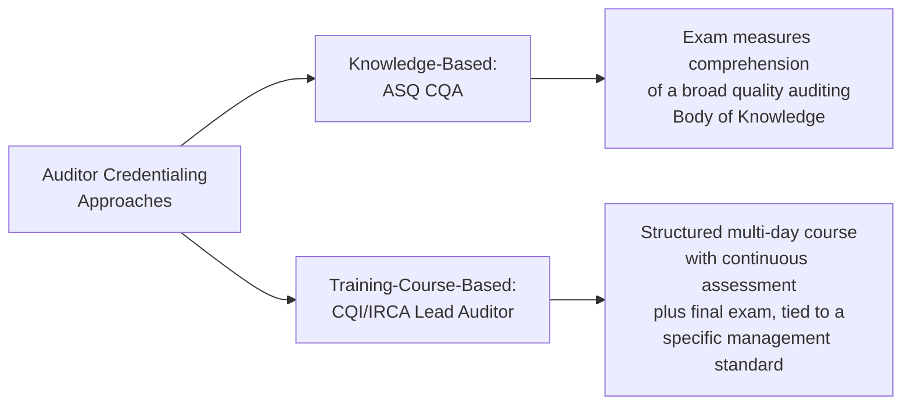
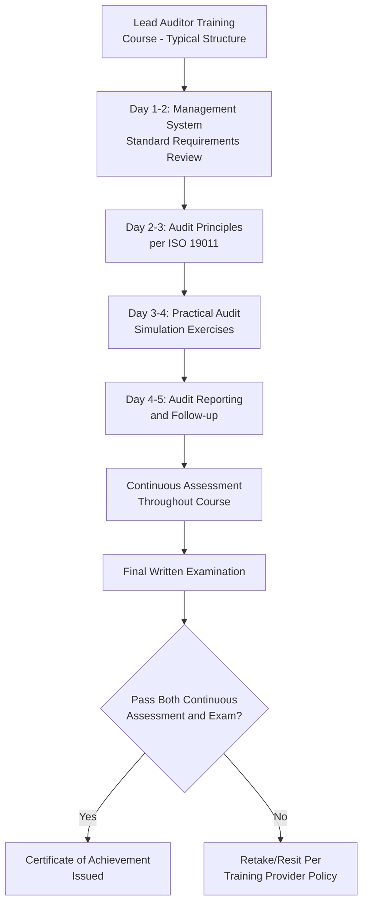
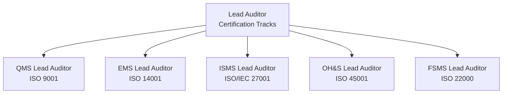
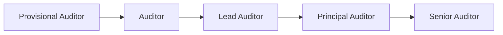

## Lead Auditor Certification Pathways

### Overview

Lead Auditor certification pathways provide the formal, internationally recognized route for individuals to qualify as competent auditors and audit team leaders for management system standards such as ISO 9001. Unlike ASQ's CQA (which is a knowledge-based professional certification), Lead Auditor certification is typically training-course-based and tied to a specific management system standard, governed primarily by the CQI/IRCA (Chartered Quality Institute / International Register of Certificated Auditors) scheme in many markets, alongside equivalent schemes offered by other certification bodies. This connects directly to ISO 19011 (Guidelines for Auditing Management Systems) and ISO/IEC 17021-1 (Requirements for Bodies Providing Audit and Certification), both referenced extensively in this curriculum's "Internal and External Auditing" and "ISO Certification and Conformity Assessment" chapters.

### CQI/IRCA vs. ASQ CQA: Two Distinct Auditor Credentialing Models

**Key Points**

- ASQ's CQA validates broad auditing knowledge applicable across contexts; CQI/IRCA Lead Auditor certification is typically earned per management system standard (e.g., a separate course/certification for ISO 9001 QMS, ISO 14001 EMS, ISO/IEC 27001 ISMS), reflecting a more standard-specific practical training model
- Many practicing lead auditors in the certification body (CB) industry hold a CQI/IRCA-recognized Lead Auditor qualification specifically because certification bodies typically require this credential (or an equivalent) as a condition of employment or contracting as a third-party auditor, distinct from ASQ certification which is more broadly used across internal, second-party, and professional-recognition contexts

### The CQI/IRCA Lead Auditor Training Course Structure

**Key Points**

- The typical course format is a five-day intensive program (classroom or online tutored delivery) providing the knowledge and skills required to perform first-, second-, and third-party audits of management systems, in accordance with ISO 19011 guidance for first- and second-party audits and ISO/IEC 17021 requirements for third-party audits
- Course objectives commonly include understanding the high-level structure (HLS) and purpose of the target management system standard from an auditing perspective, planning and conducting audits, audit communication, and value-added audit reporting and follow-up
- Participant evaluation is typically through continuous assessment during the course combined with a closed-book (or otherwise proctored) written examination at the end; passing both components is required for a Certificate of Achievement
- Course registration under a recognized governing body (such as CQI and IRCA) is what satisfies formal training requirements for individuals seeking registration under that scheme or other equivalent auditor certification schemes

### Delivery Modes and Practical Considerations

| Delivery Mode | Description | Consideration |
| --- | --- | --- |
| Classroom (in-person) | Full-week, on-site instruction with in-person practical exercises | Traditional format; strong for interactive audit simulation exercises |
| Online tutored | Live virtual instruction adapted for online learning environments, with adjusted daily hours and scheduled breaks | Requires reliable connectivity; online exams often require specific technical conditions (e.g., LAN connection and webcam) |
| Weekend/modular batches | Course split across multiple weekend sessions rather than one continuous week | Accommodates working professionals unable to take a full week off |

**Key Points**

- Total learning hours and learning objectives are generally held constant across delivery modes by training providers, even where the calendar structure (single week vs. split weekends) differs
- Online exam administration often carries specific technical requirements (webcam, stable connection) to maintain exam integrity comparable to in-person proctoring

### Standard-Specific Lead Auditor Tracks

**Key Points**

- Each track requires its own dedicated training course and certification, since the course content is built around the specific management system standard's requirements from an auditing perspective, even though the underlying audit methodology (ISO 19011 principles) is shared across tracks
- An individual pursuing multi-standard audit capability (e.g., an integrated management system auditor) typically completes separate Lead Auditor courses for each applicable standard rather than a single combined credential, reflecting the standard-specific nature of this credentialing model

### Auditor Certification Registration Tiers (Typical CQI/IRCA-Style Progression)

**Key Points**

- [Inference] Registration tiers and their exact naming/progression criteria vary by the specific certifying scheme and have evolved over time; the general pattern of progressing from a provisional/associate status through auditor, lead auditor, and more senior designations based on accumulated audit experience (verified through logged audit days/hours) is a common structural feature of professional auditor registration schemes, though candidates should verify the current specific tier structure and criteria directly with the relevant certifying body (e.g., CQI/IRCA) rather than assume a universal fixed progression
- Advancement through these tiers typically requires not only passing the initial training course but also accumulating a minimum number of logged, verified audit days across actual audits, often under supervision initially

### Standard Revision Awareness for Lead Auditor Training

**Key Points**

- Training providers structure their course content around the current edition of the target standard, and course content must be updated when a standard undergoes formal revision (connecting to this curriculum's "Transitioning Certification to a Revised Standard" content)
- [Unverified] Search results referencing course materials for an "ISO 9001:2026" edition were found among training provider marketing pages; this appears to reflect preparatory/anticipatory course materials from training providers rather than a confirmed, formally published ISO 9001 revision as of the most recent reliable general knowledge available — candidates should verify the actual current edition of ISO 9001 directly with ISO's official publication records or a certification body before enrolling in or relying on any course claiming to cover a specific standard edition, since training provider marketing pages can reference draft, anticipated, or regionally-varying naming before a revision is formally confirmed and globally adopted
- Existing certified lead auditors are typically required to complete a transition training update when the underlying standard is formally revised, in order to maintain their certification's currency against the current edition — mirroring the organizational-level transition audit process covered elsewhere in this curriculum

### Comparative Overview: Lead Auditor Certification vs. ASQ CQA

| Attribute | CQI/IRCA-Style Lead Auditor | ASQ CQA |
| --- | --- | --- |
| Credentialing Basis | Structured training course + continuous assessment + exam | Standalone knowledge-based exam |
| Standard-Specificity | Typically tied to one specific management system standard per course | Broader auditing knowledge applicable across standards |
| Typical Use Case | Qualifying to audit as a certification body auditor (third-party) | Broader professional recognition; internal, second-party, or third-party auditing knowledge validation |
| Prerequisite Experience | Course-entry requirements vary by provider; some require prior audit or quality role familiarity | Eight years of higher education and/or work experience, including three years in a decision-making position |
| Progression Model | Tiered registration (e.g., provisional, auditor, lead auditor) based on logged audit experience post-course | Single-tier certification maintained through recertification/continuing education points |

### Practical Example: Pathway Selection for a Career Combining Curriculum Development and Auditing Interest

For a professional whose work spans technical documentation/curriculum development and potential involvement in QMS auditing (e.g., supporting a document management system's eventual ISO 9001 or ISO/IEC 27001 certification effort), pathway considerations include:

| Goal | Suggested Path |
| --- | --- |
| Understand audit principles for internal QMS support work | ASQ CQA (broader knowledge, standalone credential, no course-attendance requirement beyond exam prep) |
| Qualify to conduct third-party certification audits professionally | CQI/IRCA (or equivalent) Lead Auditor training course for the specific standard(s) of interest, followed by logged audit experience toward full registration |
| Support both internal auditing and content/curriculum development around QMS/ISMS topics | Either or both, depending on whether the professional intends to perform audits directly or primarily develop training/reference material about auditing practice |

[Inference] This is a generic illustration of pathway selection logic based on differing career goals; it does not constitute a specific recommendation, since the appropriate path depends on the individual's actual career objectives, employer requirements, and the specific certification body or scheme requirements in their jurisdiction.

### Common Pitfalls

- **Key Points**
  - Assuming a single Lead Auditor certification covers multiple management system standards, when the training-course-based model typically requires a separate course/certification per standard
  - Enrolling in or relying on a course referencing an unconfirmed or draft standard edition without independently verifying the standard's actual current published status
  - Confusing course completion (Certificate of Achievement) with full auditor registration status — many schemes require subsequent logged, verified audit experience beyond course completion to achieve full Lead Auditor registration standing
  - Neglecting to complete transition training when the underlying standard is formally revised, risking certification currency lapse
  - Choosing between ASQ CQA and CQI/IRCA-style Lead Auditor certification based on name recognition alone, rather than the actual functional requirement (broad knowledge validation vs. qualification to conduct third-party certification audits)

**Next Steps**

- Overview of Quality Certifications Including CQE CQA and CMQ OE
- Audit Principles and Types (ISO 19011)
- ISO/IEC 17021-1 Requirements for Certification Bodies
- Internal Audit Program Planning and Scheduling (Clause 9.2)
- Transitioning Certification to a Revised Standard
- Auditor Competence and Impartiality Requirements
- Writing Audit Findings and Nonconformity Reports
- Career Pathways in Quality Management Beyond Certification