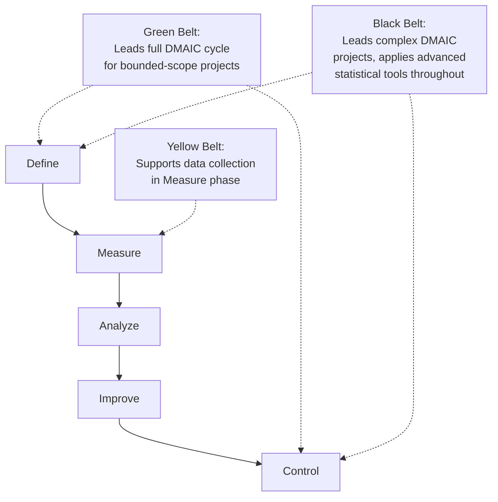
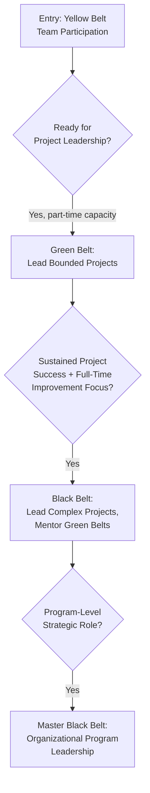

## Six Sigma Belt Certification Levels

### Overview

Six Sigma belt certifications represent a tiered credentialing system recognizing progressively deeper competence in Six Sigma methodology — the data-driven approach to process improvement centered on reducing variation and defects. The "belt" naming convention (borrowed from martial arts ranking) is used across multiple certifying bodies, most prominently ASQ, with generally consistent tier structure though credentialing criteria differ by issuer. This connects to the DMAIC framework, statistical methods covered in "Quality Tools and Statistical Methods," and complements the Lean principles covered in "Lean and Six Sigma Methodologies."

### The Belt Hierarchy

| Belt Level | Typical Role | Scope of Involvement | ASQ Certification |
| --- | --- | --- | --- |
| White Belt | Basic awareness | Understands foundational Six Sigma vocabulary; supports projects as a team member with minimal responsibility | Not an ASQ-certified tier |
| Yellow Belt | Project team member | Participates in DMAIC projects, contributes process knowledge, supports data collection | CSSYB (Certified Six Sigma Yellow Belt) |
| Green Belt | Part-time project lead | Leads smaller-scope improvement projects while retaining primary job responsibilities; applies core statistical tools | CSSGB (Certified Six Sigma Green Belt) |
| Black Belt | Full-time project lead/mentor | Leads complex, cross-functional projects; mentors Green Belts; applies advanced statistical methods | CSSBB (Certified Six Sigma Black Belt) |
| Master Black Belt | Program-level strategist/trainer | Oversees the overall Six Sigma program, trains Black Belts, ensures methodology consistency across the organization | Generally awarded via organizational/industry recognition rather than a standardized ASQ exam-based tier |

**Key Points**

- [Inference] The belt hierarchy and its associated scope of responsibility described above reflects a widely recognized general convention across Six Sigma practice; specific organizations may define role boundaries and responsibilities somewhat differently, since "Six Sigma" as a methodology is not governed by a single universal regulatory body in the way ISO standards are governed by ISO itself
- Master Black Belt is generally treated as the terminal, most senior tier, though it is less consistently formalized as a standardized third-party exam-based certification compared to the Yellow/Green/Black tiers

### ASQ Certification Requirements by Belt

**Key Points**

- CSSYB (Yellow Belt) has no experience or education requirements, reflecting its role as an entry-level, team-participation-oriented credential
- CSSGB (Green Belt) requires three years of work experience, with no education waivers given
- CSSBB (Black Belt) requires two completed improvement projects with signed affidavits attesting to their completion, or one completed project with a signed affidavit plus three years of work experience; no education waivers are given for this certification
- The affidavit-based project requirement for Black Belt certification distinguishes it from most other ASQ certifications (including CQE, CQA, CMQ/OE), which rely primarily on years-of-experience eligibility criteria rather than demonstrated project completion evidence

### DMAIC Framework Alignment by Belt Level

**Key Points**

- Yellow Belts typically engage with a subset of the DMAIC cycle as project contributors, most commonly supporting the Measure phase (data collection) rather than owning entire projects independently
- Green Belts are generally expected to independently lead a complete DMAIC cycle for bounded-scope projects, applying core statistical tools (basic control charts, Pareto analysis, hypothesis testing fundamentals)
- Black Belts lead the full DMAIC cycle for more complex, often cross-functional projects, applying advanced statistical methods (design of experiments, advanced regression, multivariate analysis) and typically mentor Green Belts on their concurrent projects

### Statistical Tool Complexity by Belt Level

| Tool/Technique | Yellow Belt | Green Belt | Black Belt |
| --- | --- | --- | --- |
| Basic quality tools (Pareto, fishbone, histograms) | Familiarity | Application | Application and teaching |
| Control charts (SPC) | Awareness | Construction and interpretation | Advanced/multivariate control charting |
| Hypothesis testing | Not typically required | Basic application (t-tests, chi-square) | Advanced application, including non-parametric methods |
| Design of Experiments (DOE) | Not typically required | Introductory exposure | Full application and design |
| Regression analysis | Not typically required | Basic linear regression | Multiple/advanced regression, ANOVA |
| Process capability analysis | Awareness | Calculation and interpretation ($C_p$, $C_{pk}$) | Advanced capability studies across complex processes |

**Key Points**

- This progression reflects increasing statistical sophistication expected at each tier, directly connecting to the statistical foundations covered in "Data Analytics and Predictive Quality Management" and "Quality Tools and Statistical Methods" — a Black Belt candidate is generally expected to apply the more advanced techniques (regression modeling, DOE) covered in those chapters independently

### Belt Progression and Career Pathway

**Key Points**

- Progression through belt levels is not purely exam-based beyond Green Belt in many organizational contexts — practical project leadership experience (formalized in ASQ's Black Belt affidavit requirement) is a defining differentiator between Green and Black Belt competence, not merely additional coursework
- Many organizations run internal belt certification programs distinct from ASQ's third-party certification, using the same terminology and general competency framework but with organization-specific criteria — a Green Belt certified internally by one organization is not automatically equivalent to an ASQ CSSGB, since criteria and rigor vary

### Distinguishing Six Sigma Belts from Lean Certifications

**Key Points**

- Six Sigma belts focus primarily on variation reduction and defect elimination through statistical methods (DMAIC), while Lean-specific certifications/training (referenced in "Lean Principles and Waste Elimination") focus on waste elimination and flow efficiency
- "Lean Six Sigma" belt certifications (offered by various providers, blending both methodologies) are common in practice, reflecting the frequent combined application of Lean and Six Sigma tools in modern quality improvement programs, though ASQ's own CSSYB/CSSGB/CSSBB certifications are specifically Six Sigma-focused per their Body of Knowledge structure

### Practical Example: Belt-Level Application in a Government Service Process Improvement Context

Applied to a government document processing improvement initiative:

| Belt Level | Applied Role |
| --- | --- |
| Yellow Belt (front-line staff) | Participate in a project analyzing application processing delays by contributing process knowledge and helping collect turnaround-time data |
| Green Belt (department supervisor) | Lead a bounded DMAIC project addressing a specific bottleneck (e.g., document verification stage), applying basic control charting to track improvement |
| Black Belt (quality/process improvement lead, if the organization has such a role) | Lead a cross-departmental project addressing systemic processing delays across multiple offices, applying more advanced statistical analysis and mentoring the Green Belt-certified supervisors involved |

[Inference] This is a generic illustration of how belt-level roles might apply in a public-sector process improvement context; actual role assignment and project scope depend on the specific organization's structure, and Six Sigma terminology/certification is more commonly associated with private-sector manufacturing contexts, though the underlying DMAIC methodology and statistical tools generalize to service and public-sector process improvement as well.

### Common Pitfalls

- **Key Points**
  - Assuming internal organizational belt certification (common in many companies' internal training programs) is equivalent to third-party ASQ certification, when criteria and rigor vary significantly between the two
  - Assigning Black Belt-level project complexity to a Green Belt-certified individual without accounting for the significant difference in expected statistical tool sophistication (DOE, advanced regression) between the two tiers
  - Treating belt certification as purely an exam-passing exercise, overlooking that ASQ's Black Belt certification specifically requires demonstrated project completion (affidavits), not solely knowledge testing
  - Conflating Six Sigma belt certification scope with Lean certification scope, when the two methodologies address related but distinct improvement dimensions (variation/defect reduction vs. waste/flow efficiency)
  - Underestimating the organizational commitment required to sustain a belt-based improvement program — a single Black Belt without broader organizational support (Green Belt project pipeline, leadership sponsorship) typically cannot sustain program-wide improvement outcomes alone

**Next Steps**

- Lean Principles and Waste Elimination
- Quality Tools and Statistical Methods — DOE and Advanced Statistics
- Data Analytics and Predictive Quality Management
- Overview of Quality Certifications Including CQE CQA and CMQ OE
- DMAIC Framework — Detailed Phase-by-Phase Application
- Root Cause Analysis Techniques (5 Whys, Fishbone, FMEA)
- Building a Six Sigma Program: Organizational Structure and Governance
- Continual Improvement Methodologies (Clause 10.3)