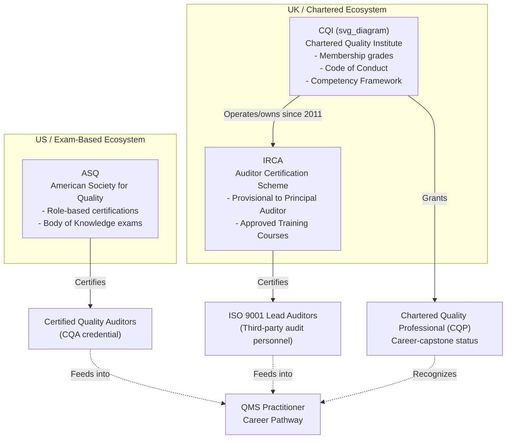

## Professional Bodies Including ASQ, IRCA, and CQI

### Overview

Professional bodies in quality management provide certification, competency frameworks, codes of conduct, and continuing professional development (CPD) structures that underpin credibility in the quality profession. For QMS practitioners and auditors, membership and certification through these bodies validate competence against internationally recognized criteria, often required or preferred for lead auditor roles, consultancy work, and regulatory/contractual eligibility.

The three most referenced bodies in ISO 9001 and broader QMS contexts are:

- **ASQ** (American Society for Quality) — US-based, broad quality discipline coverage
- **IRCA** (International Register of Certificated Auditors) — UK-originated, auditor certification specialist, now operating under CQI
- **CQI** (Chartered Quality Institute) — UK chartered body for the quality profession, parent organization of IRCA since 2011

---

### ASQ (American Society for Quality)

#### Organizational Profile

ASQ is a global professional association headquartered in Milwaukee, Wisconsin, USA, founded in 1946. It positions itself as a knowledge-based community for quality professionals across manufacturing, healthcare, service, and government sectors.

#### Core Offerings

- **Certifications**: ASQ offers role-based certifications rather than solely auditor-focused ones. Key certifications include:
  - Certified Quality Engineer (CQE)
  - Certified Quality Auditor (CQA)
  - Certified Manager of Quality/Organizational Excellence (CMQ/OE)
  - Certified Six Sigma Green Belt / Black Belt (CSSGB/CSSBB)
  - Certified Quality Improvement Associate (CQIA)
  - Certified Supplier Quality Professional (CSQP)
  - Certified Quality Process Analyst (CQPA)
- **Certification Structure**: Each certification requires a combination of:
  - Documented work experience (typically several years in a quality-related role, varying by certification)
  - Passing a proctored, multiple-choice exam covering a defined **Body of Knowledge (BOK)**
  - Recertification every 3 years via CPD points or re-examination
- **Body of Knowledge (BOK)**: Each certification publishes a detailed BOK outlining exam domains, weightings, and cognitive levels (e.g., comprehension vs. application), which candidates use for exam preparation.
- **Publications**: ASQ publishes *Quality Progress* magazine, technical journals, and standards-adjacent guidance, and is the US **ANSI-accredited standards developer** liaison body for many quality-related American National Standards.

#### Relevance to ISO 9001 / QMS

ASQ's CQA (Certified Quality Auditor) credential is widely recognized in North America as a benchmark for internal and third-party auditors performing ISO 9001 conformity assessments, though it is a knowledge-exam-based certification rather than a witnessed-audit competency scheme like IRCA's lead auditor certification.

**[Inference]** ASQ certifications tend to carry more recognition weight in US-domestic and North American supply chains, while IRCA/CQI certifications are more heavily weighted in UK, European, Middle Eastern, and Commonwealth markets — this pattern reflects general industry observation rather than a documented global equivalence standard.

---

### IRCA (International Register of Certificated Auditors)

#### Organizational Profile

IRCA was founded in 1984 in the UK, originally as an independent auditor-certification body focused specifically on management systems auditing (quality, environmental, information security, food safety, etc.). Since 2011, IRCA has operated as a **subsidiary/operating brand of CQI**, though it retains its own certification scheme identity.

#### Core Function: Auditor Certification Scheme

Unlike ASQ's exam-based model, IRCA's flagship offering is a **personnel certification scheme for management systems auditors**, layered by experience and demonstrated competence:

| IRCA Grade | Typical Requirements |
| --- | --- |
| **Provisional Auditor** | Completion of an IRCA-certified training course (e.g., ISO 9001 Lead Auditor) with no/limited audit experience |
| **Auditor** | Training course + minimum logged audit days under supervision |
| **Lead Auditor** | Training + demonstrated audit team leadership experience, logged audit days, employer/client references |
| **Principal Auditor** | Extensive audit experience, often across multiple standards/sectors, senior competence demonstration |

#### Certification Pathway Mechanics

- **Approved Training Courses**: IRCA accredits training providers to deliver standardized courses (e.g., "IRCA Certified ISO 9001:2015 Lead Auditor Training Course"), which typically run 5 days and include a written exam plus practical assessment (case studies, role-play audits).
- **Certified Training Organizations (CTOs)**: Only IRCA-approved CTOs can issue courses that count toward certification; course content is standardized against an IRCA-defined syllabus and learning outcomes.
- **Audit Log/Experience Verification**: Progression from Provisional to full Auditor/Lead Auditor status requires submission of logged, verifiable audit days, often countersigned by employers or certification bodies.
- **CPD Requirement**: IRCA-certificated auditors must maintain CPD hours annually to retain certification status.

#### Multi-Discipline Scope

IRCA certifies auditors across multiple management system standards beyond ISO 9001, including:

- ISO 14001 (Environmental)
- ISO 45001 (Occupational Health & Safety)
- ISO/IEC 27001 (Information Security)
- ISO 22000 (Food Safety)
- ISO 13485 (Medical Devices)
- AS9100 (Aerospace)

#### Relevance to ISO 9001 / QMS

IRCA Lead Auditor certification is frequently a **de facto industry requirement** (though not an ISO 9001 clause requirement itself) for individuals conducting third-party certification audits on behalf of accredited certification bodies, and is commonly specified in job postings for external/internal QMS lead auditor roles.

---

### CQI (Chartered Quality Institute)

#### Organizational Profile

CQI is the UK's **chartered professional body for the quality management profession**, granted its Royal Charter in 2006. It is the only chartered body of its kind globally dedicated to quality management as a profession (analogous to chartered status held by engineering or accounting institutes).

#### Relationship to IRCA

CQI and IRCA merged operations in 2011, with IRCA continuing to operate its auditor certification scheme under the CQI umbrella. This means:

- **CQI** governs the broader quality profession — competency frameworks, chartered membership grades, professional ethics, and the quality practitioner community.
- **IRCA** remains the specific brand/scheme for **auditor personnel certification**.

#### Membership Grades

CQI operates a graded membership structure reflecting professional seniority and competence, generally analogous across chartered UK institutes:

- **Affiliate** — entry-level, no formal quality experience required
- **Associate (ACQI)** — foundational competence demonstrated
- **Member (MCQI)** — substantial, demonstrated professional experience
- **Chartered Quality Professional (CQP)** — highest individual grade, requiring peer-reviewed evidence of professional impact, ethical practice, and sustained competence; analogous to Chartered Engineer (CEng) status in engineering disciplines
- **Fellow (FCQI)** — reserved for those with exceptional, sustained contribution to the profession

#### Competency Framework

CQI publishes a **Competency Framework** mapping skills and knowledge areas across the quality profession (e.g., governance, assurance, improvement, systems thinking), used both for self-assessment by practitioners and as a reference for employers structuring quality roles and career progression.

#### Code of Conduct

CQI members are bound by a professional **Code of Conduct**, covering integrity, objectivity, confidentiality, and professional competence — enforceable through disciplinary procedures, distinguishing chartered professional membership from a pure certification-exam model.

#### Relevance to ISO 9001 / QMS

CQI's Chartered Quality Professional (CQP) designation is often viewed as a career-capstone credential for senior UK/Commonwealth quality managers, quality directors, and consultants, signaling recognized professional standing beyond any single certification exam.

---

### Comparative Summary

| Attribute | ASQ | IRCA | CQI |
| --- | --- | --- | --- |
| **Origin/Base** | USA | UK (now under CQI) | UK |
| **Model** | Exam-based certification (BOK) | Training + logged audit experience scheme | Chartered professional membership |
| **Primary Output** | Role-based certifications (CQE, CQA, CSSBB, etc.) | Auditor grades (Provisional → Principal) | Membership grades (Affiliate → Fellow/CQP) |
| **Focus** | Broad quality discipline knowledge | Management systems auditing competence | Quality profession as a whole |
| **Recertification** | Every 3 years (CPD/exam) | Annual CPD | Ongoing CPD, ethics adherence |
| **Chartered Status** | No | No | Yes (Royal Charter) |

---

### Diagram: Relationship and Positioning of Bodies (svg_diagram)

---

### Practical Example: Career Pathway Mapping

A quality professional working toward external ISO 9001 auditing credibility might combine credentials across bodies:

1. Complete an **IRCA Certified ISO 9001:2015 Lead Auditor** training course (5-day course + exam) to gain Provisional Auditor status.
2. Log required audit days under a certification body or mentor to progress to **IRCA Auditor**, then **Lead Auditor** grade.
3. Simultaneously pursue **CQI membership** (e.g., MCQI), using logged experience and CPD records toward eventual **Chartered Quality Professional (CQP)** status.
4. If working with US-based clients or multinational supply chains, supplement with **ASQ CQA** certification to demonstrate exam-validated knowledge recognized in North American contexts.

This layered approach — auditor scheme (IRCA) + chartered professional recognition (CQI) + knowledge-exam certification (ASQ) — is common among consultants and auditors serving international clients.

---

### Key Points

- ASQ, IRCA, and CQI serve **different but complementary functions**: knowledge certification (ASQ), auditor competency certification (IRCA), and chartered professional recognition (CQI).
- IRCA has operated under CQI's ownership since 2011, but the two maintain distinct scheme identities.
- None of these bodies are mandated by ISO 9001 itself; their certifications are **industry-adopted proxies for auditor/practitioner competence**, often required contractually or by employers rather than by the standard's text.
- CPD (Continuing Professional Development) is a shared mechanism across all three bodies for maintaining certification/membership validity.

---

### Related Topics

- ISO 17024 (Conformity assessment — requirements for bodies certifying persons) as the framework underpinning personnel certification schemes
- Third-party certification body accreditation (UKAS, ANAB, IAF-member accreditation bodies) and its relationship to auditor personnel certification
- Internal auditor competence requirements under ISO 9001:2015 Clause 7.2 (Competence) and Clause 9.2 (Internal Audit)
- CQI Competency Framework in detail — mapping to job role design
- Continuing Professional Development (CPD) systems and record-keeping practices for quality professionals
- Comparative analysis: Exemplar Global (Australia/international) as a further auditor certification body alongside IRCA