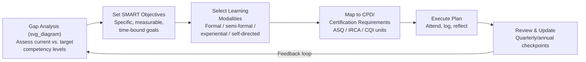

## Building a Continuing Education Plan in Quality Management

### Overview

A Continuing Education Plan (CEP) — often formalized through Continuing Professional Development (CPD) systems — is a structured, documented approach for quality professionals to maintain, extend, and demonstrate competence over their careers. It serves both certification-maintenance purposes (satisfying recertification requirements from bodies such as ASQ, IRCA, or CQI) and genuine capability development in response to evolving standards, technologies, and organizational needs.

Building an effective plan requires more than passively logging training hours; it involves gap analysis, goal-setting aligned to career trajectory, diversified learning modalities, and systematic evidence capture.

---

### Why a Structured CEP Matters in QMS

- **Certification maintenance**: Most professional bodies require documented CPD hours/points within a cycle (e.g., ASQ's 3-year recertification cycle; IRCA's annual CPD requirement) to retain active certification status.
- **Standard revisions**: ISO standards undergo periodic revision (e.g., ISO 9001:2015, with future revisions anticipated), requiring practitioners to update their working knowledge of clause structure, terminology, and risk-based thinking requirements.
- **Sector/technology drift**: Quality management increasingly intersects with digital quality systems, data analytics, AI-assisted quality tools, and evolving regulatory frameworks — a static skill set degrades in relevance over time.
- **Career progression**: Movement from internal auditor → lead auditor → quality manager → quality director typically requires demonstrable growth in leadership, strategic, and cross-functional competencies beyond technical QMS knowledge.

---

### Step 1: Competency Gap Analysis

Before setting goals, assess current competence against a recognized framework.

#### Using Published Competency Frameworks

- **CQI Competency Framework**: Maps quality professional competencies across categories such as governance, assurance, improvement, and behavioral/leadership skills, with defined proficiency levels.
- **ASQ Body of Knowledge (BOK)** documents: Each ASQ certification publishes a BOK outlining specific knowledge domains and weightings — useful even for professionals not pursuing that specific certification, as a self-assessment checklist.
- **ISO 9001 Clause Mapping**: Reviewing personal fluency against each clause (4 through 10) can reveal specific gaps (e.g., strong in Clause 8 Operations, weak in Clause 6 Risk-Based Thinking/Planning).

#### Self-Assessment Method

A simple gap-analysis structure:

| Competency Area | Current Level (1–5) | Target Level | Gap | Priority |
| --- | --- | --- | --- | --- |
| Internal auditing techniques | 3 | 5 | 2 | High |
| Statistical process control (SPC) | 2 | 4 | 2 | Medium |
| Risk-based thinking (Clause 6) | 4 | 4 | 0 | Low |
| Supplier quality management | 2 | 3 | 1 | Medium |
| Data analytics / Minitab or equivalent | 1 | 3 | 2 | High |

**[Inference]** Prioritizing gaps by both size and business relevance (rather than gap size alone) generally produces more career-relevant plans, though the specific weighting is a judgment call rather than a standardized formula.

---

### Step 2: Setting SMART Learning Objectives

Translate identified gaps into objectives using the SMART framework (Specific, Measurable, Achievable, Relevant, Time-bound):

**Example objective**: "Complete an IRCA-certified ISO 9001:2015 Lead Auditor training course and log 10 supervised audit days by end of Q3, to progress from Provisional to full Auditor status."

Avoid vague objectives such as "improve auditing skills" — they lack a completion criterion and cannot be tracked against CPD logs.

---

### Step 3: Selecting Learning Modalities

A well-rounded CEP typically blends multiple formats rather than relying solely on formal courses:

#### Formal/Structured

- Accredited training courses (e.g., IRCA CTO-delivered Lead Auditor courses)
- University or professional-body certificate programs
- Vendor-specific software/tool training (e.g., statistical software, QMS platforms)

#### Semi-Formal

- Webinars and conference sessions (ASQ World Conference on Quality and Improvement, CQI events)
- Structured reading with reflection logs (standards documents, technical journals like *Quality Progress*)
- Peer study groups or internal "lunch and learn" sessions

#### Experiential

- Job rotation or secondment into adjacent functions (e.g., a QMS auditor spending time in supplier quality management)
- Mentoring — both being mentored and mentoring others (mentoring others is often undervalued as a CPD activity but reinforces mastery)
- Cross-functional project involvement (e.g., joining a process improvement / Lean Six Sigma initiative)

#### Self-Directed

- Reading current editions of relevant ISO standards and technical reports (e.g., ISO/TS 9002 guidance, ISO 19011 for auditing guidelines)
- Following regulatory and standards-body updates (ISO committee news, national accreditation body bulletins)

**[Unverified]** The specific ratio of formal-to-informal learning that maximizes retention is debated in adult-learning literature and is not standardized by any quality body; the modalities above are illustrative categories rather than a prescribed ratio.

---

### Step 4: Mapping to Certification/CPD Requirements

Different bodies define CPD units differently — a CEP should reverse-map planned activities to the specific point/hour systems required:

| Body | Typical Cycle | Unit System | Example Activity Mapping |
| --- | --- | --- | --- |
| ASQ | 3 years | Recertification Journal (RCJ) points | 1 point per contact hour of training, capped categories for work experience, publishing, presenting |
| IRCA | Annual | CPD hours logged | Structured training, conference attendance, audit-related professional reading |
| CQI | Ongoing (reviewed at renewal) | CPD activities recorded in a log/portfolio | Structured and unstructured learning, both counted with reflective notes |

**Practical tip**: Maintain a single master CPD log capturing date, activity, hours/points, and a brief reflective note on application — then map subsets of that log to each body's specific submission format, rather than maintaining separate logs from scratch for each body.

---

### Step 5: Building the Plan Document

A practical CEP document typically includes:

1. **Current role and career target** (e.g., "Senior Quality Engineer → Quality Manager within 3 years")
2. **Competency gap analysis summary** (from Step 1)
3. **Annual objectives** (SMART-formatted, from Step 2)
4. **Planned activities and timeline** (from Step 3), often laid out quarterly
5. **Certification/CPD mapping** (from Step 4)
6. **Budget and resource requirements** (course fees, exam fees, travel, membership dues)
7. **Review checkpoints** (e.g., quarterly self-review, annual manager/mentor review)

---

### Example: One-Year CEP Excerpt

**Role**: Quality Engineer, aiming toward Lead Auditor designation

| Quarter | Objective | Activity | Est. Hours | CPD Mapping |
| --- | --- | --- | --- | --- |
| Q1 | Close SPC knowledge gap | Complete online SPC certificate course | 20 | ASQ RCJ: Education |
| Q2 | Gain lead auditor qualification | IRCA Certified ISO 9001:2015 Lead Auditor course | 35 (5-day course) | IRCA CPD: Training |
| Q3 | Apply auditing skills practically | Shadow 3 internal audits as observer/co-auditor | 15 | IRCA CPD: Practical experience |
| Q4 | Broaden professional network & knowledge | Attend CQI regional conference; present internal case study | 12 | CQI CPD: Conference + Contribution |

---

### Diagram: Continuing Education Planning Cycle (svg_diagram)

---

### Common Pitfalls

- **Treating CPD as a checkbox exercise**: Logging hours without reflective application undermines the developmental purpose and can produce weak evidence if later audited by a certifying body.
- **Overloading formal training**: Formal courses are often the most expensive and time-intensive modality; balancing with lower-cost experiential and self-directed learning improves sustainability of the plan.
- **Neglecting soft skills**: Technical QMS knowledge (auditing, statistics, standards) is necessary but senior roles increasingly require leadership, communication, and change-management competencies — these are frequently under-planned.
- **Static plans**: A CEP built once and never revisited fails to respond to standard revisions (e.g., a future ISO 9001 revision) or shifts in organizational priorities.

---

### Key Points

- An effective CEP starts with a **gap analysis against a recognized competency framework** (CQI Competency Framework, ASQ BOK, or ISO clause self-assessment), not with an arbitrary list of courses.
- Learning should span **formal, semi-formal, experiential, and self-directed** modalities rather than relying solely on courses.
- CPD requirements differ by professional body (ASQ points, IRCA annual hours, CQI portfolio logs) — a single master log mapped to each body's format is more efficient than separate tracking systems.
- Plans should include **quarterly/annual review checkpoints** to remain responsive to standard revisions and career shifts.

---

### Related Topics

- CQI Competency Framework — detailed proficiency-level breakdown
- ASQ Recertification Journal (RCJ) point system in depth
- ISO 19011 (Guidelines for auditing management systems) as a self-study resource
- Building a personal CPD portfolio/logbook template
- Mentoring and coaching as CPD activities for quality professionals
- Transitioning from Quality Engineer to Quality Manager — competency and CEP implications