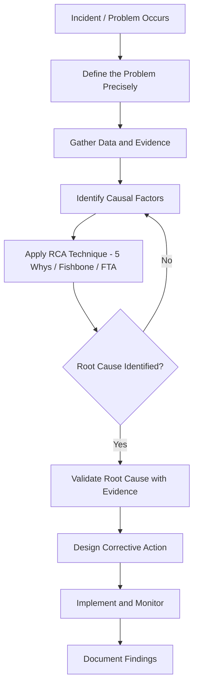

## Defining Root Cause Analysis and Its Objectives

### Overview

Root Cause Analysis (RCA) is a structured problem-solving methodology used to identify the fundamental, underlying reason(s) a problem, defect, incident, or failure occurred, rather than addressing only its symptoms. RCA operates on the principle that sustainable prevention requires eliminating the source of a problem, not merely suppressing its visible effects.

RCA is not a single fixed technique but a category of methods (e.g., the 5 Whys, Fishbone/Ishikawa diagrams, Fault Tree Analysis, Pareto Analysis) unified by a common goal: tracing a chain of causation backward from an observed effect to its originating cause(s).

### Core Definition

**Key Points**

- A **root cause** is the earliest, most fundamental point in a causal chain where an intervention would have prevented the problem from occurring.
- A **symptom** (or proximate cause) is an observable manifestation of a deeper issue — treating it provides temporary relief but does not prevent recurrence.
- RCA distinguishes between:
  - **Causal factors**: Contributing conditions that influenced the outcome but are not, alone, sufficient explanations.
  - **Root cause(s)**: The factor(s) that, if removed, would have prevented the problem entirely.

Formally, RCA can be framed as an inverse causal inference problem: given an observed failure state $F$, RCA seeks the minimal set of upstream conditions $C = \{c_1, c_2, ..., c_n\}$ such that removing any $c_i \in C$ breaks the causal chain leading to $F$.

### Objectives of RCA

1. **Prevention over correction** — Shift organizational response from reactive firefighting to proactive elimination of failure sources.
2. **Identify true causation, not correlation** — Avoid attributing failure to factors that merely co-occurred with the incident.
3. **Reduce recurrence** — A properly identified root cause, once addressed, should measurably reduce the probability of the same class of failure recurring.
4. **Support systemic (not individual) framing** — Mature RCA practice (e.g., in safety engineering and SRE culture) focuses on process, system, and design factors rather than assigning blame to individuals, since blame-oriented analysis suppresses honest reporting and hides true causes.
5. **Enable prioritized resource allocation** — By understanding which causes have the greatest downstream impact, teams can allocate fixes according to leverage rather than visibility or urgency.
6. **Create institutional knowledge** — Well-documented RCA produces a reusable record that informs design reviews, onboarding, and future incident response.

### The Symptom vs. Root Cause Distinction

A single incident typically has multiple causal layers:

| Layer | Description | Example (server outage) |
| --- | --- | --- |
| Symptom | Directly observed failure | Website returns 500 errors |
| Proximate cause | Immediate technical trigger | Database connection pool exhausted |
| Intermediate cause | Contributing systemic condition | No connection timeout configured |
| Root cause | Fundamental originating condition | No code review checklist item enforcing timeout configuration on new DB clients |

**Example**

Problem: A production deployment caused a service outage.

- Symptom: Users report 500 errors.
- Proximate cause: New code introduced an unhandled null pointer exception.
- Intermediate cause: The bug was not caught in testing.
- Root cause: The CI pipeline's test coverage requirements do not enforce null-input edge case testing for this code path.

Fixing only the null check addresses the symptom for this one deployment. Fixing the CI test-coverage policy addresses the root cause and prevents the entire class of similar future failures.

### Causal Chain Visualization

<svg xmlns="http://www.w3.org/2000/svg" viewBox="0 0 760 220">
<text x="380" y="20" text-anchor="middle" font-size="14" font-weight="bold" fill="#1a1a1a">Causal Chain: Symptom to Root Cause (svg_diagram)</text>
<rect x="20" y="60" width="150" height="60" rx="6" fill="#fde2e2" stroke="#c0392b" stroke-width="1.5" />
<text x="95" y="85" text-anchor="middle" font-size="11" font-weight="bold" fill="#7b241c">Symptom</text>
<text x="95" y="102" text-anchor="middle" font-size="10" fill="#7b241c">500 errors reported</text>
<rect x="210" y="60" width="150" height="60" rx="6" fill="#fdebd0" stroke="#d68910" stroke-width="1.5" />
<text x="285" y="85" text-anchor="middle" font-size="11" font-weight="bold" fill="#7d5a0b">Proximate Cause</text>
<text x="285" y="102" text-anchor="middle" font-size="10" fill="#7d5a0b">DB pool exhausted</text>
<rect x="400" y="60" width="150" height="60" rx="6" fill="#fcf3cf" stroke="#b7950b" stroke-width="1.5" />
<text x="475" y="85" text-anchor="middle" font-size="11" font-weight="bold" fill="#7d6608">Intermediate Cause</text>
<text x="475" y="102" text-anchor="middle" font-size="10" fill="#7d6608">No timeout config</text>
<rect x="590" y="60" width="150" height="60" rx="6" fill="#d5f5e3" stroke="#1e8449" stroke-width="1.5" />
<text x="665" y="80" text-anchor="middle" font-size="11" font-weight="bold" fill="#145a32">Root Cause</text>
<text x="665" y="96" text-anchor="middle" font-size="9.5" fill="#145a32">No CI check for</text>
<text x="665" y="108" text-anchor="middle" font-size="9.5" fill="#145a32">timeout config</text>
<path d="M170,90 L205,90" stroke="#555" stroke-width="1.5" marker-end="url(#arrow1)" />
<path d="M360,90 L395,90" stroke="#555" stroke-width="1.5" marker-end="url(#arrow1)" />
<path d="M550,90 L585,90" stroke="#555" stroke-width="1.5" marker-end="url(#arrow1)" />
<text x="380" y="150" text-anchor="middle" font-size="10.5" fill="#444">Investigation direction (right → left backward tracing)</text>

<path d="M600,175 L200,175" stroke="#888" stroke-width="1.5" stroke-dasharray="4,3" marker-end="url(#arrow2)" />

<text x="95" y="200" text-anchor="middle" font-size="9.5" fill="#888">Observed first</text>

<text x="665" y="200" text-anchor="middle" font-size="9.5" fill="#888">Discovered last, fixed for real prevention</text>

</svg>

### RCA Process Flow (Generic)

### Guiding Principles for Valid RCA

- **Evidence-based, not assumption-based**: Every causal link must be supported by verifiable data (logs, timestamps, reproducible tests), not speculation.
- **Multiple root causes are common**: Complex systems often fail due to a combination of causes; RCA should not stop at the first plausible explanation.
- **Necessity and sufficiency test**: A candidate root cause should be tested against the question, "If this factor had not been present, would the problem still have occurred?" If yes, it is not the (sole) root cause.
- **Actionability requirement**: A root cause must be something the organization can act on. "Human error" alone is rarely an acceptable root cause because it is not actionable — the RCA must continue to ask why the error was possible (e.g., missing safeguards, unclear procedures, inadequate training systems).

### Common Misconceptions

- **[Inference]** RCA is often mistakenly treated as a single fixed technique (usually equated only with "the 5 Whys"), when it is more accurately a category of complementary methods, each suited to different problem types (linear causal chains vs. multi-branch systemic failures).
- Stopping at the first "human" cause (e.g., "operator pressed the wrong button") without asking why the system allowed that error to have severe consequences is a frequent failure mode of shallow RCA.
- Conflating correlation with causation — a factor present during an incident is not necessarily causal.

### Related Topics

- The 5 Whys technique and its structured questioning method
- Fishbone (Ishikawa) diagrams for multi-causal analysis
- Fault Tree Analysis (FTA) and Boolean causal logic
- Pareto Analysis for prioritizing causes by impact
- Blameless postmortem culture and its relationship to effective RCA
- Corrective Action vs. Preventive Action (CAPA) frameworks
- Data collection and evidence-gathering techniques for incident investigation