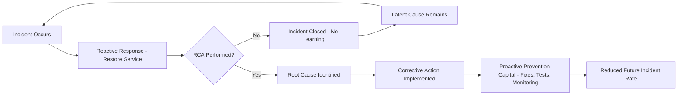

## Reactive versus Proactive Problem Solving

### Overview

Reactive and proactive problem solving represent two fundamentally different orientations toward handling failures, defects, and incidents. The distinction is central to Root Cause Analysis because RCA is, by design, a mechanism for converting reactive organizations into proactive ones — it uses the investigation of past failures to prevent future ones, rather than merely resolving the immediate disruption.

### Core Definitions

**Reactive problem solving** addresses issues only after they occur, focusing on restoring normal operation as quickly as possible. It is fundamentally symptom-oriented and time-bounded by the incident itself.

**Proactive problem solving** anticipates potential failure modes before they manifest, or, when a failure has occurred, uses that failure as a trigger to search for and eliminate systemic weaknesses that could cause similar or unrelated future failures.

| Dimension | Reactive | Proactive |
| --- | --- | --- |
| Trigger | Failure has already occurred | Risk identified before failure, or failure used as a systemic signal |
| Primary goal | Restore service / fix immediate defect | Prevent recurrence / prevent future classes of failure |
| Time horizon | Short-term (minutes to days) | Long-term (weeks to years) |
| Typical activities | Incident response, hotfixes, workarounds | RCA, risk assessment, process redesign, monitoring investment |
| Cost profile | Lower upfront cost, higher cumulative cost from recurrence | Higher upfront investment, lower long-term cost |
| Organizational posture | Firefighting | Fire prevention |
| Metric focus | MTTR (Mean Time To Repair) | MTBF (Mean Time Between Failures), defect escape rate |

### The Reactive Mode

**Key Points**

- Reactive responses are necessary and unavoidable — no system, however well-designed, is failure-proof, and immediate restoration of service or safety is often the top priority during an active incident.
- Reactive-only cultures treat each incident as isolated, closing it once symptoms are resolved without investigating underlying contributing factors.
- Reactive problem solving tends to produce **recurring incidents** because the same latent conditions remain in place.

**Example**

A web application experiences intermittent 500 errors. A purely reactive response:

1. On-call engineer restarts the affected service.
2. Errors stop; the incident is marked resolved.
3. No further investigation is conducted.
4. The same errors recur two weeks later under similar load conditions.

This pattern — restart, resolve, repeat — is a hallmark of reactive-only operations and indicates the absence of RCA in the incident lifecycle.

### The Proactive Mode

**Key Points**

- Proactive problem solving incorporates RCA as a mandatory step after incident resolution, not an optional follow-up.
- It extends beyond individual incidents into **predictive** practices: risk assessments, failure mode analysis (e.g., FMEA), load testing, and chaos engineering, which surface latent weaknesses before they cause outages.
- Proactive organizations track **leading indicators** (e.g., error rate trends, resource saturation trends) rather than relying solely on **lagging indicators** (e.g., outage count).

**Example**

Using the same scenario, a proactive response:

1. Engineer restarts the service to restore availability (reactive step, still necessary).
2. A formal RCA is opened as a required follow-up action.
3. Investigation (e.g., via the 5 Whys) traces the error to unbounded memory growth from an unclosed resource handle under specific load patterns.
4. The root cause (missing resource cleanup in a specific code path) is fixed and covered by a regression test.
5. Monitoring is added to alert on the leading indicator (memory growth rate) before it causes an outage in the future.

### Relationship to RCA

RCA acts as the **conversion mechanism** between the two modes: an organization performing RCA consistently converts each reactive incident into proactive prevention capital (fixes, tests, monitoring, documentation). Without RCA, an organization can only ever remain reactive, since no learning loop is closed after the incident.

### Cost Dynamics

The cost asymmetry between the two modes is a common justification for RCA investment. Reactive-only handling defers cost into the future in the form of repeated incidents, each carrying its own response cost, while proactive handling front-loads investigation cost in exchange for reduced recurrence.

This can be approximated conceptually as:

$$C_{total,\ reactive} = \sum_{i=1}^{n} C_{response,i}$$

$$C_{total,\ proactive} = C_{RCA} + C_{fix} + \sum_{i=1}^{m} C_{response,i}, \quad m \ll n$$

Where $n$ is the number of recurrences under reactive-only handling and $m$ is the (much smaller) number of unrelated incidents that still occur after the root cause is addressed. **[Inference]** The actual magnitude of savings depends heavily on incident frequency, severity, and the cost of the RCA process itself, and should be validated empirically per organization rather than assumed universally favorable.

### Organizational Signals

Indicators that an organization is stuck in reactive mode:

- Incident tickets are closed immediately upon symptom resolution, with no root-cause field required.
- The same alert or defect class recurs across multiple time periods.
- No formal postmortem or RCA process exists, or it exists but is not consistently applied.
- Metrics dashboards track only uptime/downtime, not defect trends or near-misses.

Indicators of proactive maturity:

- Postmortems/RCAs are mandatory for a defined severity threshold and tracked to completion.
- Near-misses (events that could have caused failure but did not) are investigated, not just actual failures.
- Preventive engineering work (refactoring, monitoring, testing investment) is prioritized alongside feature work.

### Common Misconceptions

- Proactive problem solving does not mean eliminating reactive response entirely — immediate stabilization during an active incident remains necessary; the distinction is about what happens *after* stabilization.
- **[Inference]** A fully proactive posture is an asymptotic goal rather than a fully achievable state, since novel and unforeseeable failure modes will always occur in sufficiently complex systems.
- Reactive is not synonymous with "bad engineering" — even mature proactive organizations still perform reactive incident response; the failure mode is *staying* reactive without a systemic learning loop.

### Related Topics

- Blameless postmortem processes and RCA documentation
- Mean Time To Repair (MTTR) vs. Mean Time Between Failures (MTBF) as opposing metric philosophies
- Failure Mode and Effects Analysis (FMEA) as a proactive, pre-failure RCA variant
- Leading vs. lagging indicators in reliability engineering
- Chaos engineering as proactive failure injection
- Corrective Action / Preventive Action (CAPA) systems