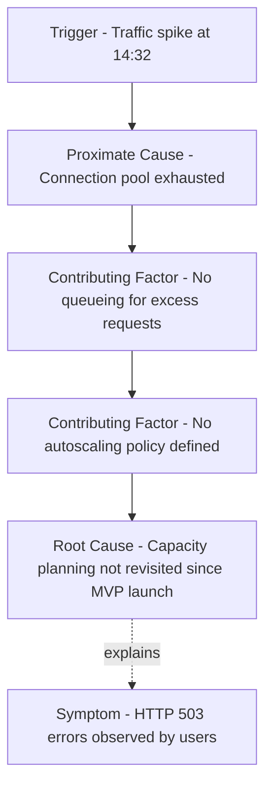

## Root Cause versus Symptom versus Trigger

### Overview

Precise terminology is foundational to valid Root Cause Analysis. Three terms are frequently conflated in informal problem-solving discussions — **symptom**, **trigger**, and **root cause** — yet each refers to a distinct position within a causal chain, and confusing them leads to corrective actions that address the wrong layer of the problem.

### Core Definitions

**Symptom**

An observable effect or manifestation of an underlying problem. Symptoms are what stakeholders notice first (error messages, alarms, customer complaints, defect reports). A symptom describes *what is wrong*, not *why*.

**Trigger**

The specific event or condition that activates or exposes an already-latent weakness, causing the symptom to appear at a particular moment. A trigger answers *why now*, not *why at all*. Triggers are often necessary but not sufficient causes — the underlying vulnerability must already exist for the trigger to produce a failure.

**Root cause**

The fundamental, underlying condition that, if eliminated, would prevent the problem from recurring — regardless of whether the same trigger occurs again. A root cause answers *why does this vulnerability exist at all*.

| Term | Question Answered | Temporal Role | Actionability |
| --- | --- | --- | --- |
| Symptom | What is observed? | Occurs at/after failure | Treating it gives temporary relief only |
| Trigger | Why did it happen now? | Occurs immediately before failure | Removing it may prevent this instance, not the class |
| Root cause | Why can this happen at all? | Pre-exists, often long before the incident | Removing it prevents the entire class of recurrence |

### Distinguishing the Three: Worked Example

**Example**

Scenario: An e-commerce checkout service crashes during a flash sale.

- **Symptom**: Checkout page returns HTTP 503 errors; customers cannot complete purchases.
- **Trigger**: A sudden 20x spike in concurrent requests during the flash sale promotion.
- **Root cause**: The service has no horizontal auto-scaling configured and a hardcoded connection pool limit of 50, set during initial development for a much smaller expected load and never revisited.

Analysis of why each label applies:

- Fixing the symptom alone (e.g., manually restarting the service) resolves nothing structurally; the same 503 errors return under the next traffic spike.
- Removing the trigger (e.g., canceling future flash sales) is not a valid mitigation — it eliminates business value to avoid a technical limitation, and doesn't protect against *other* triggers (e.g., organic viral traffic) that could expose the same weakness.
- Addressing the root cause (implementing auto-scaling and removing the hardcoded pool limit) prevents this entire class of failure regardless of what specific event causes future traffic spikes.

**[Inference]** Not every trigger is avoidable or worth avoiding — legitimate business growth or seasonal demand often cannot and should not be suppressed, which is precisely why root-cause remediation (not trigger avoidance) is the valid corrective target in most operational contexts.

### Causal Layering Model

Symptom, trigger, and root cause are not always a simple three-link chain — real incidents typically involve multiple intermediate causal factors between trigger and root cause. A more complete model:

Note the directionality: the trigger and symptom sit at opposite, *visible* ends of the chain, while root cause sits at the *invisible*, structural origin — often temporally distant from the incident itself.

### The Necessity Test

To classify a factor correctly, apply the counterfactual necessity test to each candidate:

- **Symptom test**: "Is this what was observed/reported?" — If yes, it is a symptom, not a cause.
- **Trigger test**: "Did this event need to occur for the failure to happen at this specific moment, but the system was already vulnerable beforehand?" — If yes, it is a trigger.
- **Root cause test**: "If this condition had not existed, would the failure have been prevented even under the same trigger?" — If yes, it is a (or *a*) root cause.

A useful discriminator: **triggers vary across incidents of the same underlying failure, while the root cause remains constant.** If the same root cause produces failures under multiple different triggers (traffic spikes, deployment errors, hardware faults), that consistency is strong evidence it is genuinely the root cause rather than an incidental factor.

### Common Confusions in Practice

- **Trigger mistaken for root cause**: "The root cause was a spike in traffic" is a common but invalid RCA conclusion — spikes in traffic are an environmental input the system must be designed to tolerate; treating the spike itself as the root cause leaves the actual structural weakness (e.g., lack of scaling) unaddressed.
- **Symptom mistaken for root cause**: "The root cause was a null pointer exception" describes *where* the failure manifested in code, not *why* the invalid state was reachable in the first place. A deeper "why" (e.g., missing input validation, incomplete API contract) usually remains.
- **Multiple triggers, one root cause**: A single root cause (e.g., a race condition in shared state) can be exposed by many different triggers (high load, specific request ordering, a particular client retry pattern) — RCA should generalize past the specific triggering event to the underlying condition common to all of them.

### Visual Summary

<svg xmlns="http://www.w3.org/2000/svg" viewBox="0 0 700 260">
<text x="350" y="22" text-anchor="middle" font-size="14" font-weight="bold" fill="#1a1a1a">Symptom, Trigger, and Root Cause (svg_diagram)</text>
<circle cx="120" cy="130" r="70" fill="#fde2e2" stroke="#c0392b" stroke-width="1.5" />
<text x="120" y="120" text-anchor="middle" font-size="12" font-weight="bold" fill="#7b241c">Symptom</text>
<text x="120" y="140" text-anchor="middle" font-size="10" fill="#7b241c">What is</text>
<text x="120" y="153" text-anchor="middle" font-size="10" fill="#7b241c">observed</text>
<circle cx="350" cy="130" r="70" fill="#fdebd0" stroke="#d68910" stroke-width="1.5" />
<text x="350" y="120" text-anchor="middle" font-size="12" font-weight="bold" fill="#7d5a0b">Trigger</text>
<text x="350" y="140" text-anchor="middle" font-size="10" fill="#7d5a0b">Why it</text>
<text x="350" y="153" text-anchor="middle" font-size="10" fill="#7d5a0b">happened now</text>
<circle cx="580" cy="130" r="70" fill="#d5f5e3" stroke="#1e8449" stroke-width="1.5" />
<text x="580" y="120" text-anchor="middle" font-size="12" font-weight="bold" fill="#145a32">Root Cause</text>
<text x="580" y="140" text-anchor="middle" font-size="10" fill="#145a32">Why it can</text>
<text x="580" y="153" text-anchor="middle" font-size="10" fill="#145a32">happen at all</text>
<path d="M225,150 Q285,190 275,150" stroke="#888" stroke-width="1.3" fill="none" marker-end="url(#arrow3)" />
<path d="M455,150 Q515,190 505,150" stroke="#888" stroke-width="1.3" fill="none" marker-end="url(#arrow3)" />
<text x="350" y="230" text-anchor="middle" font-size="10.5" fill="#555">Root cause remains constant across different triggers;</text>

<text x="350" y="245" text-anchor="middle" font-size="10.5" fill="#555">only removing it prevents recurrence of the symptom class.</text>

</svg>

### Related Topics

- The necessity and sufficiency test for validating candidate root causes
- Proximate cause vs. distal (ultimate) cause in causal chain analysis
- The 5 Whys technique for iteratively separating triggers from root causes
- Contributing factor analysis in multi-causal incidents
- Common RCA pitfall: stopping investigation at the first plausible trigger