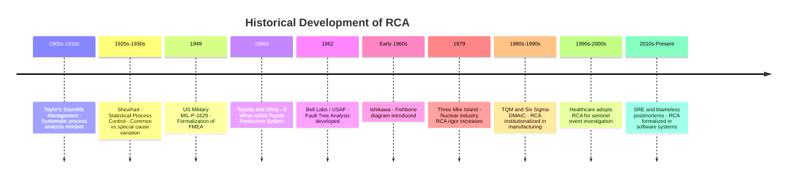

## Historical Origins of RCA in Industrial Engineering

### Overview

Root Cause Analysis did not emerge as a single invention but evolved incrementally across several disciplines — manufacturing, quality management, safety engineering, and systems reliability — over roughly a century. Its development is closely tied to the broader history of industrial quality control and the shift from craft-based to statistically and systematically managed production.

### Early 20th Century: Scientific Management Roots

**Key Points**

- Frederick Winslow Taylor's *Scientific Management* (early 1900s) introduced the idea of systematically analyzing work processes to identify inefficiencies, establishing a precedent for treating production problems as analyzable systems rather than unavoidable happenstance.
- This period established the underlying philosophy that problems in production have discoverable, addressable causes — a prerequisite mindset for RCA, though not yet a formal RCA methodology.

**[Unverified]** The direct lineage between Taylorist scientific management and specific later RCA techniques (such as the 5 Whys) is often asserted in secondary/practitioner literature but is not always rigorously documented with primary sourcing; it should be treated as a plausible philosophical precursor rather than a confirmed direct methodological ancestor.

### 1930s–1950s: Statistical Quality Control and the Toyota Production System

**Walter Shewhart and Statistical Process Control**

Walter Shewhart, working at Bell Labs in the 1920s–1930s, developed statistical process control (SPC), introducing the idea of distinguishing between **common cause variation** (inherent, systemic randomness in a process) and **special cause variation** (identifiable, addressable anomalies). This distinction is a direct conceptual ancestor of RCA's separation of routine noise from genuinely investigable root causes.

**W. Edwards Deming**

Deming extended Shewhart's work, particularly in postwar Japan, emphasizing that most quality problems stem from systemic/process causes rather than individual worker error — a principle central to modern blameless RCA culture.

**Sakichi Toyoda and the 5 Whys**

The **5 Whys** technique, one of the most widely used RCA methods, is most closely associated with **Sakichi Toyoda**, founder of Toyota Industries, and was formalized as a core practice within the **Toyota Production System (TPS)** during the mid-20th century. The technique became central to TPS principles of *jidoka* (automation with a human touch — stopping production immediately upon detecting a defect) and continuous improvement (*kaizen*).

**Taiichi Ohno**, the principal architect of TPS, popularized the 5 Whys as a shop-floor investigative tool, famously illustrated by his example of tracing a stopped welding machine back through five iterative "why" questions to a missing filter and, ultimately, a subcontracting practice — arriving at a process-level, not component-level, root cause.

### 1960s–1980s: Formalization in Reliability and Safety Engineering

**Failure Mode and Effects Analysis (FMEA)**

Developed by the U.S. military (MIL-P-1629, 1949) and later adopted extensively by NASA and the automotive/aerospace industries in the 1960s–1970s, FMEA introduced a proactive, pre-failure variant of root cause thinking — systematically enumerating potential failure modes before they occur, rather than only analyzing after-the-fact.

**Fault Tree Analysis (FTA)**

Developed at Bell Labs in 1962 for the U.S. Air Force Minuteman missile program, FTA introduced formal Boolean logic structures (AND/OR gates) to model how combinations of lower-level failures propagate to system-level failures — a more mathematically rigorous complement to the largely qualitative 5 Whys approach.

**Ishikawa (Fishbone) Diagrams**

**Kaoru Ishikawa**, a Japanese quality management pioneer, introduced the cause-and-effect diagram (fishbone/Ishikawa diagram) in the early 1960s as a visual tool for organizing multiple potential causal categories (commonly Materials, Methods, Machines, Manpower, Measurement, Environment) contributing to a single effect. This addressed a key limitation of the 5 Whys — its tendency toward a single linear chain — by supporting multi-branch causal investigation.

### 1980s–2000s: Institutionalization Across Industries

- **Total Quality Management (TQM)** movements in the 1980s–1990s incorporated RCA as a standard component of continuous improvement programs across manufacturing sectors globally.
- **Six Sigma** (developed at Motorola in 1986, later popularized by General Electric) formalized RCA within its DMAIC framework (Define, Measure, Analyze, Improve, Control), embedding root-cause identification as a required phase (Analyze) rather than an optional practice.
- **Nuclear and aviation safety industries** adopted rigorous RCA practices following high-profile incidents (e.g., the Three Mile Island accident, 1979), contributing methodologies like **Human Factors Analysis** and formal incident investigation boards, which emphasized systemic and organizational causes over individual operator blame.
- **Healthcare** adopted RCA formally in the 1990s–2000s, notably via the Veterans Health Administration and Joint Commission accreditation requirements in the U.S., applying it to patient safety incidents ("sentinel events").

### 2000s–Present: Extension into Software and Systems Engineering

**Key Points**

- RCA principles were adapted into **software engineering and IT operations** as systems grew more complex and distributed, particularly through the **postmortem** practice popularized by Google's Site Reliability Engineering (SRE) discipline (formalized publicly in the 2016 *Site Reliability Engineering* book).
- The **blameless postmortem** culture — explicitly tracing lineage to Deming-era systemic-cause thinking rather than individual blame — became a standard practice at technology companies for RCA following production incidents.
- Modern software RCA typically blends multiple historical techniques: the 5 Whys for linear investigation, Ishikawa-style categorization for multi-factor incidents, and fault-tree-like dependency graphs for distributed systems failure analysis.

### Historical Timeline

### Cross-Disciplinary Convergence

<svg xmlns="http://www.w3.org/2000/svg" viewBox="0 0 720 300">
<text x="360" y="22" text-anchor="middle" font-size="14" font-weight="bold" fill="#1a1a1a">Convergent Origins of Modern RCA (svg_diagram)</text>
<rect x="20" y="50" width="180" height="50" rx="6" fill="#d6eaf8" stroke="#2874a6" stroke-width="1.5" />
<text x="110" y="70" text-anchor="middle" font-size="10.5" font-weight="bold" fill="#1b4f72">Statistical Quality Control</text>
<text x="110" y="86" text-anchor="middle" font-size="9.5" fill="#1b4f72">Shewhart, Deming</text>
<rect x="270" y="50" width="180" height="50" rx="6" fill="#d5f5e3" stroke="#1e8449" stroke-width="1.5" />
<text x="360" y="70" text-anchor="middle" font-size="10.5" font-weight="bold" fill="#145a32">Toyota Production System</text>
<text x="360" y="86" text-anchor="middle" font-size="9.5" fill="#145a32">Toyoda, Ohno - 5 Whys</text>
<rect x="520" y="50" width="180" height="50" rx="6" fill="#fdebd0" stroke="#d68910" stroke-width="1.5" />
<text x="610" y="70" text-anchor="middle" font-size="10.5" font-weight="bold" fill="#7d5a0b">Reliability Engineering</text>
<text x="610" y="86" text-anchor="middle" font-size="9.5" fill="#7d5a0b">FMEA, Fault Tree Analysis</text>
<rect x="150" y="150" width="180" height="50" rx="6" fill="#f5eef8" stroke="#7d3c98" stroke-width="1.5" />
<text x="240" y="170" text-anchor="middle" font-size="10.5" font-weight="bold" fill="#4a235a">Quality Management</text>
<text x="240" y="186" text-anchor="middle" font-size="9.5" fill="#4a235a">Ishikawa, TQM, Six Sigma</text>
<rect x="400" y="150" width="180" height="50" rx="6" fill="#fdedec" stroke="#943126" stroke-width="1.5" />
<text x="490" y="170" text-anchor="middle" font-size="10.5" font-weight="bold" fill="#641e16">Safety Engineering</text>
<text x="490" y="186" text-anchor="middle" font-size="9.5" fill="#641e16">Nuclear, aviation, healthcare</text>
<rect x="270" y="240" width="180" height="50" rx="6" fill="#eaeded" stroke="#424949" stroke-width="1.5" />
<text x="360" y="260" text-anchor="middle" font-size="10.5" font-weight="bold" fill="#1c2833">Modern RCA Practice</text>
<text x="360" y="276" text-anchor="middle" font-size="9.5" fill="#1c2833">incl. software SRE postmortems</text>
<path d="M110,100 L240,148" stroke="#888" stroke-width="1.3" marker-end="url(#arrow4)" />
<path d="M360,100 L360,148" stroke="#888" stroke-width="1.3" marker-end="url(#arrow4)" />
<path d="M610,100 L490,148" stroke="#888" stroke-width="1.3" marker-end="url(#arrow4)" />
<path d="M240,200 L340,238" stroke="#888" stroke-width="1.3" marker-end="url(#arrow4)" />
<path d="M490,200 L390,238" stroke="#888" stroke-width="1.3" marker-end="url(#arrow4)" />
</svg>

### Conclusion

RCA's historical development reflects convergent evolution across independent disciplines rather than a single linear invention: statistical quality control contributed the causal-variation mindset, Toyota's manufacturing culture contributed the practical, accessible 5 Whys technique, reliability engineering contributed rigorous formal modeling (FMEA, FTA), and safety-critical industries contributed the systemic, blame-aware investigative culture. Modern RCA practice — including its adaptation into software engineering via SRE postmortems — draws on all of these lineages simultaneously.

### Related Topics

- The 5 Whys technique in depth: structure, strengths, and limitations
- Kaoru Ishikawa and the Fishbone diagram methodology
- Failure Mode and Effects Analysis (FMEA) as proactive RCA
- Fault Tree Analysis and Boolean causal modeling
- Deming's 14 Points and the systemic-cause philosophy of quality management
- Blameless postmortems in Site Reliability Engineering (SRE)
- Six Sigma's DMAIC framework and its Analyze phase