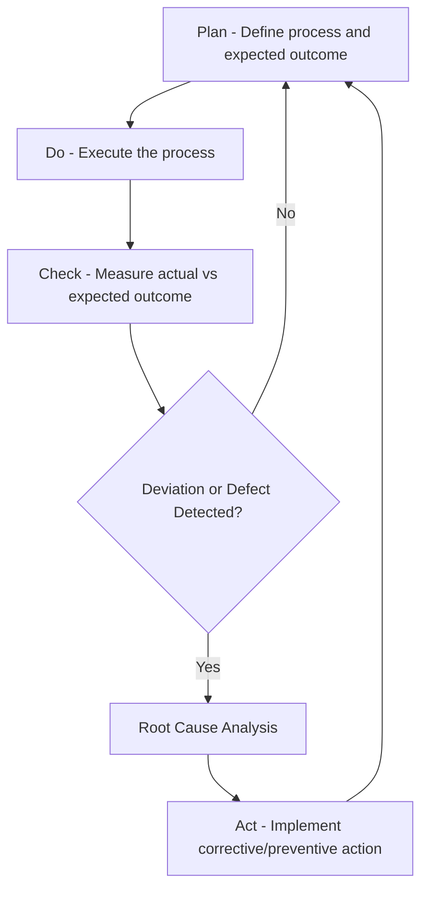

## RCA within Total Quality Management Philosophy

### Overview

Total Quality Management (TQM) is a holistic organizational philosophy centered on continuous improvement, customer focus, and the systemic elimination of defects across every process, not just final product inspection. Root Cause Analysis functions as one of TQM's core operational tools — the mechanism by which the philosophy's abstract commitment to "continuous improvement" is translated into concrete, repeatable action on specific quality problems.

### TQM Core Principles and RCA's Role

TQM is generally characterized by a set of interlocking principles, several of which directly depend on RCA to be operationally meaningful:

| TQM Principle | How RCA Operationalizes It |
| --- | --- |
| Customer focus | RCA on customer-reported defects traces complaints back to process failures, not just symptoms |
| Continuous improvement (Kaizen) | RCA provides the specific "what to improve" input for each improvement cycle |
| Process-centered thinking | RCA enforces investigation of *process* conditions rather than isolated events |
| Systemic, not individual, causation | RCA's emphasis on latent/systemic causes aligns with TQM's rejection of blame-based quality control |
| Fact-based decision making | RCA requires evidence-based causal validation rather than assumption |
| Everyone's responsibility | RCA techniques (5 Whys, fishbone) are designed to be usable by frontline workers, not only quality specialists |

### Deming's Influence: The Philosophical Foundation

**Key Points**

- W. Edwards Deming, whose work heavily shaped TQM (and, through it, the Toyota Production System and later Six Sigma), argued that the vast majority of quality problems (commonly cited as roughly 85–94% in Deming's writing) originate from **systemic/process causes** controllable by management, not from individual worker error.
- This claim is foundational to why TQM treats RCA as a *systemic* investigation tool rather than a disciplinary one — if most defects trace to process design, then RCA must examine processes, not assign blame to operators.
- Deming's **PDCA cycle** (Plan-Do-Check-Act, originally derived from Shewhart) is the iterative improvement loop within which RCA is embedded: the "Check" phase is where RCA is typically applied to understand why a process deviated from expected performance, feeding into the "Act" phase's corrective action.

**[Unverified]** The specific percentage figures (e.g., "94% of problems are system-caused") attributed to Deming vary across secondary sources and should be treated as an illustrative order-of-magnitude claim from Deming's writings rather than a precisely reproducible statistic.

### RCA's Position within the PDCA Cycle

RCA is positioned as the analytical bridge between detecting a deviation (Check) and correcting it structurally (Act). Without RCA, the Act phase risks correcting only the symptom, breaking the improvement cycle's ability to compound gains over successive iterations.

### TQM Tools Ecosystem Surrounding RCA

TQM did not rely on RCA in isolation; it packaged RCA alongside complementary tools, often referred to collectively as the "Seven Basic Tools of Quality" (attributed largely to Ishikawa's synthesis of existing statistical and quality methods):

1. **Cause-and-effect (Fishbone/Ishikawa) diagram** — the primary RCA visualization tool within TQM, organizing candidate causes by category.
2. **Check sheet** — structured data collection to support evidence-based RCA rather than anecdotal causal claims.
3. **Control chart** — distinguishes common-cause (systemic, expected) variation from special-cause (anomalous, investigable) variation, informing *when* RCA should be triggered.
4. **Histogram** — reveals distributional patterns in defect data that can suggest causal hypotheses.
5. **Pareto chart** — prioritizes which causes/defect categories to investigate first, based on the Pareto principle (roughly 80% of effects stem from 20% of causes).
6. **Scatter diagram** — tests hypothesized correlations between a candidate cause and an effect.
7. **Flowchart/stratification** — maps the process itself, helping locate where in the process a defect-causing deviation is introduced.

**Example**

A manufacturing line has a rising defect rate in a specific weld joint.

1. **Control chart** shows a shift from common-cause to special-cause variation starting on a specific date — signaling that RCA is warranted rather than accepting the deviation as normal process noise.
2. **Pareto chart** of defect types confirms weld joint failures account for the majority of total defects — justifying investigative priority.
3. **Fishbone diagram** organizes candidate causes across Machine (welder calibration), Method (weld procedure change), Material (new supplier batch), Manpower (recent staff rotation), Measurement (gauge drift), and Environment (humidity).
4. **5 Whys**, applied to the most probable branch (Method), traces the defect to an unauthorized procedure change made without updating the documented work instruction.
5. **Scatter diagram** confirms correlation between the procedure change date and defect rate increase, supporting the causal hypothesis before committing to corrective action.

### RCA and the TQM Rejection of Blame Culture

**Key Points**

- TQM explicitly discourages RCA conclusions that terminate at "operator error" without further investigation, because this contradicts the philosophy's premise that management-controlled systems, not individual workers, are the primary source of defects.
- This principle directly informs later blameless postmortem culture in software engineering (see historical origins content), which traces its philosophical lineage through TQM and Deming back to this same argument.
- Under TQM, if an RCA does legitimately conclude that an individual action was proximate to a defect, the analysis is expected to continue further: *why was that action possible, uncaught, or unsupported by adequate process safeguards?*

### Continuous Improvement as Compounding RCA Cycles

TQM treats quality improvement as cumulative rather than a one-time project: each RCA cycle, correctly executed, permanently removes one causal factor from the system, and successive cycles compound this effect over time. This is distinct from purely reactive quality control, which resets to the same baseline defect rate after each incident because no causal factor is permanently removed.

$$Q_{n} = Q_{n-1} \times (1 - r)$$

Where $Q_n$ represents the residual defect-causing conditions remaining after RCA cycle $n$, and $r$ represents the fractional reduction achieved per correctly executed RCA cycle. **[Inference]** This is a simplified conceptual model illustrating compounding improvement; real-world defect reduction under TQM is influenced by many confounding factors (new process introductions, scale changes, external supplier variation) and rarely follows a clean geometric decay in practice.

### Conclusion

Within TQM, RCA is not a standalone technique but an embedded analytical component of a broader philosophy: it operationalizes Deming's systemic-cause premise, integrates with the PDCA improvement cycle, and works alongside the Seven Basic Tools to convert raw defect data into validated, actionable process corrections — always oriented toward compounding, permanent quality improvement rather than one-off symptom relief.

### Related Topics

- Deming's PDCA (Plan-Do-Check-Act) cycle in depth
- The Seven Basic Tools of Quality and their individual applications
- Pareto Analysis for RCA prioritization
- Control charts and distinguishing common-cause from special-cause variation
- Six Sigma's DMAIC framework as TQM's statistically rigorous successor
- Blameless postmortem culture and its philosophical lineage from TQM