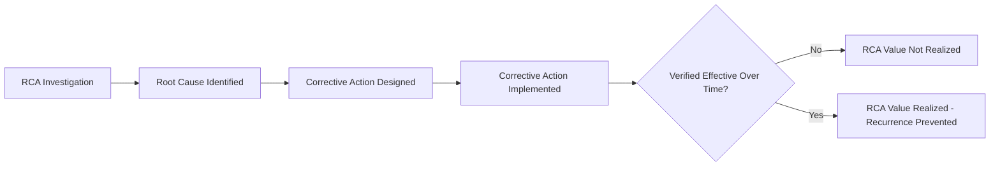

## Common Misconceptions about Root Cause Analysis

### Overview

Despite RCA's widespread adoption, its practical application is frequently undermined by a recurring set of misconceptions. These misunderstandings tend to produce investigations that are procedurally correct in form but analytically shallow — closing incidents without eliminating the conditions that caused them. This section catalogs the most common misconceptions and the corrective reasoning for each.

### Misconception 1: RCA Always Produces a Single Root Cause

**The misconception**: Every problem has exactly one root cause, and the goal of RCA is to find "the" answer.

**Why it's wrong**: Complex systems, particularly in software, manufacturing, and organizational contexts, frequently fail due to the **conjunction of multiple independent or interacting causal factors**, none of which alone would have caused the failure. Treating RCA as a search for a single culprit encourages investigators to stop prematurely at the first plausible explanation rather than continuing to map the full causal structure.

**Corrective framing**: RCA should identify the **complete set of necessary conditions** whose combination produced the failure, and evaluate each for whether removing it independently would have prevented the incident.

### Misconception 2: The 5 Whys Is Synonymous with RCA

**The misconception**: "Doing RCA" means running the 5 Whys technique, and any other approach is unnecessary.

**Why it's wrong**: The 5 Whys is one RCA *technique* among several (Fishbone diagrams, Fault Tree Analysis, Pareto Analysis, FMEA), each suited to different problem structures. The 5 Whys works well for linear, single-chain causal problems but is poorly suited to multi-branch or probabilistic failure modes, where it can produce a false sense of rigor while actually oversimplifying a genuinely complex causal structure.

**[Inference]** A common practical failure mode is applying the 5 Whys to a problem that actually has multiple contributing branches, producing a single linear narrative that omits equally valid alternative causal paths — this risk is inherent to the technique's structure rather than a flaw in any particular application of it.

### Misconception 3: Human Error Is an Acceptable Root Cause

**The misconception**: If an investigation traces the failure to a person making a mistake, "human error" is a valid, complete root cause and the RCA can conclude there.

**Why it's wrong**: "Human error" describes a proximate event, not a root cause — it is not actionable on its own (you cannot design out human fallibility) and it typically obscures further systemic questions: Why was the error possible? Why wasn't it caught? Why did the system allow a single human action to cause system-level failure?

**Example**

Non-corrective conclusion: "The engineer deployed the wrong configuration file — root cause: human error."

Corrected continuation:

- Why was the wrong file deployable? → No automated validation step existed.
- Why was there no validation step? → Deployment tooling was built for a smaller team without that safeguard.
- Why wasn't the tooling updated as the team grew? → No process owner was assigned to deployment tooling maintenance.

The last item is a genuinely actionable root cause; "human error" is not.

### Misconception 4: RCA Is Only for Major Incidents

**The misconception**: RCA is reserved for severe outages, safety incidents, or high-visibility failures; minor issues and near-misses don't warrant formal investigation.

**Why it's wrong**: Minor incidents and **near-misses** (events that could have caused failure but didn't, due to luck or partial safeguards) frequently share root causes with future major incidents. Mature RCA practice — notably in aviation and nuclear safety, and later adopted in SRE culture — explicitly investigates near-misses precisely because they expose the same latent conditions before those conditions cause a costlier failure.

### Misconception 5: Correlation Found During Investigation Equals Causation

**The misconception**: If a factor changed around the same time as the failure, it must be a cause.

**Why it's wrong**: Temporal coincidence is a common but insufficient basis for causal attribution. Without applying a necessity/sufficiency test (would the failure still have occurred without this factor?) or supporting evidence (logs, reproducible tests, controlled comparison), correlated factors risk being misidentified as causal, leading to ineffective corrective action while the true cause persists.

### Misconception 6: RCA Is a One-Time Activity Completed at Incident Closure

**The misconception**: Once an RCA document is written and the incident ticket is closed, the RCA process is complete.

**Why it's wrong**: RCA's value depends on the corrective action actually being implemented and **verified effective** over time. An RCA that identifies a root cause but whose corrective action is never implemented, or is implemented but not confirmed to prevent recurrence, delivers no more benefit than no RCA at all.

### Misconception 7: RCA Is Primarily About Assigning Responsibility

**The misconception**: The purpose of RCA is to determine who or what was at fault so accountability can be assigned.

**Why it's wrong**: Blame-oriented RCA actively undermines the investigation's accuracy, because participants who fear punitive consequences are incentivized to omit, minimize, or distort information. This directly contradicts RCA's evidentiary requirement. Blameless postmortem culture (formalized in SRE practice, philosophically rooted in Deming-era TQM) treats RCA as a systemic learning exercise specifically to preserve honest reporting.

### Misconception 8: A Fix That Resolves the Symptom Confirms the Root Cause Was Correct

**The misconception**: If applying a fix makes the symptom go away, this proves the identified root cause was accurate.

**Why it's wrong**: A symptom can disappear for reasons unrelated to the actual root cause — a fix might coincidentally address a different contributing factor, the triggering conditions might simply not have recurred yet, or the underlying issue may resurface under different circumstances. Symptom disappearance is *weak* supporting evidence at best; genuine confirmation requires monitoring over a sufficient period and, where feasible, reproducing the original failure conditions to confirm the fix specifically addresses the identified cause.

**[Inference]** This misconception is particularly risky in intermittent or load-dependent failures, where the absence of recurrence in a short observation window can easily be mistaken for resolution when the triggering conditions simply have not reoccurred yet.

### Misconception 9: More Whys Automatically Means a Better Root Cause

**The misconception**: The "5" in 5 Whys is a target to maximize — asking more why questions always yields a deeper, more valid root cause.

**Why it's wrong**: Five is a heuristic, not a rule. Some causal chains bottom out at a genuinely actionable root cause in three questions; others require more than five. Mechanically continuing past the point of actionability risks drifting into unfalsifiable or overly abstract territory (e.g., "the root cause is that the company doesn't value quality enough"), which is not a specific, correctable condition.

### Misconception 10: RCA Findings Are Objective Facts Rather Than Best-Available Conclusions

**The misconception**: A completed RCA represents the definitive, objective truth of what happened.

**Why it's wrong**: RCA conclusions are constrained by the evidence available at investigation time, which is often incomplete (missing logs, imperfect recall, destroyed physical evidence). Rigorous RCA practice treats findings as the **best current explanation consistent with available evidence**, remaining open to revision if new evidence emerges — rather than as an unrevisable final verdict.

### Summary Table

| Misconception | Corrective Principle |
| --- | --- |
| Always one root cause | Map the full set of necessary contributing conditions |
| 5 Whys = RCA | Match technique to problem structure (linear vs. multi-branch) |
| "Human error" is sufficient | Continue investigation until an actionable systemic factor is found |
| Only for major incidents | Investigate near-misses; they share root causes with future failures |
| Correlation = causation | Apply necessity/sufficiency testing before accepting a cause |
| RCA ends at ticket closure | Verify corrective action effectiveness over time |
| Purpose is assigning blame | Blameless framing preserves investigative accuracy |
| Symptom resolution confirms cause | Symptom absence is weak evidence; verify under original conditions |
| More whys = better | Stop at actionable specificity, not an arbitrary question count |
| Findings are objective fact | Treat conclusions as evidence-bound and revisable |

### Related Topics

- The necessity and sufficiency test for validating causal claims
- Blameless postmortem practices and psychological safety in investigation
- Near-miss reporting systems in safety-critical industries
- Verification and effectiveness monitoring of corrective actions
- Limitations of the 5 Whys technique and when to use Fishbone/FTA instead