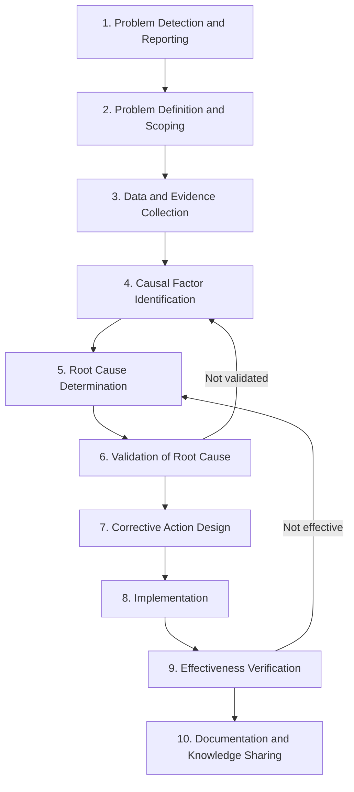

## Overview of the RCA Process Lifecycle

### Overview

The RCA process lifecycle is the structured sequence of phases an investigation moves through, from initial problem detection to verified, sustained resolution. While specific techniques (5 Whys, Fishbone, FTA) differ in their analytical mechanics, virtually all mature RCA methodologies share a common overarching lifecycle structure. Understanding this lifecycle is a prerequisite to applying any individual technique correctly, since misapplied techniques most often fail not from the technique itself but from skipping or rushing a lifecycle phase.

### The Lifecycle Phases

### Phase 1: Problem Detection and Reporting

**Key Points**

- The lifecycle begins when a deviation from expected behavior is detected — via monitoring/alerting, customer report, internal QA, audit, or near-miss observation.
- The quality of RCA is bounded by the quality of detection: undetected or unreported problems never enter the lifecycle at all, meaning detection infrastructure (monitoring, reporting channels, escalation paths) is itself a prerequisite investment for effective RCA culture.

### Phase 2: Problem Definition and Scoping

**Key Points**

- Before any causal investigation begins, the problem must be precisely and narrowly defined: what specifically happened, when, where, under what conditions, and to what extent (scope/impact).
- A vague or overly broad problem statement ("the system is slow") produces unfocused investigation; a precise statement ("checkout API p99 latency exceeded 4s for 12 minutes starting 14:02 UTC on affected region us-east-1") anchors subsequent evidence collection.
- This phase typically also defines what the problem is **not** — explicitly bounding scope prevents investigators from conflating unrelated concurrent issues with the target problem.

**Example**

Poor problem statement: "Deployment broke things."

Well-scoped problem statement: "The v2.4.1 deployment at 09:15 UTC caused a 15% increase in HTTP 500 errors on the `/api/orders` endpoint specifically, lasting until rollback at 09:42 UTC; no other endpoints or services were affected."

### Phase 3: Data and Evidence Collection

**Key Points**

- This phase gathers all available factual evidence relevant to the defined problem: logs, metrics, timestamps, configuration diffs, deployment history, witness/operator statements, and physical evidence where applicable (manufacturing/hardware contexts).
- Evidence collection should occur **before** causal hypotheses are formed where possible, to reduce confirmation bias — investigators who form a hypothesis first often unconsciously collect only confirming evidence.
- **[Inference]** In practice, some hypothesis formation is unavoidable even during collection since investigators must decide what evidence is relevant to gather; disciplined RCA practice mitigates this by deliberately gathering evidence that could *disconfirm* leading hypotheses, not only evidence that supports them.
- Time-sensitive evidence (memory state, transient logs, physical residue) often must be captured immediately, before the lifecycle can proceed further — this urgency is a common justification for initiating evidence preservation in parallel with initial incident response, not after it.

### Phase 4: Causal Factor Identification

**Key Points**

- Using the collected evidence, this phase generates the set of candidate causal factors that could explain the problem, typically via a structured technique (Fishbone diagram for categorized brainstorming, Fault Tree Analysis for formal logic-gate modeling, or an initial pass of the 5 Whys for linear chains).
- The goal here is breadth: generating a sufficiently complete set of candidate factors before narrowing, to avoid prematurely committing to the first plausible explanation (a common failure mode addressed in the misconceptions content).

### Phase 5: Root Cause Determination

**Key Points**

- Candidate causal factors from Phase 4 are iteratively narrowed and traced deeper (commonly via continued "why" questioning per factor) until reaching a condition that satisfies the actionability and necessity criteria for a genuine root cause.
- Multiple root causes may be determined if the evidence supports multiple independently necessary conditions.

### Phase 6: Validation of Root Cause

**Key Points**

- Before committing to corrective action, the candidate root cause(s) must be validated against the evidence — does the proposed root cause fully explain the observed symptom, timing, and scope of the problem? Are there aspects of the incident the proposed root cause fails to explain?
- Validation may include reproducing the failure under controlled conditions (where safe and feasible), reviewing the causal chain against a second investigator, or checking whether the same root cause explains prior related incidents.
- If validation fails — the proposed cause doesn't fully account for the evidence — the lifecycle returns to Phase 4/5 rather than proceeding to corrective action on an unverified hypothesis.

### Phase 7: Corrective Action Design

**Key Points**

- Corrective actions are designed specifically to eliminate or neutralize the validated root cause(s), distinct from any immediate containment/mitigation actions that may have already occurred during initial incident response (Phase 1).
- Effective corrective action design typically distinguishes:
  - **Corrective action**: Addresses the specific root cause found.
  - **Preventive action**: Addresses the broader class of risk the root cause represents, potentially generalizing beyond the specific instance investigated.
- Corrective actions should be evaluated for unintended side effects before implementation, since fixes made under time pressure can introduce new risks.

### Phase 8: Implementation

**Key Points**

- The designed corrective action is executed — code changes, process updates, training, equipment modification, documentation updates, or policy changes, depending on the domain.
- Implementation should be tracked to a defined owner and completion criteria; unowned or indefinitely deferred corrective actions are a common point of lifecycle failure in practice.

### Phase 9: Effectiveness Verification

**Key Points**

- This phase confirms, over a sufficient observation period, that the implemented corrective action actually prevents recurrence — not merely that the immediate symptom has not reappeared yet (see the "fix resolves symptom" misconception).
- Verification methods include monitoring relevant metrics over time, deliberately testing under previously failure-triggering conditions where safe, or auditing whether the same root-cause pattern reappears in unrelated incidents.
- If verification fails, the lifecycle returns to root cause determination (Phase 5) rather than assuming the original analysis was final.

### Phase 10: Documentation and Knowledge Sharing

**Key Points**

- The completed RCA — problem definition, evidence, causal chain, corrective action, and verification outcome — is documented and made accessible for institutional learning.
- This phase converts a single investigation into reusable organizational knowledge: informing design reviews, onboarding materials, and pattern recognition for future incidents that may share underlying causes.
- Documentation quality directly affects whether an organization can detect **recurring root causes across seemingly unrelated incidents** — a pattern only visible if past RCA records are searchable and consistently structured.

### Lifecycle as an Iterative, Non-Linear Process

While presented sequentially, the lifecycle includes explicit feedback loops (shown in the diagram above): failed validation returns investigation to causal identification, and failed effectiveness verification returns to root cause determination. Treating the lifecycle as strictly linear — proceeding from evidence directly to corrective action without validation checkpoints — is a common practical shortcut that undermines RCA rigor, particularly under organizational pressure to close incidents quickly.

### Typical Time Distribution

**[Inference]** In mature RCA practice, evidence collection and causal analysis (Phases 3–6) often consume a disproportionately large share of total investigation effort relative to corrective action implementation (Phases 7–8), since rigorous causal validation is comparatively labor-intensive; however, actual time distribution varies significantly by domain (software incidents vs. manufacturing defects vs. safety investigations) and is not governed by a fixed ratio.

### Related Topics

- Problem statement scoping techniques and precision criteria
- Evidence collection methodology and confirmation bias mitigation
- Validation techniques for candidate root causes
- Distinguishing corrective action from preventive action
- Effectiveness verification methods and monitoring design
- Postmortem documentation standards and organizational knowledge bases