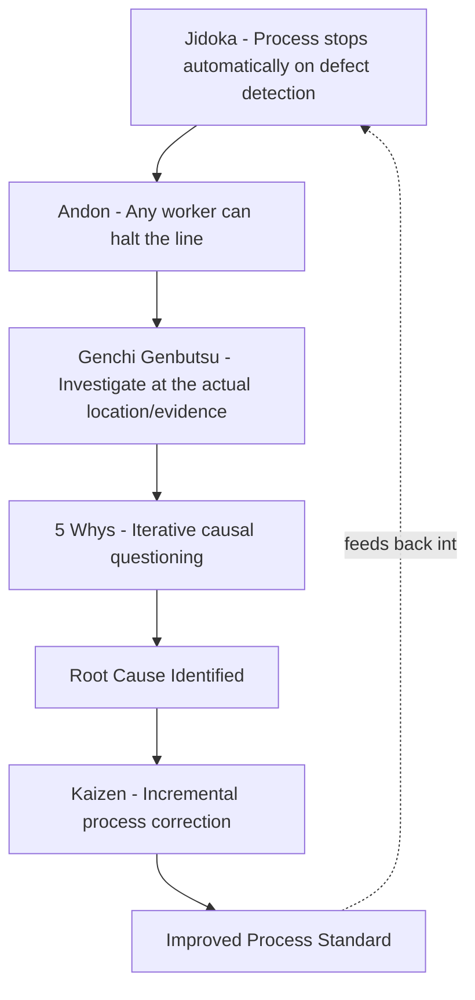

## Origins at Toyota and the Toyota Production System

### Overview

The 5 Whys technique's identity as *the* most recognizable RCA method is inseparable from its origins within the Toyota Production System (TPS). Understanding this origin is not merely historical trivia — TPS's surrounding philosophy (jidoka, kaizen, genchi genbutsu) shapes how the 5 Whys is meant to be applied, and much of the technique's misapplication in other contexts stems from extracting the questioning format while discarding the TPS principles that originally constrained and validated it.

### Sakichi Toyoda: Founding Influence

**Key Points**

- **Sakichi Toyoda** (1867–1930), founder of Toyota Industries (originally a loom manufacturing company before automotive expansion), is widely credited as the philosophical originator of the iterative "why" questioning approach, rooted in his engineering practice of deeply investigating mechanical failures rather than accepting surface explanations.
- Toyoda's most direct technical legacy relevant to RCA is the invention of the **automatic loom with a non-stop shuttle-change mechanism**, which included a built-in ability to detect a broken thread and stop the machine automatically — embodying the principle that a system should surface problems immediately rather than continue producing defects. This mechanical principle became the seed of **jidoka**.

### Jidoka: Automation with a Human Touch

**Key Points**

- **Jidoka** (自働化) is a core TPS pillar meaning roughly "automation with a human touch" — machines and processes are designed to detect abnormalities and **stop immediately** upon detecting a defect, rather than continuing to produce defective output downstream.
- Jidoka is structurally significant to the 5 Whys because it creates the **precondition for effective RCA**: a stopped process, investigated at the moment of failure, preserves far more diagnostic evidence (machine state, operator context, immediate conditions) than a defect discovered much later after further processing has occurred.
- This connects directly to Phase 3 of the general RCA lifecycle (evidence collection) — jidoka is, in effect, an organizational design choice that optimizes for evidence preservation at the moment of failure.

### Taiichi Ohno and the Popularization of the 5 Whys

**Key Points**

- **Taiichi Ohno** (1912–1990), the principal architect of the Toyota Production System as a coherent management philosophy, is most closely credited with formalizing and popularizing the 5 Whys as a shop-floor investigative practice during the mid-20th century.
- Ohno framed the technique not as an abstract quality tool but as a practical discipline for **frontline workers and supervisors**, explicitly designed to be usable without specialized statistical training — distinguishing it from more formal/statistical quality methods being developed concurrently in the West (e.g., Shewhart's control charts).
- Ohno's own writing illustrates the method with the frequently cited example of investigating a stopped welding robot: repeated "why" questioning traces the immediate mechanical failure (blown fuse, overloaded circuit) progressively backward through insufficient lubrication, a malfunctioning pump, worn-out shaft debris, and ultimately to the absence of a strainer on the pump — a root cause fixable with a low-cost part, rather than simply replacing the fuse repeatedly.

**[Unverified]** The exact wording and number of iterations in Ohno's original welding-robot example vary somewhat across different secondary retellings in management literature; the core structural lesson (iterative causal tracing to a low-level, easily-missed physical/process cause) is consistently preserved across versions, even where precise phrasing differs.

### Genchi Genbutsu: "Go and See"

**Key Points**

- **Genchi genbutsu** (現地現物, "go and see for yourself") is a related TPS principle requiring that investigation occur at the actual location of the problem, examining the actual physical evidence, rather than relying on secondhand reports or assumptions.
- This principle directly shapes how the 5 Whys was originally meant to be applied: each "why" answer was expected to be grounded in direct observation of the process, not speculative reasoning at a remove from the actual production floor.
- **[Inference]** A significant portion of modern criticism of the 5 Whys (that it produces shallow or speculative answers) may stem from applying the questioning format divorced from genchi genbutsu — i.e., generating "why" answers through discussion or assumption rather than direct evidence-gathering at the source, which was not how the technique was originally intended to function within TPS.

### Kaizen: Continuous, Incremental Improvement

**Key Points**

- **Kaizen** (改善, "change for better"/continuous improvement) is the overarching TPS philosophy within which the 5 Whys operates as a tactical tool — each root cause identified and corrected represents one incremental improvement contributing to a compounding, long-term quality trajectory, mirroring TQM's PDCA-based improvement cycle discussed in the TQM content.
- Under kaizen, RCA (via 5 Whys) is expected to be performed **continuously and by frontline workers themselves**, not solely by specialized quality engineers, reflecting TPS's broader philosophy of distributed responsibility for quality (related to the andon cord system, which allowed any line worker to halt production upon detecting a problem).

### Structural Position within TPS

### Why the TPS Context Matters for Correct Application

**Key Points**

- The 5 Whys, extracted from TPS and applied as a standalone checklist technique (as it commonly is today across software, healthcare, and other industries), loses several implicit supports that originally made it effective within Toyota:
  1. **Evidence proximity** (via jidoka's immediate stopping and genchi genbutsu's on-site investigation) — without these, "why" answers risk being speculative rather than evidence-grounded.
  2. **Cultural safety for stopping/reporting** (via andon and non-punitive investigation norms) — without psychological safety, workers may not surface true causal information.
  3. **Integration into a continuous improvement loop** (via kaizen) — without this, RCA findings risk being one-off rather than contributing to compounding systemic improvement.
- **[Inference]** This context explains a common critique of 5 Whys implementations outside manufacturing: the technique itself is not inherently shallow, but many implementations omit the surrounding organizational supports (evidence discipline, psychological safety, systemic follow-through) that made it rigorous in its original TPS context.

### Related Topics

- Jidoka and defect-detection design in manufacturing systems
- Genchi genbutsu and evidence-based investigation discipline
- Andon systems and distributed quality responsibility
- Kaizen and continuous improvement cycles
- Strengths and limitations of the 5 Whys technique outside manufacturing contexts
- Comparing the 5 Whys to Ishikawa diagrams for multi-branch causal problems