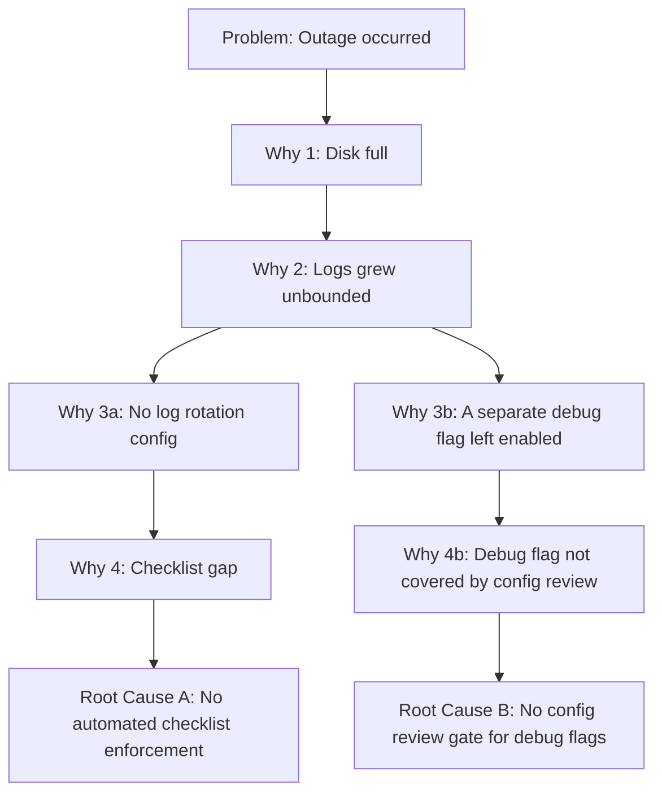

## Core Mechanics of the Iterative Why Asking Process

### Overview

The 5 Whys technique's mechanics are deceptively simple in description — ask "why" repeatedly until reaching a root cause — but rigorous application requires structural discipline that distinguishes valid causal chains from superficial or speculative ones. This section details the actual mechanics: how each iteration should be constructed, validated, and terminated.

### Basic Structure

The technique proceeds as a sequential chain, where each answer becomes the subject of the next question:



```
Problem statement
  → Why did [problem] happen? → Answer 1
    → Why did [Answer 1] happen? → Answer 2
      → Why did [Answer 2] happen? → Answer 3
        → Why did [Answer 3] happen? → Answer 4
          → Why did [Answer 4] happen? → Answer 5 (candidate root cause)
```

**Key Points**

- "5" is a heuristic convention, not a fixed rule — some chains terminate at a genuine root cause in 3 iterations; others require 7 or more. The number of iterations should be determined by when the actionability criterion (below) is met, not by a fixed count.
- Each step must be a **direct, evidence-supported answer** to the immediately preceding why-question — not a restatement of the problem, not a speculative leap, and not an answer to a *different* question than the one asked.

### Mechanics of a Single Iteration

Each iteration consists of three sub-steps, though practitioners often collapse them into a single visible question-answer pair:

1. **Formulate the why-question** precisely against the prior answer's specific claim (not the original problem statement).
2. **Gather or cite evidence** supporting the answer — per genchi genbutsu discipline, this should be grounded in direct observation, logs, or verifiable data rather than assumption.
3. **State the answer as a specific, falsifiable causal claim** — vague answers ("communication issues," "process wasn't followed") should be pushed to greater specificity before proceeding to the next why.

**Example**

Problem: A production database experienced a 20-minute outage.

| Iteration | Question | Answer |
| --- | --- | --- |
| Why 1 | Why did the database go down? | Disk space reached 100% capacity |
| Why 2 | Why did disk space reach 100% capacity? | Log files grew unbounded over 6 hours |
| Why 3 | Why did log files grow unbounded? | Log rotation was not configured for the new logging module |
| Why 4 | Why was log rotation not configured for the new module? | The module was added last sprint without updating the deployment checklist |
| Why 5 | Why does the deployment checklist not auto-update for new modules? | No automated check enforces checklist completeness against the codebase |

Here, Why 5 reaches an actionable systemic condition (missing automated enforcement), distinct from Why 1's mere symptom description.

### The Single-Chain Constraint

**Key Points**

- Classical 5 Whys is structurally a **single linear chain** — at each step, exactly one answer is selected and carried forward to the next question.
- This is both the technique's core strength (simplicity, speed, low training barrier) and its principal structural limitation: real incidents often have **multiple valid "why" answers at a given step**, and the standard technique provides no built-in mechanism for exploring more than one branch simultaneously.
- When multiple plausible answers exist at a given iteration, practitioners commonly either (a) select the most evidence-supported answer and note the alternative(s) for separate investigation, or (b) branch into a tree structure — at which point the investigation functionally becomes closer to a Fishbone diagram or Fault Tree Analysis rather than pure 5 Whys.



When branching occurs, as illustrated above, the investigation should track each branch to its own root cause rather than forcing a single linear narrative — an incident with genuinely multiple independent causes should not be artificially collapsed into one chain.

### Termination Criteria

**Key Points**

- The chain should terminate when the current answer satisfies **all** of the following, not merely when a fixed number of questions has been asked:
  1. **Actionability**: The organization can directly design a corrective action targeting this condition.
  2. **Necessity**: If this condition had not existed, the failure would not have occurred (see the necessity test in Root Cause vs. Symptom vs. Trigger).
  3. **Non-triviality**: The answer is not itself trivially explainable by "that's just how the system/process/world works" in a way that offers no corrective leverage (over-generalizing past productive specificity).
- Continuing to ask "why" past this point risks drifting into unfalsifiable, overly abstract, or organizationally unproductive territory (e.g., "why does the organization sometimes make mistakes" → "because it's run by humans" — not actionable).

### Common Mechanical Errors

| Error | Description | Correction |
| --- | --- | --- |
| Restating the problem | Answer merely rephrases the original symptom rather than explaining a cause | Ensure each answer introduces new causal information |
| Jumping levels | Answer skips several causal layers, hiding intermediate steps | Slow down; verify each step is the *direct* explanation of the prior one |
| Unsupported speculation | Answer is asserted without evidence | Apply genchi genbutsu — verify with logs, data, or direct observation before proceeding |
| Premature stop at "human error" | Chain terminates at an individual action without further systemic questioning | Continue: why was that action possible/uncaught? |
| False single-chain forcing | Multiple valid causes at one step are arbitrarily collapsed into one | Branch the investigation or run separate chains per plausible cause |
| Stopping at organizational policy without specificity | "Because policy doesn't require it" without identifying *why* the policy gap exists or how to close it | Push one level further to identify the specific, correctable policy gap |

### Documentation Format

A well-documented 5 Whys chain typically records, for each iteration: the question, the answer, the supporting evidence or source, and (at the final step) an explicit statement of why the actionability/necessity criteria are satisfied. This creates an auditable record supporting the validation phase of the broader RCA lifecycle, and allows a second reviewer to assess whether each causal link is adequately supported rather than merely asserted.

### Related Topics

- Necessity and sufficiency testing for validating each causal link
- Branching structures: when 5 Whys should transition to Fishbone or Fault Tree Analysis
- Genchi genbutsu and evidence discipline in causal claims
- Common misconceptions about RCA (premature termination, human error as root cause)
- Documentation standards for auditable causal chains