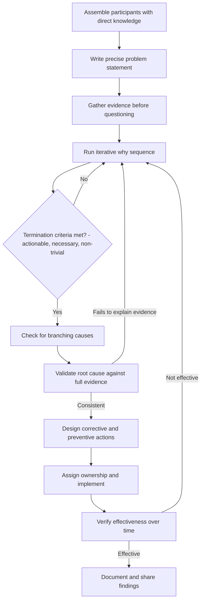

## Step by Step Walkthrough of a 5 Whys Session

### Overview

This section provides a complete, procedural walkthrough of running a 5 Whys session end-to-end — from initial problem framing through documented corrective action — using a realistic software incident as the working example. Unlike the mechanics content (which covers the internal logic of each why-iteration), this walkthrough covers the **session-level procedure**: who is involved, what happens before and after the questioning itself, and how the session integrates with the broader RCA lifecycle.

### Pre-Session: Assembling the Right Participants

**Key Points**

- Effective 5 Whys sessions include people with **direct, firsthand knowledge** of the process or system involved (per genchi genbutsu), not only managers or facilitators removed from the actual work.
- A neutral facilitator is often valuable to keep questioning evidence-based and prevent the session from drifting into blame attribution or premature conclusions.
- Sessions are typically time-boxed (commonly 30–60 minutes) to maintain focus, with follow-up investigation scheduled separately if evidence gathering proves more extensive than anticipated.

### Step 1: Write a Precise Problem Statement

Before any why-question is asked, the team agrees on a specific, scoped problem statement (per the Problem Definition and Scoping phase of the general RCA lifecycle).

**Example — working scenario**

> **Problem statement**: On 2026-09-10 at 03:14 UTC, the nightly batch job `invoice-reconciliation` failed for all tenants, delaying invoice generation by 9 hours. No code deployment occurred in the 24 hours prior. The job had run successfully every night for the preceding 11 months.

### Step 2: Gather Available Evidence Before Questioning Begins

The team collects logs, error messages, metrics, and timing data relevant to the problem statement.

**Example — evidence gathered**

- Job logs show the failure: `ConnectionTimeoutError: could not connect to replica-db-03 after 30000ms`.
- Infrastructure dashboard shows `replica-db-03` CPU utilization spiked to 98% at 03:10 UTC.
- No deployments or config changes are recorded in the deployment log for the prior 48 hours.
- A separate scheduled job, `monthly-analytics-export`, is found in the job scheduler configured to run at 03:00 UTC on the 10th of each month.

### Step 3: Run the Iterative Why Sequence

With evidence in hand, the team proceeds through the chain, grounding each answer in the gathered evidence rather than speculation.

| # | Question | Answer | Supporting Evidence |
| --- | --- | --- | --- |
| Why 1 | Why did `invoice-reconciliation` fail? | It could not connect to `replica-db-03` within the 30-second timeout | Job log error message |
| Why 2 | Why could it not connect within 30 seconds? | `replica-db-03` CPU was at 98% utilization, causing connection acceptance delays | Infrastructure monitoring dashboard |
| Why 3 | Why was CPU at 98% at that time? | `monthly-analytics-export` was running a full-table scan against the same replica concurrently | Job scheduler configuration and query logs |
| Why 4 | Why were both jobs scheduled to run concurrently against the same replica? | No scheduling coordination mechanism exists to prevent resource-intensive jobs from overlapping | Review of job scheduler design and configuration history |
| Why 5 | Why does no coordination mechanism exist? | The job scheduler was designed for a small number of independent jobs early in the system's history and was never revisited as job count and resource intensity grew | Interview with original scheduler implementer; commit history showing scheduler unchanged since initial implementation |

### Step 4: Apply Termination Criteria

At each step, the team checks whether the answer is actionable, necessary, and non-trivial before proceeding further (per the mechanics content's termination criteria).

- **Why 5 evaluated**: Is it actionable? Yes — a scheduling coordination mechanism can be designed and implemented. Is it necessary? Yes — if such a mechanism existed, this specific resource contention would not have occurred regardless of which two jobs happened to overlap. Is it non-trivial? Yes — it identifies a specific, correctable structural gap, not merely "the system is old."

The team stops at Why 5, having satisfied all three criteria.

### Step 5: Check for Branching Causes

Before finalizing, the team explicitly considers whether other valid "why" answers existed at any step that were set aside for the primary chain.

**Example — branch check**

> At Why 3, the team also notes: "Why did `replica-db-03` specifically lack headroom for a concurrent full-table scan?" This surfaces a secondary, related but distinct factor — the replica's provisioned capacity was sized for `invoice-reconciliation` alone, without accounting for other jobs later added to the same replica. This is documented as a **contributing factor** alongside the primary root cause, since it independently increases the risk of similar future contention even after the scheduling gap is fixed.

### Step 6: Validate the Root Cause Against the Evidence

The team checks whether the identified root cause fully explains the observed problem's scope and timing.

- Does it explain why the failure occurred specifically on the 10th? Yes — `monthly-analytics-export` only runs on the 10th.
- Does it explain why the job had run successfully for 11 months prior? Yes — `monthly-analytics-export` was introduced only in the prior month, per deployment history reviewed during validation.
- Does any evidence contradict the proposed root cause? None found.

This step confirms the causal chain is internally consistent with all available evidence before proceeding to corrective action.

### Step 7: Design Corrective and Preventive Actions

Distinguishing corrective action (fixing this specific instance) from preventive action (addressing the broader class of risk), per the general RCA lifecycle's Phase 7.

**Example**

- **Corrective action**: Reschedule `monthly-analytics-export` to run against a dedicated read replica, or at a time with no overlapping resource-intensive jobs.
- **Preventive action**: Implement a job scheduling coordination check that flags or blocks new job schedules from overlapping with existing resource-intensive jobs against the same database target; review and right-size replica capacity provisioning process to account for all jobs targeting a given replica, not just the original one.

### Step 8: Assign Ownership and Implement

Each corrective/preventive action is assigned an owner and a completion target, tracked to closure rather than left as an unowned recommendation (addressing the common lifecycle failure mode of unimplemented findings).

### Step 9: Verify Effectiveness Over Time

**Example**

> Following implementation, the team monitors the next three occurrences of `monthly-analytics-export` (subsequent months) to confirm no recurrence of the connection timeout, and reviews whether the new scheduling check successfully flags a subsequent, unrelated scheduling conflict introduced by a different team — confirming the preventive action generalizes beyond the original incident.

### Step 10: Document and Share

The completed chain, evidence, corrective/preventive actions, and verification outcome are recorded in a shared, searchable format (e.g., an incident postmortem repository), enabling future investigators to recognize similar resource-contention patterns.

### Full Session Flow

### Session Anti-Patterns to Avoid

- **Skipping evidence gathering** and proceeding directly from problem statement to questioning based on assumption.
- **Facilitator or senior participant dominating answers** without input from those with direct operational knowledge of the failure.
- **Treating the first coherent-sounding chain as final** without validating it explains the full scope and timing of the incident.
- **Closing the session without assigning ownership** for corrective actions, leaving findings undocumented and unimplemented.

### Related Topics

- Evidence collection and confirmation bias mitigation in RCA
- Validating candidate root causes against full incident evidence
- Distinguishing corrective action from preventive action
- Effectiveness verification methods for implemented fixes
- Documentation standards for searchable, reusable RCA records