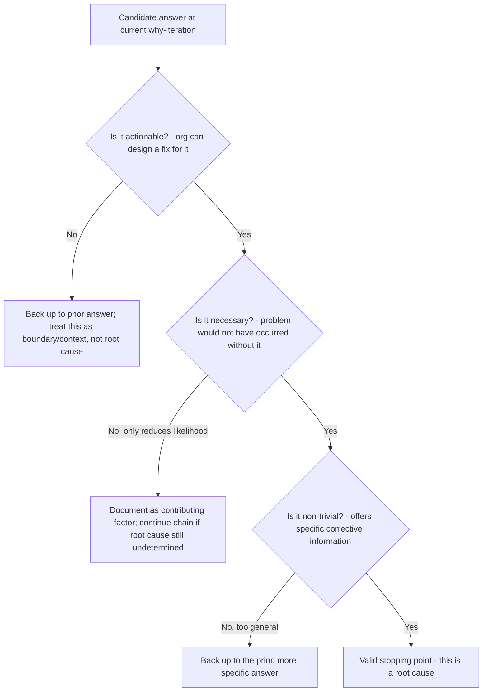

## Determining When Enough Whys Have Been Asked

### Overview

One of the most consequential judgment calls in a 5 Whys session is deciding when to stop. Stopping too early leaves the investigation at a symptom or intermediate cause; continuing past the point of actionability drifts into unfalsifiable or organizationally unproductive territory. This section formalizes the termination decision beyond the brief criteria introduced in the mechanics content, providing concrete decision procedures and worked boundary cases.

### The Three Termination Criteria, Expanded

**Key Points**

As established in the mechanics content, a candidate stopping point must satisfy actionability, necessity, and non-triviality. Each deserves closer examination as an independent test, since a chain can fail on any one of them even while appearing to satisfy the others.

**1. Actionability**

Ask: *"Can the organization directly design and implement a corrective action targeting this specific condition?"*

- If the answer describes something outside the organization's control (e.g., "the internet is inherently unreliable," "customers sometimes make mistakes"), it fails actionability — the investigation should back up to the most recent answer that *was* within the organization's control, even if that means stopping one level earlier than a technically "truer" but unactionable statement.
- If the answer is actionable but only through disproportionate or impractical means (e.g., "rewrite the entire platform"), this may indicate the chain should branch to find a more targeted, proportionate intervention point rather than accepting an technically-correct-but-impractical root cause as final.

**2. Necessity**

Ask: *"If this specific condition had not existed, would the observed problem have been prevented?"*

- Apply this counterfactually and specifically to the validated problem statement — not to a vaguely similar future problem.
- If removing the candidate cause would *reduce likelihood* but not *prevent* the specific incident, it is a contributing factor, not (sole) root cause — continue investigating, or document it as a contributing factor alongside a still-undetermined root cause.

**3. Non-triviality**

Ask: *"Does this answer provide new, specific, corrective information, or does it merely restate an unavoidable general truth?"*

- Answers like "because software has bugs," "because people make mistakes," or "because things break over time" are trivially true of virtually any system and offer no differentiating corrective leverage — they indicate the chain has been pushed past its useful depth.
- A non-trivial answer should be specific enough that a reader unfamiliar with the incident could identify a concrete design or process change from it.

### Decision Procedure

### Worked Boundary Cases

**Case 1: Stopping too early (fails actionability check on the chosen level, but a deeper actionable cause exists)**

> Why 1: Why did the report generate incorrect totals? → Because a formula referenced the wrong column.
>
> Why 2: Why did the formula reference the wrong column? → Because a column was inserted earlier in the spreadsheet, shifting references.

If the team stops here, the "root cause" (column insertion) is actionable only in the narrow, non-generalizable sense of "don't insert columns" — it doesn't explain why the formula was fragile to insertion in the first place, nor prevent the same class of error in other spreadsheets. Continuing:

> Why 3: Why was the formula vulnerable to a column insertion? → Because it used relative column references instead of named ranges or structured table references.

This is a more genuinely actionable and generalizable root cause — it explains a design choice that can be systematically corrected (e.g., a spreadsheet-design standard requiring structured references) and would prevent the entire class of insertion-related formula errors, not just this specific instance.

**Case 2: Stopping too late (drifting past actionability into triviality)**

> Why 5: Why did the deployment pipeline lack a rollback safeguard? → Because the team prioritized shipping speed over defensive tooling.
>
> Why 6 (over-extension): Why did the team prioritize speed over defensive tooling? → Because the industry generally rewards fast shipping.
>
> Why 7 (over-extension): Why does the industry reward fast shipping? → Because competitive markets favor speed.

Why 6 and 7 have drifted outside the organization's actionable control and into general, trivially-true industry commentary. The valid stopping point was Why 5 — "team prioritized shipping speed over defensive tooling" is itself actionable (e.g., establish a minimum defensive-tooling bar in the deployment process, independent of shipping-speed pressure) and specific enough to inform a concrete policy change.

**Case 3: Ambiguous — necessity test resolves it**

> Candidate root cause: "The on-call engineer was inexperienced with this subsystem."

Apply the necessity test: would an experienced engineer necessarily have prevented this failure? If the underlying system provided no diagnostic tooling or documentation regardless of experience level, an experienced engineer might have resolved it faster but the underlying defect would still exist and could still cause impact. This suggests "engineer inexperience" is a contributing factor affecting *time-to-resolution*, not the root cause of the *defect's existence* — the chain should continue toward why adequate diagnostic tooling/documentation was unavailable.

### The "So What" Test as a Practical Heuristic

**Key Points**

A useful practical supplement to the formal criteria: after each candidate stopping point, ask *"So what would we actually do differently tomorrow if this is the final answer?"*

- If the team can articulate a specific, concrete change, the criteria are likely satisfied.
- If the answer produces only vague responses ("we'd try to be more careful," "we'd remind people to pay attention"), this signals either insufficient actionability or insufficient specificity, and the chain should continue or branch.

### When Multiple Valid Stopping Points Exist

**Key Points**

- It is valid — and often correct — for a 5 Whys session to conclude with **more than one** root cause when the evidence supports multiple independently necessary conditions (see the branching structure discussed in the mechanics content).
- Forcing a single stopping point when the evidence genuinely supports parallel causal branches reintroduces the "single root cause" misconception, potentially leaving one valid corrective opportunity unaddressed.

### Summary Checklist

Before finalizing a stopping point, confirm:

- [ ] The organization can design a specific corrective action targeting this condition (actionability)
- [ ] Removing this condition would have prevented the specific documented incident (necessity)
- [ ] The answer is specific enough to inform a concrete change, not a general truism (non-triviality)
- [ ] The "so what" test produces a concrete, differentiated action
- [ ] Alternative branches at each prior step have been considered and either folded in as contributing factors or explicitly ruled out with evidence

### Related Topics

- Core mechanics of the iterative why-asking process
- Necessity and sufficiency testing for causal claims
- Common misconceptions: "more whys is always better" and premature termination at human error
- Branching structures and multi-root-cause investigations
- Validating root causes against full incident evidence