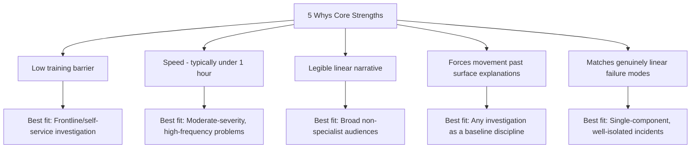

## Strengths and Ideal Use Cases of the Technique

### Overview

The 5 Whys occupies a distinct niche within the broader RCA toolkit. Understanding precisely where it excels — rather than treating it as a universal default — is essential for selecting it appropriately over alternatives like Fishbone diagrams or Fault Tree Analysis. This section catalogs the technique's genuine strengths and the problem characteristics that make it the right tool.

### Core Strengths

**1. Low Barrier to Entry**

**Key Points**

- The technique requires no specialized statistical training, software tooling, or facilitation expertise — it can be conducted by frontline practitioners with only the discipline to ask "why" and ground each answer in evidence.
- This accessibility was a deliberate design characteristic within TPS: Ohno intended the method to be usable directly by shop-floor workers and supervisors, not only by dedicated quality engineers.
- **[Inference]** This low barrier is likely the primary reason the 5 Whys remains the most widely recognized RCA technique across industries outside manufacturing, since it requires minimal onboarding investment relative to statistically grounded alternatives.

**2. Speed**

**Key Points**

- A well-scoped 5 Whys session can typically be completed in well under an hour, compared to more elaborate techniques (Fault Tree Analysis, formal FMEA) that may require days of structured modeling.
- This makes it well suited to high-frequency, moderate-severity problems where investigation cost must remain proportionate to the problem's impact.

**3. Direct Traceability of the Causal Narrative**

**Key Points**

- Because the technique produces a single linear chain (in its classical form), the resulting causal narrative is easy for non-specialist stakeholders to read, understand, and verify — each step follows visibly from the last, unlike a dense fault tree or multi-branch fishbone diagram that requires more interpretive effort.
- This readability makes 5 Whys output well suited for sharing in postmortem documents intended for broad organizational audiences, not just RCA specialists.

**4. Forces Movement Past Surface-Level Explanations**

**Key Points**

- The technique's core mechanical discipline — refusing to stop at the first answer — directly counters the common failure mode of accepting a proximate cause or trigger as if it were a root cause.
- Even where the technique's other limitations apply, this forcing function has standalone value: teams that adopt even a partial 5 Whys discipline (asking "why" at least two or three times beyond the first answer) tend to surface more systemic factors than teams that stop at the first plausible explanation.

**5. Naturally Aligns with Sequential/Linear Failure Modes**

**Key Points**

- Many real-world failures genuinely do follow a single dominant causal chain, particularly in well-understood, single-component systems — in these cases, the linear structure of 5 Whys is not a limitation but an accurate reflection of the underlying causal reality, and imposing a more complex multi-branch technique would add unnecessary overhead.

### Ideal Use Cases

| Use Case Characteristic | Why 5 Whys Fits |
| --- | --- |
| Single, well-defined incident with a discoverable linear cause chain | Matches the technique's native linear structure |
| Moderate-severity, moderate-frequency problems | Investigation cost/speed tradeoff is proportionate |
| Frontline teams without dedicated quality/RCA specialists | Low training barrier enables self-service investigation |
| Need for a quick initial hypothesis before deeper investigation | Can serve as a fast first pass, escalated to Fishbone/FTA if branching emerges |
| Audience includes non-specialist stakeholders who need to understand the causal story | Linear narrative is more broadly legible than fault trees |
| Organizational culture already supports blameless, evidence-based investigation (TPS-style genchi genbutsu) | Technique performs as originally designed under these conditions |

### Worked Example: A Good Fit

**Example**

Scenario: A specific API endpoint returns incorrect data for a narrow set of inputs, discovered via a single bug report.

Why this fits 5 Whys well:

- The failure is a single, well-isolated incident (not a systemic pattern across many unrelated failures).
- The likely causal chain is genuinely linear: a specific code path → a specific logic error → a specific missing test case → a specific gap in test coverage requirements.
- A quick 5 Whys session by the engineer who owns the code, grounded in direct log/code inspection (genchi genbutsu), can plausibly reach an actionable root cause within 20–30 minutes without requiring a formal fishbone workshop.

### Contrast: Where 5 Whys Is a Poor Fit (Boundary Awareness)

**Key Points**

While a full comparative treatment belongs in a dedicated comparison of techniques, understanding the technique's strengths requires recognizing where those strengths do *not* transfer:

- **Multi-causal, systemic problems** (e.g., a rising defect rate across many unrelated production batches) — where the failure genuinely has several independent contributing categories (Machine, Method, Material, Manpower, Measurement, Environment) — are better served by a Fishbone diagram's explicit multi-branch structure.
- **Safety-critical or high-consequence systems** requiring formal, auditable, probabilistic causal modeling (aerospace, nuclear) are better served by Fault Tree Analysis, whose Boolean logic-gate structure supports rigorous verification in a way a narrative why-chain does not.
- **Problems where evidence is genuinely ambiguous or contested** among stakeholders may require the more structured, categorized brainstorming of a Fishbone session (with multiple participants proposing candidate causes across categories) rather than a single linear narrative that can inadvertently privilege one investigator's initial framing.

### Strengths Summary Diagram

### Conclusion

The 5 Whys' strengths are not merely "simplicity" in the abstract but specific, situational advantages: low barrier to entry, speed, narrative legibility, and a forcing function against premature symptom-acceptance. These strengths make it the right default choice specifically for well-isolated, plausibly linear problems investigated by non-specialist practitioners under time constraints — and the wrong choice when a problem's causal structure is genuinely multi-branch, safety-critical, or contested enough to require more rigorous, auditable modeling.

### Related Topics

- Limitations and failure modes of the 5 Whys technique
- Comparing 5 Whys to Fishbone diagrams for multi-branch problems
- Fault Tree Analysis for safety-critical, auditable causal modeling
- Genchi genbutsu and evidence discipline as a precondition for effective application
- Determining when enough whys have been asked