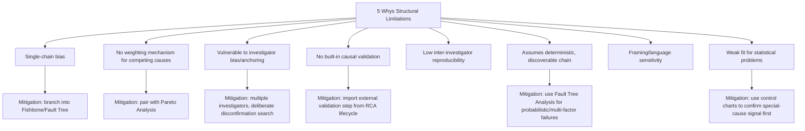

## Known Limitations and Criticisms

### Overview

Where the previous chapter item catalogued the 5 Whys' genuine strengths and appropriate use cases, this section catalogs its documented structural limitations. These are not merely "the technique is sometimes misused" (covered in common misconceptions) but limitations **inherent to the technique's design** — constraints that persist even under ideal, disciplined application.

### Limitation 1: Structural Bias Toward a Single Causal Chain

**Key Points**

- The classical 5 Whys format inherently produces one linear narrative, selecting a single answer at each iteration. This is a structural constraint, not merely a risk of poor execution — even a perfectly disciplined investigator following the technique as designed must choose one path forward at each step.
- **[Inference]** This structural bias likely explains why the technique performs comparatively poorly on genuinely multi-causal problems even in the hands of experienced practitioners — the limitation is embedded in the method's format, not solely attributable to investigator skill or diligence.
- Mitigation (branching into a tree, as discussed in the mechanics content) is possible but, once adopted, the technique functionally converges toward a Fault Tree or Fishbone structure — meaning the "5 Whys" label no longer accurately describes what is actually being practiced.

### Limitation 2: No Built-In Mechanism for Weighing or Prioritizing Multiple Candidate Causes

**Key Points**

- Unlike Pareto Analysis (which ranks causes by frequency/impact) or Fault Tree Analysis (which can assign probabilities to different failure paths), the 5 Whys provides no formal method for determining which of several plausible "why" answers at a given step is most likely correct — selection typically relies on investigator judgment alone.
- This absence of a weighting mechanism means the technique's output quality is more dependent on the investigator's domain expertise and evidence-gathering rigor than techniques with more formal selection criteria built in.

### Limitation 3: Vulnerable to Investigator Bias and Anchoring

**Key Points**

- Because a single investigator (or small group) typically selects each successive answer, the technique is structurally susceptible to **confirmation bias** — investigators may unconsciously favor answers that align with a hypothesis formed early in the session, and the linear format provides no structural checkpoint forcing consideration of alternative branches.
- **Anchoring** is a related risk: the first plausible answer at an early "why" step disproportionately shapes the entire subsequent chain, since each following question is asked directly against the prior answer rather than against the original problem.
- **[Inference]** This risk is likely amplified when sessions are conducted quickly (one of the technique's cited strengths) since less time is available to deliberately seek disconfirming evidence for the leading hypothesis at each step.

### Limitation 4: No Formal Causal Validation Mechanism

**Key Points**

- The technique itself contains no built-in method to test whether the final "root cause" is genuinely necessary and sufficient to explain the incident — this validation must be imported from outside the technique (as covered in the general RCA lifecycle's validation phase).
- Compare to Fault Tree Analysis, which uses explicit Boolean logic (AND/OR gates) that inherently forces clarification of whether combinations of factors are jointly necessary — the 5 Whys' narrative prose format does not enforce this same logical rigor.

### Limitation 5: Reproducibility and Consistency Across Investigators

**Key Points**

- Because each why-answer depends substantially on investigator judgment, different investigators examining the same incident can plausibly produce different causal chains and different "root causes" — the technique offers limited inter-investigator reliability compared to more structured, criteria-driven methods.
- **[Unverified]** Formal empirical studies quantifying inter-rater reliability specifically for the 5 Whys technique are limited in the general literature; this criticism is more commonly raised as a structural/theoretical concern in quality management and safety engineering discourse than as a rigorously measured statistic.

### Limitation 6: Assumes a Discoverable, Deterministic Causal Chain

**Key Points**

- The technique implicitly assumes each "why" has one clear, discoverable answer traceable through direct evidence. This assumption weakens for failures with **probabilistic, emergent, or genuinely multi-factorial** causation — e.g., complex distributed systems failures where an incident results from the statistical interaction of several independently low-probability conditions occurring simultaneously, with no single dominant chain.
- **[Inference]** In such cases, forcing a 5 Whys narrative can produce a chain that is internally coherent and persuasive but does not accurately represent the actual (probabilistic, multi-factor) causal structure — a risk sometimes termed "narrative fallacy" in broader causal reasoning literature, where a plausible story is mistaken for an accurate model of a genuinely more complex reality.

### Limitation 7: Language and Framing Sensitivity

**Key Points**

- Because each "why" answer is expressed in natural language rather than a formal model, the same underlying causal reality can be described at different levels of abstraction depending on phrasing — e.g., "the deploy script lacked a check" vs. "engineering culture undervalues defensive tooling" — both potentially "true" but at very different levels of actionable specificity.
- This makes the technique more sensitive to the facilitator's or investigator's framing skill than techniques with more standardized categorical structures (e.g., Fishbone's fixed category headings, which impose a consistent framing scaffold across sessions).

### Limitation 8: Weak Support for Quantitative or Statistical Problems

**Key Points**

- The technique is qualitative and narrative by design; it does not naturally incorporate statistical evidence (e.g., control chart signals, correlation coefficients, defect rate distributions) into its structure the way Pareto Analysis or statistical process control methods do.
- For problems where the central question is fundamentally statistical (e.g., "is this defect rate a special-cause anomaly or normal common-cause variation?"), the 5 Whys is not the appropriate starting technique — that determination properly belongs to control charts, with 5 Whys applied only after a special-cause signal has been confirmed.

### Comparative Limitation Summary

### When These Limitations Matter Most

**Key Points**

- These limitations are most consequential for: high-stakes/safety-critical investigations, problems with genuinely ambiguous or contested causation among stakeholders, statistically-driven quality problems, and complex distributed systems with multiple independently-contributing failure conditions.
- They matter comparatively less for: well-isolated, single-component incidents with a plausibly linear cause, investigated by someone with direct domain evidence, where the technique's strengths (covered in the prior chapter item) dominate its weaknesses.

### Conclusion

The 5 Whys' limitations are largely the inverse of its strengths — the same simplicity and linearity that make it fast and accessible also make it structurally biased toward single narratives, vulnerable to investigator bias, and unable to formally validate or weight competing causal hypotheses. Recognizing these limitations is not an argument against using the technique, but a basis for correctly pairing it with complementary methods (Fishbone for multi-branch brainstorming, Fault Tree Analysis for formal validation, Pareto/control charts for statistical grounding) when a given problem's characteristics exceed what pure 5 Whys can reliably support.

### Related Topics

- Strengths and ideal use cases of the 5 Whys technique
- Fishbone (Ishikawa) diagrams for multi-branch causal brainstorming
- Fault Tree Analysis and formal Boolean causal validation
- Pareto Analysis and statistical cause prioritization
- Confirmation bias and anchoring in investigative reasoning
- Control charts and distinguishing common-cause from special-cause variation