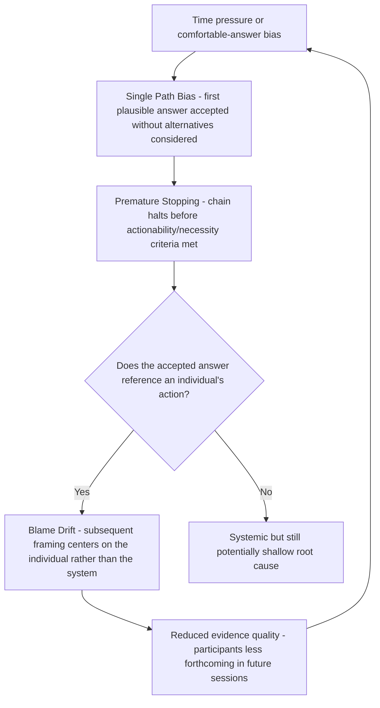

## Common Failure Modes: Single Path Bias, Premature Stopping, Blame Drift

### Overview

While prior sections addressed the 5 Whys' structural limitations (inherent to the technique regardless of skill) and general RCA misconceptions (conceptual misunderstandings), this section focuses specifically on the three most commonly documented **execution-level failure modes** that occur during actual 5 Whys sessions — patterns that emerge from how the technique is practiced, distinct from either its inherent design constraints or broader misconceptions about RCA as a discipline. These three failure modes frequently compound one another in practice.

### Failure Mode 1: Single Path Bias

**Definition**: The tendency to commit to one causal branch at the first plausible answer and pursue it exclusively, without deliberately surfacing or documenting alternative candidate answers at each step.

**Key Points**

- This differs from the *structural* single-chain limitation of the technique (which is unavoidable by design) — single path bias refers specifically to the **failure to even consider** alternative branches before committing, when doing so was in fact possible with the available evidence.
- Single path bias is typically driven by time pressure, a desire for a clean/simple narrative, or the first answer being proposed by a senior or vocal participant whose framing then anchors the rest of the group.
- The failure mode is often invisible in session documentation — a clean linear chain in the final report looks identical whether alternative branches were genuinely considered and ruled out, or simply never raised.

**Example**

> Problem: A mobile app crashes on launch for a subset of users.
>
> Why 1: Why does it crash? → A required configuration value is null.
>
> [Single path bias]: The team immediately proceeds to "why is it null" without pausing to ask whether *multiple independent causes* could produce a null value (e.g., a caching bug, a migration script failure, AND a race condition in initialization — three genuinely distinct mechanisms all capable of producing the same symptom).
>
> Result: The team fixes the first mechanism found (a caching bug) and closes the incident, while the migration script failure — a separate, still-latent cause — resurfaces in a future incident.

**Mitigation**

- At each why-step, explicitly ask "Is this the *only* plausible explanation supported by the evidence, or merely the first one we thought of?" before proceeding.
- Assign at least one participant the explicit role of proposing alternative explanations, distinct from the primary investigator driving the chain forward.

### Failure Mode 2: Premature Stopping

**Definition**: Terminating the why-chain before reaching a genuinely actionable, necessary, and non-trivial root cause — typically stopping at a proximate cause or trigger instead (see Root Cause vs. Symptom vs. Trigger).

**Key Points**

- Premature stopping is distinct from the deliberate, criteria-based termination discussed in Determining When Enough Whys Have Been Asked — it refers specifically to stopping *without* rigorously checking the termination criteria, often due to reaching a comfortable, easy-to-accept answer.
- Common triggers for premature stopping include: time pressure to close an incident quickly, organizational preference for simple explanations over structurally uncomfortable ones, and reaching an answer that requires no significant process or design change to address.
- **[Inference]** Premature stopping is likely more common when the "true" root cause would require politically or organizationally costly changes (e.g., revising a long-standing process owned by another team) compared to when the root cause is cheap and uncontroversial to fix — though this asymmetry is difficult to verify directly since it manifests as an absence (chains that were *not* pursued further) rather than an observable event.

**Example**

> Why 1: Why did the release cause an outage? → A configuration flag was set incorrectly.
>
> Why 2: Why was the flag set incorrectly? → The engineer copied it from an outdated template.
>
> [Premature stop]: "Root cause: outdated template. Corrective action: update the template."

This stops before addressing *why* an outdated template was available and used without detection — continuing would likely surface a deeper condition (e.g., no automated validation of configuration values against current schema, no review process catching stale templates) whose correction would prevent the entire class of template-staleness errors, not just this one flag.

### Failure Mode 3: Blame Drift

**Definition**: The gradual (often unintentional) shift of a nominally systemic investigation toward identifying an individual's action or decision as the terminal explanation, even when the session began with process-oriented framing.

**Key Points**

- Blame drift frequently occurs *despite* explicit blameless-culture intentions, because natural language "why" answers often most immediately and intuitively reference a person's action ("why did the bug ship?" → "the reviewer approved it") rather than the systemic condition behind that action.
- Once a chain reaches an individual's action, blame drift compounds through two related sub-patterns:
  - **Stopping at the individual** (a form of premature stopping specifically at a human-action answer, treating "human error" as sufficient — see Common Misconceptions).
  - **Reframing subsequent questions around the individual** rather than the system — e.g., "why did the reviewer approve it?" → "they weren't paying close enough attention" (an unfalsifiable, unactionable claim about attention/diligence) rather than "what about the review process made this specific error easy to miss?" (a systemic, actionable framing).
- Blame drift is particularly damaging to the RCA lifecycle's evidence-quality precondition: participants who sense a session drifting toward attributing fault to a specific colleague (or themselves) become measurably less forthcoming with information, directly undermining the evidentiary basis the technique depends on.

**Example**

> Why 1: Why did the wrong pricing display to customers? → The pricing engineer manually updated a value instead of using the automated pipeline.
>
> [Blame drift]: Why 2 (drifted framing): Why did the engineer manually update it instead of using the pipeline? → They were in a hurry and didn't follow procedure.
>
> [Continued drift]: Why 3: Why didn't they follow procedure? → They should have known better; this is a training/attentiveness issue.

Corrected, systemic framing:

> Why 2 (systemic framing): Why was manually updating the value possible/available as an option at all? → No system-level restriction prevents direct database writes to pricing values outside the pipeline.
>
> Why 3: Why does no restriction exist? → Pricing data access controls were never hardened after the pipeline was introduced; direct write access, originally needed before the pipeline existed, was never revoked.

The systemic framing reaches an actionable, generalizable root cause (unrevoked legacy access) rather than terminating at an individual's judgment in a moment of time pressure — a conclusion that offers no durable prevention against the next engineer facing similar time pressure.

### Interaction Between the Three Failure Modes

Note the feedback loop: blame drift's chilling effect on future evidence-sharing tends to *increase* the likelihood of single path bias and premature stopping in subsequent investigations, since participants become less willing to surface uncomfortable or incriminating information — meaning these three failure modes are not independent risks but can reinforce each other across an organization's investigative culture over time.

### Detection Checklist

A session or its documentation may exhibit these failure modes if:

- [ ] No alternative branches are mentioned or explicitly ruled out at any step (possible single path bias)
- [ ] The final "root cause" requires no significant process, tooling, or design change to address (possible premature stopping)
- [ ] Any why-answer names a specific individual's judgment, attentiveness, or diligence as the causal explanation (possible blame drift)
- [ ] The chain's language shifts from process/system nouns ("the pipeline," "the review process") to person-focused verbs ("they should have," "they didn't") partway through (blame drift in progress)
- [ ] The session was conducted under significant time pressure to close the incident quickly (risk factor for all three)

### Mitigations Summary

| Failure Mode | Primary Mitigation |
| --- | --- |
| Single path bias | Explicitly solicit alternative explanations at each step; assign a dedicated "devil's advocate" role |
| Premature stopping | Rigorously apply the actionability/necessity/non-triviality criteria before accepting a final answer |
| Blame drift | Reframe any answer referencing an individual's action toward the systemic condition that made that action possible or consequential |

### Related Topics

- Determining when enough whys have been asked
- Common misconceptions about root cause analysis (human error as root cause)
- Blameless postmortem culture and psychological safety in investigation
- Core mechanics of the iterative why-asking process
- Branching structures: transitioning from 5 Whys to Fishbone diagrams