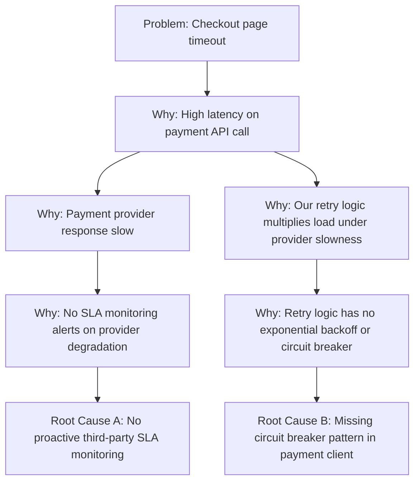
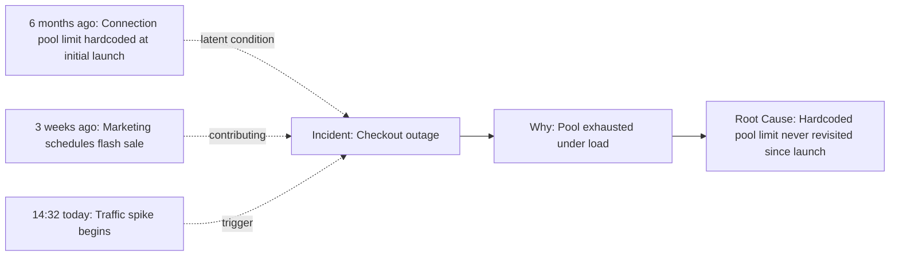

## Combining 5 Whys with Visual Cause Mapping

### Overview

The prior sections established that classical 5 Whys' single-chain format is a structural limitation for multi-causal problems, and that single path bias is a common execution-level failure mode. Visual cause mapping addresses both concerns directly by giving the iterative why-questioning process a graphical structure that natively supports branching, side-by-side comparison of candidate causes, and explicit tracking of ruled-out hypotheses. This hybrid approach preserves the 5 Whys' core discipline (iterative, evidence-grounded "why" questioning) while shedding its strict linearity.

### Why Combine the Two

**Key Points**

- Pure 5 Whys forces a single narrative chain even when a problem has genuinely multiple contributing causal branches (per the structural limitations discussion) — visual mapping formats provide a native branching structure that removes this forced simplification.
- Visual formats make single path bias more visible and preventable: an investigator or group looking at a mind-map or tree diagram is structurally prompted to consider "what else could explain this node?" at each branch point, since the empty space around a node visually invites additional branches in a way linear text does not.
- Visual artifacts also support better **group facilitation** — multiple participants can propose and annotate different branches simultaneously, rather than a single narrator driving one sequential chain, which directly mitigates the anchoring risk of one early answer dominating the whole session.

### Common Visual Cause Mapping Formats for 5 Whys

**1. Why-Tree (Branching 5 Whys)**

The most direct hybrid: instead of a strict chain, each "why" question can spawn multiple child answers, each pursued independently to its own termination point.

This structure makes explicit what a linear 5 Whys chain would hide: two independently necessary root causes (missing monitoring and missing circuit breaker) both contribute to the incident's severity, and fixing only one leaves meaningful residual risk.

**2. Fishbone-Integrated 5 Whys**

Rather than treating Fishbone (Ishikawa) categorization and 5 Whys as competing alternatives, they combine naturally: the Fishbone diagram's categories (Machine, Method, Material, Manpower, Measurement, Environment, or a domain-appropriate variant) provide the initial branching structure, and a 5 Whys chain is then run independently *within* each category branch that evidence supports as plausible.

**Example**

> Problem: Intermittent data corruption in a batch processing job.
>
> Fishbone categories generate initial candidate branches: Method (processing logic), Machine (infrastructure/hardware), Measurement (validation/monitoring gaps).
>
> Within "Method": Why 1 → Why 2 → Why 3 reaches "race condition in concurrent write handling."
>
> Within "Measurement": Why 1 → Why 2 reaches "no checksum validation on batch output."
>
> Both branches are retained as independently valid, necessary findings — the race condition explains *why corruption occurs*, and the missing checksum validation explains *why it went undetected for weeks*.

**3. Timeline-Anchored Cause Mapping**

For incidents with a meaningful temporal dimension, cause maps can be anchored to a timeline axis, with why-branches attached at the point in time each contributing condition became relevant. This format is particularly useful for incidents where the root cause and the triggering event are temporally distant (see Root Cause vs. Symptom vs. Trigger), since it visually separates long-standing latent conditions from the specific triggering moment.

### Structural Visualization: The Hybrid Process

<svg xmlns="http://www.w3.org/2000/svg" viewBox="0 0 720 300">
<text x="360" y="22" text-anchor="middle" font-size="14" font-weight="bold" fill="#1a1a1a">5 Whys + Visual Cause Mapping Workflow (svg_diagram)</text>
<rect x="270" y="45" width="180" height="45" rx="6" fill="#eaeded" stroke="#424949" stroke-width="1.5" />
<text x="360" y="72" text-anchor="middle" font-size="11" font-weight="bold" fill="#1c2833">Problem Statement</text>
<rect x="80" y="120" width="160" height="45" rx="6" fill="#d6eaf8" stroke="#2874a6" stroke-width="1.5" />
<text x="160" y="147" text-anchor="middle" font-size="10.5" font-weight="bold" fill="#1b4f72">Candidate Branch A</text>
<rect x="280" y="120" width="160" height="45" rx="6" fill="#d6eaf8" stroke="#2874a6" stroke-width="1.5" />
<text x="360" y="147" text-anchor="middle" font-size="10.5" font-weight="bold" fill="#1b4f72">Candidate Branch B</text>
<rect x="480" y="120" width="160" height="45" rx="6" fill="#d6eaf8" stroke="#2874a6" stroke-width="1.5" />
<text x="560" y="147" text-anchor="middle" font-size="10.5" font-weight="bold" fill="#1b4f72">Candidate Branch C</text>
<rect x="80" y="195" width="160" height="45" rx="6" fill="#d5f5e3" stroke="#1e8449" stroke-width="1.5" />
<text x="160" y="217" text-anchor="middle" font-size="10" font-weight="bold" fill="#145a32">5 Whys chain →</text>
<text x="160" y="231" text-anchor="middle" font-size="10" font-weight="bold" fill="#145a32">Root Cause A</text>
<rect x="280" y="195" width="160" height="45" rx="6" fill="#fdebd0" stroke="#d68910" stroke-width="1.5" />
<text x="360" y="217" text-anchor="middle" font-size="10" fill="#7d5a0b">5 Whys chain →</text>
<text x="360" y="231" text-anchor="middle" font-size="10" fill="#7d5a0b">Ruled out (evidence)</text>
<rect x="480" y="195" width="160" height="45" rx="6" fill="#d5f5e3" stroke="#1e8449" stroke-width="1.5" />
<text x="560" y="217" text-anchor="middle" font-size="10" font-weight="bold" fill="#145a32">5 Whys chain →</text>
<text x="560" y="231" text-anchor="middle" font-size="10" font-weight="bold" fill="#145a32">Root Cause B</text>
<path d="M330,90 L160,118" stroke="#666" stroke-width="1.3" marker-end="url(#arrow5)" />
<path d="M360,90 L360,118" stroke="#666" stroke-width="1.3" marker-end="url(#arrow5)" />
<path d="M390,90 L560,118" stroke="#666" stroke-width="1.3" marker-end="url(#arrow5)" />
<path d="M160,165 L160,193" stroke="#666" stroke-width="1.3" marker-end="url(#arrow5)" />
<path d="M360,165 L360,193" stroke="#666" stroke-width="1.3" marker-end="url(#arrow5)" />
<path d="M560,165 L560,193" stroke="#666" stroke-width="1.3" marker-end="url(#arrow5)" />
<text x="360" y="275" text-anchor="middle" font-size="10.5" fill="#555">Multiple branches investigated in parallel; ruled-out branches remain visible</text>

<text x="360" y="290" text-anchor="middle" font-size="10.5" fill="#555">and documented rather than silently discarded, unlike a pure linear chain.</text>

</svg>

### Benefits of Retaining Ruled-Out Branches

**Key Points**

- A key advantage of visual mapping over pure linear 5 Whys is that **rejected candidate branches remain visible and documented** (as in Branch B above), rather than silently disappearing as they would in a linear narrative that only records the single chain ultimately pursued.
- This has direct value for the RCA lifecycle's validation phase: a reviewer can assess not only *what* was concluded but *what alternatives were considered and why they were ruled out*, strengthening confidence in the final root cause(s) and reducing the risk of undetected single path bias.
- Documented ruled-out branches also serve as useful reference material for future, superficially similar incidents — if a later investigation encounters the same symptom, checking previously ruled-out branches first can save redundant investigation effort, or alternatively surface that a previously ruled-out cause is now newly plausible under different conditions.

### Practical Guidance for Facilitating Hybrid Sessions

- Start with a lightweight branching skeleton (Fishbone categories, or simply "what are the 2–4 most plausible initial explanations?") before running why-chains within each branch, rather than committing to a single chain from the first answer.
- Assign each branch its own evidence trail; a branch without supporting evidence should be explicitly marked as unconfirmed or ruled out rather than left ambiguous.
- Limit active parallel branches to a manageable number (commonly 2–4) to preserve the technique's speed advantage — visual mapping mitigates single-chain bias but should not be allowed to expand into an unbounded, unfocused investigation.
- Converge branches back toward corrective action design only after each retained branch has independently satisfied the actionability/necessity/non-triviality termination criteria.

### Conclusion

Combining 5 Whys with visual cause mapping preserves the technique's core value — disciplined, evidence-grounded iterative questioning — while directly addressing its most cited structural limitation (forced single-chain narrative) and its most common execution failure mode (single path bias). The hybrid retains 5 Whys' speed and accessibility for each individual branch while borrowing Fishbone-style categorization or tree structures to ensure the investigation's overall shape matches the problem's actual causal complexity, rather than artificially flattening it.

### Related Topics

- Known limitations and criticisms of the 5 Whys technique
- Common failure modes: single path bias, premature stopping, blame drift
- Fishbone (Ishikawa) diagrams and cause categorization
- Fault Tree Analysis for formal branching causal logic
- Documentation standards for auditable, multi-branch RCA records