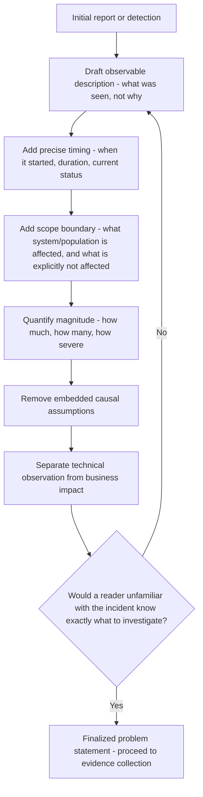

## Writing an Effective Problem Statement

### Overview

The problem statement is the foundation upon which every subsequent RCA activity depends — evidence collection, causal questioning, and validation are all scoped against it. A vague or poorly constructed problem statement propagates error throughout the entire investigation: it becomes impossible to definitively validate a root cause against an ambiguous target, and investigators risk conflating unrelated concurrent issues. This section details the specific criteria and construction technique for writing problem statements that support rigorous RCA.

### Why Problem Statement Quality Determines Investigation Quality

**Key Points**

- Every termination criterion discussed elsewhere (actionability, necessity, non-triviality) is evaluated **relative to the problem statement** — an imprecise statement makes these criteria impossible to apply rigorously, since "would this have prevented the problem" is unanswerable if "the problem" itself is ambiguous.
- A vague problem statement is also a primary enabler of scope creep during investigation — without a precise boundary, unrelated issues discovered along the way can get conflated with the original problem, diluting focus and potentially producing a causal chain that doesn't actually explain the original incident.

### The Five Core Components (5W1H Adapted for RCA)

An effective problem statement addresses each of the following dimensions with specificity:

| Component | Question Answered | Why It Matters for RCA |
| --- | --- | --- |
| **What** | What specifically happened, described observably | Anchors the investigation to a concrete, falsifiable phenomenon |
| **When** | Precise timing — start, duration, end (if resolved) | Enables correlation with logs, deployments, or environmental changes |
| **Where** | System, component, location, or population affected | Bounds the scope; prevents conflating affected vs. unaffected areas |
| **Extent** | Magnitude/severity — how much, how many, how severe | Distinguishes this incident from superficially similar but differently-scoped ones |
| **Deviation baseline** | What was expected instead | Establishes the specific gap being explained, not just "something went wrong" |

### Criteria for a Well-Constructed Problem Statement

**1. Observable, Not Interpretive**

The statement should describe what was directly observed, not an already-assumed explanation.

- Weak: "The database failed due to overload." (This asserts a cause — overload — before investigation has confirmed it.)
- Strong: "The database became unresponsive to new connections for 14 minutes." (Describes the observed effect only, leaving causation open to investigation.)

**2. Precisely Bounded**

The statement should specify what is included and, where useful, explicitly what is excluded, to prevent scope drift.

**Example**

> Weak: "Users are experiencing errors on the platform."
>
> Strong: "Users in the EU region experienced HTTP 429 rate-limit errors on the `/api/search` endpoint between 08:00–08:45 UTC on 2026-09-15; no other regions or endpoints showed elevated error rates in the same window."

**3. Quantified Wherever Possible**

Numeric specificity supports both evidence correlation and later severity/impact assessment.

- Weak: "Response times got slow."
- Strong: "p95 response latency rose from a baseline of 180ms to 3,200ms."

**4. Free of Embedded Causal Assumptions**

**Key Points**

- A common problem statement error is embedding an unverified causal claim directly into the description of the problem itself — e.g., "the outage caused by the bad deployment" presupposes the deployment as the cause before investigation, which can bias subsequent questioning toward confirming that assumption (a form of anchoring, discussed in the failure modes content).
- Corrected: "An outage occurred beginning shortly after a deployment at 09:15 UTC" — describes the observed temporal relationship as a fact, without asserting the causal claim the investigation is meant to establish.

**5. Distinguishes Symptom from Impact**

The problem statement should clearly separate *what was technically observed* from *what business/user impact resulted*, since these are related but distinct facts, both useful for scoping but serving different investigative purposes.

**Example**

> Technical observation: "The checkout service returned HTTP 500 errors for 22% of requests."
>
> Impact: "This resulted in an estimated 340 failed transactions and 6 customer support escalations during the affected window."

Both are valuable, but the technical observation is what causal investigation should be scoped against; the impact statement supports prioritization and stakeholder communication but should not itself become the target of "why" questioning (asking "why did we get support escalations" is a different, downstream question from "why did checkout return errors").

### Worked Comparison: Weak vs. Strong Problem Statements

| Weak Statement | Why It's Weak | Strong Rewrite |
| --- | --- | --- |
| "The app is broken." | No specificity on what, when, extent | "The mobile app's login screen fails to load for iOS users on app version 4.2.1, starting at approximately 07:00 UTC on 2026-09-18, affecting an estimated 8% of daily active iOS users." |
| "The report generator crashed because of bad input." | Embeds unverified causal claim | "The monthly report generator process terminated unexpectedly at 02:14 UTC during the 2026-09 run, before producing output for any of the 40 scheduled report types." |
| "Customers are unhappy with slow support." | Vague, unquantified, conflates cause with symptom | "Average first-response time for support tickets rose from a 2-hour baseline to 11 hours over the past 3 weeks, based on the last 500 tickets in the support queue." |

### Construction Procedure

### Handling Ambiguity When Full Precision Isn't Yet Available

**Key Points**

- At the moment an incident is first detected, complete precision (exact scope, exact timing) may not yet be available — in these cases, the problem statement should be written with the best currently available specificity and explicitly flagged as provisional, to be refined as more evidence is gathered during the early investigation phase, rather than either blocking investigation entirely or proceeding on a permanently vague statement.
- **[Inference]** A reasonable practical approach is to timebox initial problem-statement refinement to a short window (e.g., the first 15–30 minutes of investigation) sufficient to establish rough scope and timing, revising the statement as firmer data arrives rather than treating the very first draft as fixed for the remainder of the investigation.

### Common Problem Statement Errors

| Error | Example | Correction |
| --- | --- | --- |
| Embedded blame | "The developer's careless change broke the build." | "The build failed starting with commit `a3f21b`." |
| Overgeneralization | "The system is unreliable." | "The payment service experienced 3 outages totaling 47 minutes of downtime in the past 7 days." |
| Solution embedded in problem | "We need better monitoring because we didn't catch the outage sooner." | "The outage was undetected by existing monitoring for 34 minutes before a customer report triggered investigation." |
| Multiple unrelated issues merged | "The site is slow and also the search results are wrong." | Two separate problem statements, investigated independently unless evidence later shows a shared cause |

### Related Topics

- Scoping and bounding RCA investigations to prevent scope creep
- Evidence collection methodology and confirmation bias mitigation
- Distinguishing symptom, trigger, and root cause
- The general RCA process lifecycle and where problem definition fits
- Validating root causes against the original problem statement's full scope