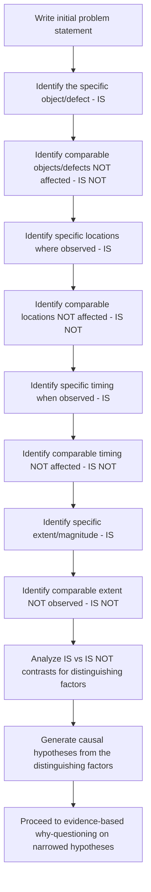

## The Is and Is Not Analysis Technique

### Overview

Is/Is Not analysis (also known as the Is/Is Not matrix, a core component of Kepner-Tregoe problem-solving methodology) is a structured technique for precisely bounding a problem before causal investigation begins. Where the previous section established general criteria for writing a good problem statement, Is/Is Not analysis provides a concrete, systematic procedure for achieving that precision — by explicitly contrasting what the problem **is** against closely comparable situations where the problem **is not** observed, despite otherwise similar conditions.

### Core Principle

**Key Points**

- The technique rests on a specific insight: the boundary between where a problem occurs and where it does not occur is itself powerful causal evidence. If a problem affects System A but not the highly similar System B, the *difference* between A and B is a prime candidate location for the root cause.
- This reframes problem scoping from a purely descriptive exercise ("what happened") into an actively diagnostic one — the contrast itself narrows the causal search space before any "why" questioning begins.
- The technique originates from the Kepner-Tregoe Problem Analysis methodology (developed by Charles Kepner and Benjamin Tregoe, first published in the 1960s), which structured systematic troubleshooting as a formal discipline, contributing to the same mid-20th-century wave of quality/problem-solving formalization that produced Ishikawa diagrams and Fault Tree Analysis.

### The Four Dimensions

Is/Is Not analysis is typically structured across four dimensions, each examined as a contrasting pair:

| Dimension | IS (where/when problem occurs) | IS NOT (where/when problem does not occur, despite similarity) |
| --- | --- | --- |
| **What** (object/defect) | Specific object, unit, or defect type affected | Similar objects/defect types NOT affected |
| **Where** (location) | Specific location(s) where observed | Similar locations where NOT observed |
| **When** (timing) | Specific time(s) when observed | Similar times when NOT observed |
| **Extent** (magnitude) | Specific scope/size/trend of the problem | Comparable scope that would be expected but is NOT observed |

### Worked Example

**Example**

Problem: Elevated error rates on a specific API.

| Dimension | IS | IS NOT |
| --- | --- | --- |
| What | `POST /api/orders` returns 500 errors | `GET /api/orders` and all other endpoints on the same service return normally |
| Where | Requests routed through the `us-east-1` region | Requests routed through `eu-west-1` and `ap-southeast-1` regions (same service version) are unaffected |
| When | Errors began at 03:00 UTC and continue | No errors reported in the equivalent 03:00 UTC window on any of the preceding 30 days |
| Extent | Affects requests specifically containing a `discount_code` parameter | Requests without a `discount_code` parameter, hitting the same endpoint at the same time, succeed normally |
| Who/Which population | Affects only orders from the mobile app client | Orders from the web client, using the same backend endpoint, are unaffected |

**Diagnostic narrowing from the contrast**: The combination of "IS: `us-east-1` only" + "IS: requests with `discount_code`" + "IS: mobile app client only" dramatically narrows the causal search space — rather than investigating the entire order service, the investigation can focus specifically on whatever differs between `us-east-1` and other regions, and between mobile-client discount-code handling and web-client discount-code handling. This might quickly surface, for example, that a region-specific configuration rollout modified discount validation logic only for the mobile client's request format.

### Procedure

### Why This Strengthens Subsequent RCA

**Key Points**

- Feeding directly into the 5 Whys or Fishbone process: rather than beginning why-questioning against a broad, unscoped problem, the investigation begins with a specific, evidence-derived hypothesis (the distinguishing factor between IS and IS NOT), meaningfully reducing the risk of single path bias since the starting hypothesis is itself already evidence-grounded rather than the first thing that came to mind.
- The IS NOT column functions as a built-in disconfirmation mechanism — any candidate root cause proposed during subsequent investigation should also be checked against the IS NOT column: does the candidate cause explain why the IS NOT conditions were unaffected? If a candidate root cause would equally apply to an IS NOT condition, but that condition shows no problem, the candidate cause is likely incomplete or incorrect.

**Example — using IS NOT to test a candidate root cause**

> Candidate root cause proposed: "A recent library upgrade introduced the bug."
>
> Check against IS NOT: If the same library upgrade was deployed identically to `eu-west-1` (an IS NOT region) with no observed problem, this candidate root cause is insufficient on its own — something else must differ between `us-east-1` and `eu-west-1` beyond the shared library upgrade, since the upgrade alone doesn't explain the region-specific pattern.

This validation step mirrors the necessity test discussed elsewhere in this curriculum, but grounded specifically in the concrete comparative evidence the Is/Is Not matrix has already assembled.

### When to Use Is/Is Not Analysis

**Key Points**

- Most valuable when a comparable, unaffected population, location, or time period genuinely exists — the technique depends on having a meaningful contrast to draw from. For entirely novel, first-of-its-kind failures with no comparable unaffected baseline, the technique offers less diagnostic leverage.
- Particularly well suited to intermittent or partial-scope problems (affecting some but not all of a population) rather than problems affecting 100% of all comparable cases uniformly, since uniform failures provide no internal contrast to analyze.
- Commonly used as a **pre-step** before 5 Whys or Fishbone diagramming, narrowing the problem sufficiently that subsequent causal questioning is more efficiently targeted, rather than as a replacement for causal investigation itself — Is/Is Not analysis identifies *where to look*, not *why* the underlying mechanism causes the effect.

### Common Errors in Application

| Error | Description | Correction |
| --- | --- | --- |
| Weak comparability | Choosing an IS NOT comparator that differs in many uncontrolled ways from the IS case | Select the *most similar possible* comparator, differing in as few dimensions as possible |
| Stopping at the matrix | Treating the completed Is/Is Not table itself as the root cause | Use the matrix's contrasts to generate hypotheses, then continue with why-questioning or evidence testing |
| Incomplete IS NOT investigation | Only documenting the IS side, leaving IS NOT columns blank or assumed | Actively verify IS NOT claims with evidence, not assumption — the comparator's unaffected status should be confirmed, not presumed |
| Ignoring newly surfaced IS NOT conflicts | A later-proposed root cause is not checked against the IS NOT column at all | Systematically re-check every candidate root cause against all IS NOT entries before finalizing |

### Related Topics

- Writing an effective problem statement
- The 5 Whys and how Is/Is Not analysis narrows its starting hypothesis
- Necessity and sufficiency testing for candidate root causes
- Fishbone diagrams and categorized causal brainstorming
- Kepner-Tregoe Problem Analysis methodology