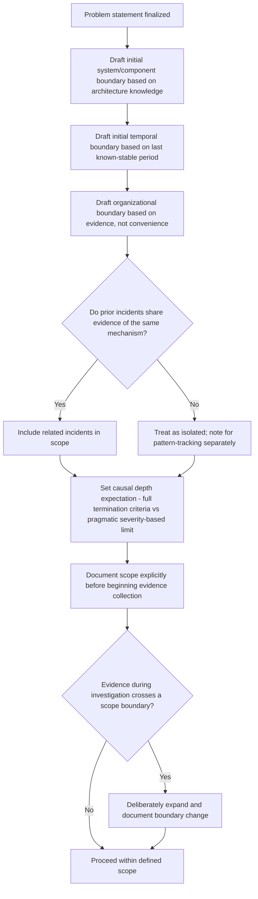

## Scoping the Investigation Boundary

### Overview

Scoping defines the deliberate limits of an RCA investigation — what systems, time periods, populations, and causal depth are within bounds, and what is explicitly excluded. While a strong problem statement (covered previously) establishes *what happened*, scoping addresses a related but distinct question: *how far should the investigation reasonably extend* in pursuing causes, related incidents, and systemic implications. Poor scoping produces two opposite failure patterns — investigations that are too narrow to find the actionable root cause, and investigations that expand indefinitely without ever reaching a conclusion.

### Why Scoping Is a Distinct Concern from Problem Definition

**Key Points**

- A problem statement bounds *what was observed*; scope additionally bounds *how the investigation itself will proceed* — which systems will be examined, how far back in time evidence will be gathered, whether related-but-distinct incidents will be folded in, and how deep the causal chain will be pursued before corrective action is prioritized over further investigation.
- Without explicit scope boundaries, investigators can drift into either premature narrowing (stopping analysis at organizational or system boundaries that are convenient but not causally justified) or unbounded expansion (following every tangentially related thread indefinitely, delaying corrective action).

### Dimensions of Investigation Scope

| Scope Dimension | Question to Answer | Risk if Undefined |
| --- | --- | --- |
| System/component boundary | Which systems, services, or components will be examined for evidence? | Missing evidence in an adjacent system that actually holds the cause |
| Temporal boundary | How far back will historical data/changes be reviewed? | Missing a relevant but temporally distant contributing change |
| Organizational boundary | Which teams' processes/decisions are in scope for questioning? | Stopping investigation at a team boundary for political rather than causal reasons |
| Related-incident boundary | Will similar past incidents be folded into this investigation or treated separately? | Either missing a recurring pattern, or diluting focus by merging unrelated issues |
| Causal depth boundary | How many "why" iterations / how deep will the investigation pursue before acting? | Stopping too shallow (premature stopping) or pursuing indefinitely without ever reaching action |

### Setting the System/Component Boundary

**Key Points**

- The initial system boundary should be drawn generously enough to include all components plausibly connected to the observed problem (based on architecture/dependency knowledge), but should be explicitly stated so investigators know what has been excluded and why.
- Boundaries should be evidence-revisable: if investigation within the initial boundary reveals a dependency crossing into an excluded system, the boundary should be deliberately expanded (and documented as such) rather than either ignored or silently absorbed without acknowledgment.

**Example**

> Initial scope: "Investigation is bounded to the `checkout-service` and its direct dependencies (`payment-gateway-client`, `inventory-service` read path). The user-facing frontend and unrelated backend services (`recommendation-engine`, `email-service`) are explicitly out of scope unless evidence indicates otherwise."

### Setting the Temporal Boundary

**Key Points**

- The temporal boundary determines how far back historical changes (deployments, configuration changes, infrastructure changes) will be reviewed as potential contributing factors.
- A boundary set too narrowly (e.g., "only changes in the last 24 hours") risks missing slow-building or long-latent root causes (as seen in the timeline-anchored cause mapping example, where a root cause originated 6 months prior to the triggering incident).
- **[Inference]** A reasonable default starting boundary is to review changes back to the last confirmed stable/incident-free period for the affected system, rather than an arbitrary fixed window — though the appropriate window ultimately depends on the specific system's change frequency and the nature of the suspected failure mode.

### Setting the Organizational Boundary

**Key Points**

- Organizational scope determines which teams' decisions, processes, and ownership areas are legitimately subject to investigation.
- This dimension carries particular risk of being set for political rather than causal reasons — e.g., an investigation implicitly avoiding examination of a powerful team's process, or stopping at a service ownership boundary because crossing it would require inter-team coordination that feels burdensome.
- **Key principle**: organizational scope should be drawn based on where the *causal evidence* leads, not where it is organizationally convenient to stop. If evidence points to a decision or process owned by a different team, that team's process legitimately enters the investigation's scope regardless of coordination friction.

### Setting the Related-Incident Boundary

**Key Points**

- A decision must be made whether superficially similar past incidents are folded into the current investigation (treated as recurrences of a shared root cause) or investigated as fully separate problems.
- Folding related incidents together is appropriate when there is genuine evidence of a shared mechanism (e.g., same error signature, same affected component); it is inappropriate when incidents merely share superficial symptoms but differ substantially in underlying context (e.g., two unrelated causes both happening to produce "500 errors").
- **Example**: If three prior incidents over six months share the identical error message and affected endpoint as the current incident, this is strong evidence for a shared, still-unaddressed root cause — the investigation scope should explicitly include reviewing those prior incident records rather than treating the current incident as isolated.

### Setting the Causal Depth Boundary

**Key Points**

- This dimension connects directly to the termination criteria discussed in the 5 Whys content (actionability, necessity, non-triviality) — causal depth scope is essentially a pre-commitment to apply those criteria consistently, rather than an arbitrarily fixed "stop after N steps" rule.
- However, scope can also usefully include a **pragmatic depth limit** distinct from the theoretical termination criteria: for lower-severity problems, an organization may deliberately scope the investigation to stop at a "good enough" actionable cause even if a theoretically deeper, more systemic cause might exist, reserving deeper systemic investigation for patterns that recur across multiple incidents (per the related-incident boundary above) rather than exhaustively pursuing maximum depth on every single low-severity incident.

### Scoping Decision Flow

### Documenting Scope Explicitly

**Key Points**

- Scope decisions should be recorded alongside the problem statement, not left implicit — an explicit scope statement allows later reviewers to distinguish "this factor was investigated and ruled out" from "this factor was never examined because it fell outside scope," which are meaningfully different states with different implications for how much confidence to place in the final root cause.
- Undocumented, implicit scoping is a common source of RCA disputes after the fact, where stakeholders assume broader or narrower investigation coverage than what actually occurred.

**Example — explicit scope documentation**

> **In scope**: `checkout-service`, `payment-gateway-client`, `inventory-service` (read path only); changes since the last stable deployment (2026-08-30); decisions made by the Payments and Checkout teams.
>
> **Out of scope**: Frontend rendering layer (no evidence of frontend involvement); `recommendation-engine` and `email-service` (no dependency path to the affected flow); incidents prior to 2026-01 (predate current architecture, insufficient log retention for comparison).
>
> **Revisited during investigation**: Scope was expanded on 2026-09-16 to include the `feature-flag-service` after evidence showed a flag change correlated with the incident onset, despite not being in the original dependency list.

### Balancing Scope Discipline Against Genuine Discovery

**Key Points**

- Rigid, unrevisable scope commitments risk suppressing genuine findings that cross the initial boundary (a form of the premature stopping failure mode, applied at the scope level rather than the individual why-question level).
- The correct discipline is not "never expand scope" but "expand scope deliberately and visibly, based on evidence, rather than silently or arbitrarily" — scope exists to prevent unfocused drift, not to blind the investigation to genuine evidence that happens to fall outside the initial boundary.

### Related Topics

- Writing an effective problem statement
- The Is/Is Not analysis technique for precise problem boundaries
- Determining when enough whys have been asked (causal depth termination)
- Documentation standards for auditable RCA records
- Recognizing recurring root causes across related incidents