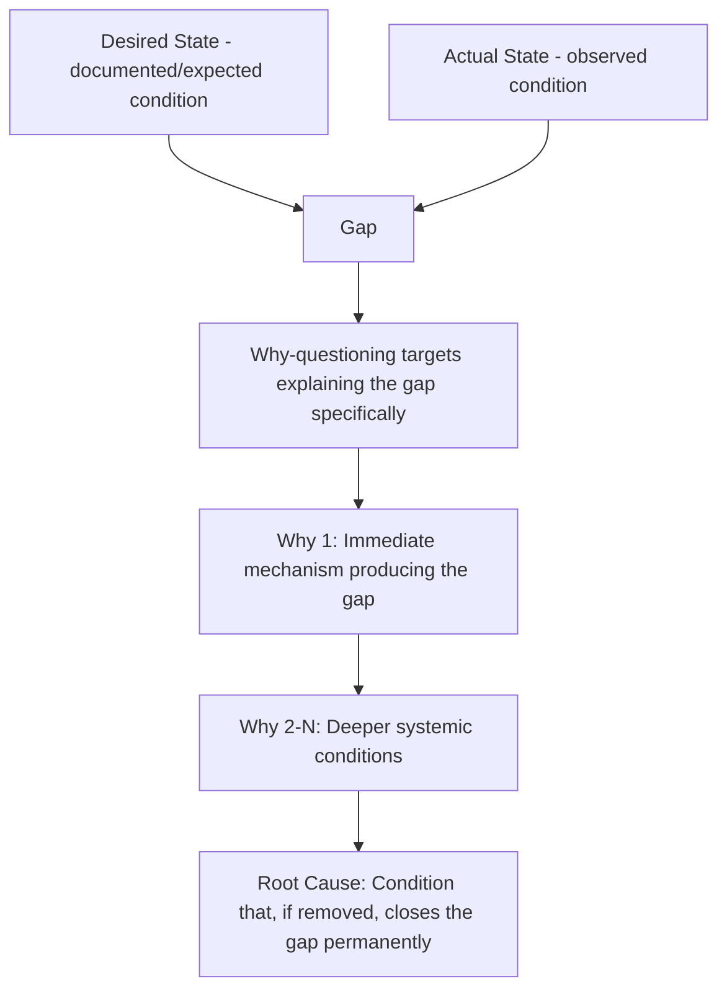

## Establishing Desired State versus Actual State

### Overview

Every RCA investigation implicitly compares two conditions: what actually happened (**actual state**) and what should have happened instead (**desired state**). Making this comparison explicit — rather than leaving the desired state as an unstated assumption — is a foundational discipline that sharpens problem statements, exposes hidden disagreements among stakeholders about what "correct" behavior even means, and provides the precise gap that causal investigation must explain.

### Core Definitions

**Actual state**: The observed, factual condition of the system, process, or outcome — what genuinely occurred, described without interpretation.

**Desired state**: The specification, standard, expectation, or previously-functioning baseline against which the actual state is being judged as deficient. This may derive from a formal specification, a documented SLA, a previously observed normal operating range, or an implicit but broadly shared expectation.

**Key Points**

- A "problem" is, by definition, the **gap** between desired state and actual state — without an explicit desired state, there is no principled basis for calling the actual state a problem at all, only an unexamined assumption that something is wrong.
- RCA's entire causal investigation exists to explain *why the gap occurred* — this makes explicit desired/actual framing a direct precursor to effective why-questioning, since each "why" is implicitly asking "why did the actual state diverge from the desired state at this point."

### Why This Distinction Is Often Skipped — and Why That's Risky

**Key Points**

- In many cases, the desired state feels so obvious that teams skip stating it explicitly (e.g., "obviously the system shouldn't crash") — but this apparent obviousness can mask real disagreement, particularly for less binary situations (acceptable latency, acceptable error rate, acceptable data staleness) where "desired" is a matter of degree rather than a clear pass/fail.
- **[Inference]** Skipping explicit desired-state definition is more likely to cause downstream problems for gradual or threshold-based issues (e.g., "response time is a bit slow") than for binary failures (e.g., "the service is completely down"), since binary failures have an implicit, widely-shared desired state (uptime) that rarely requires debate, whereas threshold-based problems often have contested or undocumented acceptable ranges.

### Worked Example: Explicit Desired vs. Actual

**Example**

Problem area: API response latency.

|  | Description |
| --- | --- |
| **Desired state** | Per the documented SLA, p95 latency for `/api/search` should remain under 500ms under normal load (defined as under 1,000 requests/second) |
| **Actual state** | p95 latency measured at 2,100ms during the period 14:00–14:30 UTC, while load remained within the normal-load definition (peak: 640 requests/second) |
| **Gap** | 1,600ms excess latency under conditions that should not have triggered degraded performance per the documented SLA |

This framing immediately sharpens the investigation: the gap is not merely "latency was high" but specifically "latency was high **despite load remaining within the documented normal range**" — ruling out simple load-based explanations as a *sufficient* standalone cause and directing investigation toward what else differed during that window.

### Sources of Desired State

Desired state is not always derived from the same kind of reference; recognizing which source applies clarifies how confidently the "problem" label can be applied:

| Source Type | Example | Confidence Level |
| --- | --- | --- |
| Formal specification/SLA | Documented uptime or latency commitment | High — explicit, agreed-upon standard |
| Regulatory/compliance requirement | Data retention or security control mandated by law | High — externally enforced standard |
| Historical baseline | "This process has run successfully for 11 months without this behavior" | Medium — descriptive, not necessarily prescriptive, but strong evidentiary basis |
| Design intent/documentation | Original design doc describing intended behavior | Medium — depends on whether design doc remains current |
| Implicit/tacit expectation | "Everyone assumes this should work this way" | Low — should be made explicit and validated with stakeholders before treating as authoritative |

**[Inference]** When the desired state derives only from an implicit or tacit expectation (the lowest-confidence source above), it is worth explicitly surfacing and confirming that expectation with relevant stakeholders before proceeding — disagreement about the desired state discovered mid-investigation can otherwise derail an otherwise sound causal analysis.

### Distinguishing "Gap Exists" from "Gap Is Worth Investigating"

**Key Points**

- Not every desired-vs-actual gap warrants a full RCA investigation — establishing the gap is a precondition for deciding to investigate, not an automatic trigger. Severity, frequency, and cost of investigation should factor into this decision (connecting to the causal-depth scoping discussion in the prior section).
- However, explicitly stating the gap — even for a problem ultimately judged not worth deep investigation — has standalone value: it creates a documented record that can be referenced if the same gap recurs at higher severity or frequency in the future.

### The Gap as the Direct Target of Why-Questioning

Framing why-questioning explicitly against "why does the gap exist" (rather than the vaguer "why did this happen") keeps each iteration anchored to the specific, bounded deviation rather than drifting toward tangentially related observations that don't actually explain the stated gap.

### Common Errors

| Error | Description | Correction |
| --- | --- | --- |
| Undefined desired state | Investigation proceeds without ever stating what "correct" behavior would have looked like | Explicitly state the desired state, citing its source, before beginning causal analysis |
| Desired state defined after the fact to match convenient explanation | Desired state is retroactively adjusted to make a preferred causal narrative fit | Fix desired state definition first, independently of any causal hypothesis, before investigation begins |
| Conflating "different" with "wrong" | Any deviation from a specific instance is treated as a problem, even when normal variation is expected | Distinguish genuine desired-state violations from expected, normal variation (connects to control chart / common-cause vs. special-cause reasoning) |
| Assuming universal agreement on desired state | Investigation proceeds assuming everyone shares the same expectation without confirming | Explicitly surface and validate desired state with relevant stakeholders, especially for threshold/degree-based issues |

### Relationship to Problem Statement and Scoping

**Key Points**

- Desired-vs-actual framing complements, rather than duplicates, the problem statement discipline covered previously: the problem statement describes the actual state with precision (what/when/where/extent), while desired-vs-actual framing makes explicit the standard the actual state is being measured against — together, they fully specify the gap the investigation must explain.
- This framing also interacts with the Is/Is Not technique: the "IS NOT" comparator population is, in effect, evidence of the desired state actually being achieved elsewhere under comparable conditions — reinforcing that the desired state is achievable and therefore the gap is a genuine deviation requiring explanation, not an unavoidable inherent limitation.

### Related Topics

- Writing an effective problem statement
- The Is/Is Not analysis technique
- Common-cause vs. special-cause variation (control chart reasoning)
- Scoping the investigation boundary
- Necessity and sufficiency testing for candidate root causes