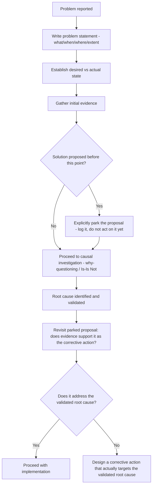

## Avoiding Solution Jumping During Framing

### Overview

Solution jumping is the premature commitment to a corrective action before the causal investigation that would justify it has actually been completed. It is one of the most common and consequential failures during the framing phase of RCA — occurring even before formal why-questioning begins — and it systematically undermines every downstream RCA activity by substituting a comfortable, familiar fix for a genuinely evidence-derived root cause.

### Definition and Core Mechanism

**Key Points**

- Solution jumping occurs when a proposed fix is identified — often within seconds of a problem being reported — and the investigation team's subsequent effort shifts toward justifying or implementing that fix rather than genuinely investigating causation.
- This differs from premature stopping (a 5 Whys-specific failure mode covered earlier) in timing and mechanism: premature stopping occurs *during* a why-chain, terminating investigation once a comfortable answer is reached; solution jumping can occur *before* investigation even begins, with the "solution" often preceding any structured causal questioning at all.
- The two failure modes frequently reinforce each other: a team that has already jumped to a solution during framing will often unconsciously steer subsequent why-questioning toward answers that justify the pre-selected fix, rather than following the evidence.

### Why Solution Jumping Happens

**Key Points**

- **Pattern matching to past incidents**: Experienced practitioners often (correctly, in many cases) recognize surface-level similarity to a previously solved problem and propose the same fix — this is valuable expertise, but becomes solution jumping when the surface similarity is treated as confirmed causal similarity without verification.
- **Organizational pressure for speed**: Incident response urgency creates strong pressure to propose *something* actionable immediately, and a concrete proposed fix can feel more reassuring to stakeholders than an open-ended "we're still investigating" status.
- **Cognitive availability bias**: The most recently learned or most memorable potential cause/fix tends to be proposed first, independent of whether it is actually the most evidentially supported explanation for the current specific incident.
- **Fix ownership incentives**: A team or individual with an existing preferred solution (e.g., an already-planned infrastructure migration) may be motivated to frame a new incident as further justification for that pre-existing plan, regardless of whether the incident's actual causation supports that framing.

### Worked Example: Solution Jumping in Action

**Example**

> Incident reported: "The recommendation engine is returning stale results for some users."
>
> **Solution jumping response**: "We've been meaning to migrate to the new caching layer — this confirms we need to prioritize that migration. Let's fast-track it."
>
> **What's skipped**: No investigation has yet established *why* results are stale for *some* (not all) users, what the actual mechanism of staleness is, or whether the proposed caching migration would even address this specific mechanism.

**Corrected framing-first approach**:

> Problem statement: "Recommendation results for 12% of users, specifically those in session cohort B, showed data from more than 6 hours prior, despite the expected refresh interval of 15 minutes."
>
> Is/Is Not check: Cohort A (88% of users) shows correctly refreshed data under identical infrastructure — ruling out a general caching-layer-wide problem as a *sufficient* explanation, since a caching layer issue would be expected to affect all cohorts, not selectively cohort B.
>
> Subsequent investigation reveals: cohort B users are specifically those with a particular feature flag enabled, which routes their refresh requests through a different, recently modified code path with a bug in its cache invalidation logic.

The caching migration might still be valuable as separate, forward-looking infrastructure work — but it would not have addressed *this specific incident's* actual mechanism, and treating it as the incident's fix would have left the actual bug (in the feature-flag-specific code path) unaddressed and likely to recur or affect other cohorts as the flag rolls out further.

### Detecting Solution Jumping in Progress

**Key Points**

- A proposed fix is offered before a problem statement has been written or before any evidence has been reviewed.
- The conversation's energy shifts toward implementation logistics (timeline, resourcing, who will build it) before causal questions have been asked at all.
- Objections to the proposed fix are met with justifications for why it should be done anyway ("even if that's not the cause, it's still a good idea") rather than engagement with whether it actually addresses the evidenced mechanism.
- The proposed solution closely matches a fix the proposer was already interested in implementing before this specific incident occurred.

### Mitigation Techniques

**1. Explicit Framing-Before-Fixing Sequencing**

Structure the investigation process so that problem statement, desired/actual state, and initial evidence review are explicit prerequisite steps before solution proposals are permitted to be discussed — not merely encouraged as good practice, but structurally sequenced.

**2. "Parking" Proposed Solutions**

Rather than suppressing solution ideas entirely (which can feel dismissive and may discard genuinely useful pattern-matching insight), explicitly acknowledge and record proposed solutions as they arise, then defer evaluating them until after causal investigation — revisiting the parked list once a root cause is validated, checking each proposal against whether it actually addresses the confirmed mechanism.

**3. Explicit Facilitator Role**

In group investigation settings, assigning a facilitator specifically responsible for redirecting premature solution discussion back toward framing/evidence questions can counteract the natural conversational pull toward "what should we do about it," particularly under incident-response time pressure.

**4. The "How Do We Know" Check**

Before allowing a proposed fix to move forward, ask explicitly: "What evidence establishes that this fix addresses the actual mechanism behind this specific problem, as opposed to a mechanism we're assuming based on similarity to a past incident?" If this question cannot be answered with reference to evidence gathered during this investigation, the proposal remains provisional.

### Distinguishing Legitimate Fast-Response Fixes from Solution Jumping

**Key Points**

- Not every quick fix during an active incident is solution jumping — immediate **mitigation** actions (restarting a service, rolling back a deployment, failing over to a backup) taken to restore service during an active incident are legitimate and often necessary, distinct from the RCA's causal investigation itself (this mirrors the reactive-vs-proactive discussion's point that reactive stabilization remains necessary).
- The distinction is: mitigation actions are explicitly understood as temporary stabilization, not substitutes for the causal investigation that follows; solution jumping specifically refers to treating a proposed fix as the *final, causally-justified* corrective action without that justification having been established.

**Example**

> Legitimate: "We're rolling back the deployment now to restore service (mitigation), and will conduct a full RCA afterward to determine whether the deployment was actually the cause or merely correlated with the timing (investigation)."
>
> Solution jumping: "We rolled back the deployment and it fixed things, so the deployment was clearly the root cause — case closed." (Skips validating whether rollback's apparent success actually confirms causation, versus the symptom resolving for an unrelated reason — connecting to the "fix resolves symptom" misconception covered earlier.)

### Related Topics

- Writing an effective problem statement
- Common misconceptions about root cause analysis (symptom resolution ≠ confirmed cause)
- Common failure modes: single path bias, premature stopping, blame drift
- Establishing desired state versus actual state
- Distinguishing corrective action from preventive action