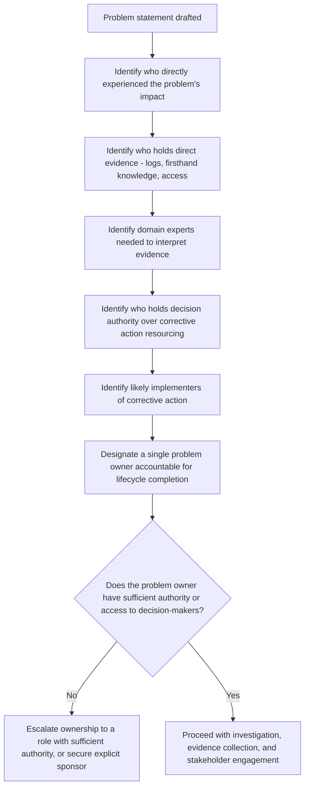

## Identifying Stakeholders and Problem Owners

### Overview

RCA investigations do not occur in a vacuum — they involve people with varying knowledge, authority, and interest in both the problem and its resolution. Identifying stakeholders and establishing clear problem ownership during the framing phase determines who provides evidence, who validates findings, who has authority to implement corrective action, and ultimately whether the RCA's conclusions translate into actual, durable change. Skipping this step is a common structural cause of RCAs that produce well-reasoned findings which are never implemented.

### Distinguishing Stakeholders from Problem Owners

**Key Points**

- **Stakeholders** are any individuals or groups affected by, knowledgeable about, or with legitimate interest in the problem and its resolution — this is typically a broad set.
- The **problem owner** is the specific individual or role accountable for ensuring the investigation proceeds, reaches a conclusion, and that corrective action is implemented and verified — this is typically a single, clearly designated role, not a broad set.
- Conflating these two concepts is a common framing error: treating "everyone affected" as equally responsible for driving the investigation forward tends to produce diffused responsibility, where no single person ensures the RCA lifecycle (evidence collection through effectiveness verification) is actually completed.

### Categories of Stakeholders

| Category | Role in the Investigation | Example |
| --- | --- | --- |
| Affected parties | Experienced the problem's impact directly | Customers, end users, downstream teams consuming a broken service |
| Evidence holders | Possess direct, firsthand knowledge or access to relevant data (genchi genbutsu-relevant) | The engineer who made a relevant change, the operator present during the incident |
| Domain experts | Provide technical or process expertise to interpret evidence and evaluate causal hypotheses | A database specialist consulted on query performance evidence |
| Decision authority | Can authorize resourcing, prioritization, or implementation of corrective action | Team lead, engineering manager, process owner |
| Implementers | Will actually carry out the corrective/preventive action | The engineer assigned to fix the identified defect |
| Reviewers/validators | Provide independent scrutiny of the causal chain before it is finalized | A peer reviewer checking the 5 Whys chain for single path bias |

### The Problem Owner Role in Detail

**Key Points**

- The problem owner is responsible for: ensuring a precise problem statement is written, assembling the right evidence-holders and domain experts, driving the investigation to a validated conclusion, securing decision-authority buy-in for corrective action, and following through to effectiveness verification and documentation.
- The problem owner does not need to personally possess the deepest technical expertise on the issue — their primary responsibility is **process accountability** (ensuring the RCA lifecycle phases actually occur) rather than necessarily being the most knowledgeable investigator.
- **[Inference]** Ambiguity about problem ownership is likely a significant contributor to the "premature stopping" and "RCA ends at ticket closure" failure modes discussed earlier, since without a clearly accountable owner, no individual has a defined responsibility to push the investigation past a comfortable early stopping point or to verify corrective action effectiveness after implementation.

### Worked Example: Stakeholder Mapping

**Example**

Problem: A recurring billing calculation error affecting a subset of enterprise customers.

| Stakeholder | Category | Role in This Investigation |
| --- | --- | --- |
| Enterprise customers affected | Affected parties | Provide impact reports; not directly involved in causal investigation |
| Billing engineering team | Evidence holders + Implementers | Hold system logs, code history; will implement any code-level fix |
| Finance/accounting team | Domain experts + Affected parties | Understand correct calculation rules; also affected by billing discrepancies needing correction |
| Billing team lead | Problem owner (decision authority) | Accountable for driving investigation to completion and securing implementation resourcing |
| Customer success team | Affected parties (secondary) | Not evidence holders, but need visibility into findings to manage customer communication |
| A senior engineer from an unrelated team | Reviewer/validator | Provides independent review of the causal chain to check for bias, per validation best practices |

### Stakeholder Identification Procedure

### Common Ownership and Stakeholder Errors

| Error | Description | Consequence |
| --- | --- | --- |
| No designated owner | Investigation proceeds as a diffuse group effort with no single accountable individual | Findings may never reach implementation; lifecycle stalls after root cause identification |
| Owner without authority | Problem owner lacks the organizational standing to secure resourcing for corrective action | Valid findings go unimplemented due to lack of prioritization power |
| Excluding evidence holders | Key individuals with direct, firsthand knowledge are not consulted | Investigation proceeds on incomplete or secondhand evidence, violating genchi genbutsu discipline |
| Excluding affected-party perspective | Investigation focuses purely on internal technical evidence without considering actual user/customer impact framing | Problem statement or desired-state definition may miss what stakeholders actually consider the deficiency |
| Owner conflated with blame target | The person most associated with the failure is assigned as "owner" in a way that functions as informal blame assignment | Undermines blameless investigation culture; may discourage the owner from surfacing self-incriminating evidence |
| Too many decision-makers, no clear final authority | Multiple stakeholders each believe they have final say over corrective action prioritization | Delayed or conflicting decisions on how to proceed |

### Stakeholder Engagement Across the RCA Lifecycle

**Key Points**

- Different stakeholder categories are relevant at different lifecycle phases (referencing the general RCA process lifecycle): evidence holders and domain experts are most critical during evidence collection and causal factor identification; decision authority becomes critical at corrective action design and implementation; affected parties are most relevant to problem definition (establishing desired state) and to communication once conclusions are reached.
- **[Inference]** Engaging decision authority only at the very end of an investigation (rather than informing them early that an investigation is underway) risks a late-stage resourcing bottleneck, where a technically sound corrective action design stalls because the relevant decision-maker was not prepared for the request — proactively flagging likely resourcing needs earlier in the lifecycle, even before conclusions are final, can mitigate this risk.

### Relationship to Blameless Culture

**Key Points**

- Clear stakeholder and ownership identification supports, rather than conflicts with, blameless investigation culture (introduced in the RCA within TQM and blame drift discussions) — ownership here refers to *process accountability for driving the investigation forward*, explicitly distinct from *fault attribution for having caused the problem*. Conflating the two (assigning "ownership" as an implicit blame marker) undermines the psychological safety the investigation depends on for honest evidence-sharing.

### Related Topics

- Avoiding solution jumping during framing
- Blameless postmortem culture and psychological safety in investigation
- The general RCA process lifecycle and where stakeholder engagement fits
- Documentation and knowledge sharing standards
- Distinguishing corrective action from preventive action ownership