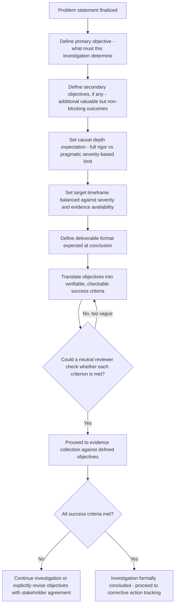

## Setting Investigation Objectives and Success Criteria

### Overview

An RCA investigation needs a defined endpoint — a concrete answer to "what does 'done' look like for this investigation, and how will we know we've succeeded." Without explicit objectives and success criteria, investigations risk two opposite failure patterns: stopping too early because no clear bar for completion was ever defined, or continuing indefinitely because there is no agreed signal that sufficient rigor has been achieved. This section establishes how to define investigation objectives distinctly from the problem statement, and how to set concrete, verifiable success criteria before the investigation begins.

### Distinguishing Investigation Objectives from the Problem Statement

**Key Points**

- The problem statement (covered earlier) describes **what happened** — the observed gap between desired and actual state.
- Investigation objectives describe **what the investigation itself is meant to accomplish** — which is not always simply "find the root cause." Depending on context, objectives might include identifying the root cause, determining whether a specific hypothesis is correct, establishing whether an incident is part of a recurring pattern, or providing sufficient evidence to inform a resourcing decision.
- Conflating these two can cause an investigation to feel directionless even after a precise problem statement has been written, if it remains unclear what specific outcome the investigation is meant to produce.

### Components of Well-Defined Investigation Objectives

| Component | Description |
| --- | --- |
| Primary objective | The main outcome the investigation is meant to produce (e.g., "identify the root cause(s) sufficient to prevent recurrence") |
| Secondary objectives | Additional outcomes of value but not strictly required for investigation closure (e.g., "assess whether this incident shares a root cause with two prior related incidents") |
| Depth expectation | How rigorously the investigation should pursue causal depth, connecting to the causal-depth scoping dimension covered earlier — full termination-criteria rigor versus a pragmatic, severity-appropriate limit |
| Timeframe | A target window for reaching investigation conclusions, balanced against evidence availability and severity |
| Deliverable format | What artifact the investigation is expected to produce (e.g., a documented causal chain, a formal postmortem report, a decision brief for leadership) |

### Setting Success Criteria

Success criteria translate objectives into concrete, checkable conditions — ideally stated so that a neutral reviewer, not just the original investigators, could assess whether they have been met.

**Key Points**

- Effective success criteria are **verifiable**, not aspirational — "we understand the problem better" is not verifiable; "a root cause has been identified that satisfies the actionability, necessity, and non-triviality criteria, and is supported by cited evidence" is verifiable.
- Success criteria should be set **before** the investigation begins, for the same reason problem statements should avoid embedded causal assumptions — criteria set after conclusions are reached risk being unconsciously tailored to match whatever was actually found, rather than genuinely constraining the investigation's rigor.

**Example — investigation objectives and success criteria**

> **Problem statement**: "The nightly ETL pipeline failed to complete for 3 of the last 5 runs, each time at a different stage."
>
> **Primary objective**: Identify the root cause(s) explaining why failures occurred at inconsistent stages, sufficient to design a fix preventing recurrence.
>
> **Secondary objective**: Determine whether the inconsistent failure stage indicates a shared underlying cause (e.g., resource contention) versus multiple independent causes.
>
> **Success criteria**:
>
> - [ ] A candidate root cause (or set of causes) is identified and validated against evidence from all 3 failed runs, explaining the stage-inconsistency specifically
> - [ ] Each candidate root cause satisfies the actionability, necessity, and non-triviality criteria
> - [ ] The candidate cause(s) are checked against the 2 successful runs in the same period (Is/Is Not style validation) to confirm they don't equally apply to unaffected runs
> - [ ] A corrective action is proposed with a named owner and target implementation date
> - [ ] The investigation is documented in a format reviewable by the platform team, who own the underlying infrastructure

### Investigation Objectives Procedure

### Calibrating Objectives to Severity

**Key Points**

- Investigation objectives and success criteria should scale with the severity, frequency, and impact of the problem — this connects directly to the causal-depth scoping principle discussed earlier, but applied specifically to how rigorously success criteria are defined.
- A low-severity, one-off issue might have lightweight success criteria (e.g., "a plausible, evidence-supported explanation is documented, without requiring formal cross-validation against historical patterns"), while a high-severity or recurring issue warrants more rigorous criteria (e.g., mandatory validation against related incidents, mandatory independent review, formal effectiveness verification over a defined monitoring period).

| Severity Tier | Typical Objective Rigor | Example Success Criteria Emphasis |
| --- | --- | --- |
| Low (isolated, low impact) | Lightweight, single-investigator | Plausible, evidence-supported cause documented; corrective action proposed |
| Medium (moderate impact or recurring pattern) | Structured, may involve small group review | Root cause validated against Is/Is Not comparators; independent review of causal chain |
| High (severe impact, safety, or repeated pattern) | Full rigor, multi-stakeholder | Formal validation, cross-incident pattern analysis, effectiveness verification plan mandatory before closure, executive-level documentation |

### Avoiding Overly Rigid or Overly Vague Criteria

**Key Points**

- **Too rigid**: Success criteria that specify an exact expected finding in advance (e.g., "success criteria: confirm that the deployment caused the outage") improperly presuppose the investigation's conclusion — this is a subtle form of the embedded-causal-assumption error discussed in problem statement construction, now applied to objectives rather than the problem description itself. Criteria should specify the *rigor and completeness bar* for whatever is found, not the expected finding itself.
- **Too vague**: Success criteria like "understand what happened" provide no checkable completion signal and risk the investigation either stopping arbitrarily early or continuing indefinitely without a defined endpoint.

### Revising Objectives Mid-Investigation

**Key Points**

- As with scope (discussed in the prior scoping section), objectives may legitimately need revision if early evidence reveals the original objectives were miscalibrated — e.g., evidence suggesting the problem is part of a much larger recurring pattern than initially assumed, warranting escalation of the depth/rigor tier.
- Such revisions should be made deliberately and documented, with stakeholder awareness (connecting to the problem owner's responsibility for lifecycle accountability), rather than silently abandoning the original criteria without acknowledgment.

### Relationship to the Broader RCA Lifecycle

**Key Points**

- Investigation objectives and success criteria function as the acceptance test for the general RCA lifecycle's validation phase (covered in the lifecycle overview) — "validation" is only meaningful relative to a predefined bar for what counts as sufficient, which is precisely what success criteria establish upfront.
- Explicit success criteria also directly support the problem owner's accountability role (covered in the prior stakeholder section): a clear, checkable criteria list gives the owner a concrete basis for determining when the investigation is genuinely complete, versus when it has merely become organizationally convenient to stop.

### Related Topics

- Writing an effective problem statement
- Scoping the investigation boundary
- Identifying stakeholders and problem owners
- Determining when enough whys have been asked
- Validating root causes against full incident evidence