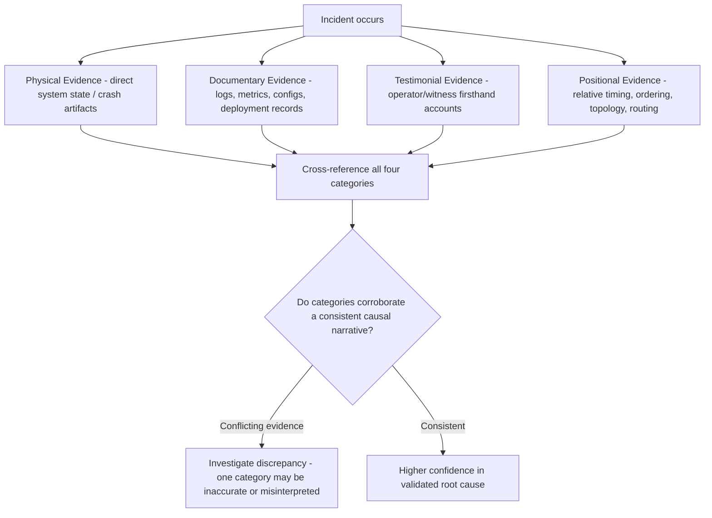

## Categories of Evidence: Physical, Documentary, Testimonial, Positional

### Overview

Rigorous RCA depends on gathering evidence broadly and deliberately, rather than relying on whichever information happens to be most immediately available. A well-established framework — borrowed from formal accident investigation disciplines (aviation, forensic engineering) and widely adapted into general RCA practice — categorizes evidence into four types: **physical**, **documentary**, **testimonial**, and **positional**. Understanding these categories ensures investigators systematically check each evidence source rather than defaulting only to the most convenient type (commonly testimonial or documentary), which can leave stronger, more objective evidence types unexamined.

### The Four Evidence Categories

| Category | Definition | Examples in Technical/Software Context | Examples in Physical/Manufacturing Context |
| --- | --- | --- | --- |
| **Physical** | Tangible artifacts, system states, or direct traces left by the event | Core dumps, crashed process memory state, corrupted data files, hardware component that failed | Fractured part, worn component, residue, damaged material |
| **Documentary** | Records created independent of the investigation, describing conditions or actions | Logs, metrics, monitoring dashboards, deployment records, commit history, configuration files, tickets | Maintenance logs, inspection records, work orders, design specifications |
| **Testimonial** | Firsthand accounts from people present or involved | Operator/on-call engineer's account of what they observed and did | Eyewitness accounts, operator statements |
| **Positional** | The spatial, temporal, or relational arrangement of objects/events relative to each other | Which service instance handled which request, request routing/ordering, which nodes were in a given cluster state | Where a part was positioned in an assembly, the sequence of physical events at a scene |

### Physical Evidence

**Key Points**

- Physical evidence in a technical/software context refers to direct system state artifacts — memory dumps, crash reports, corrupted files, or (in hardware/manufacturing contexts) the actual failed component itself.
- Physical evidence is often the most objective evidence category, since it represents a direct trace of the failure rather than an interpretation or record of it — but it is also frequently the most **time-sensitive**, since system state can be overwritten, processes restarted, or physical evidence discarded/repaired before it is captured.
- **[Inference]** This time-sensitivity is likely the primary reason physical evidence capture should occur in parallel with, rather than after, initial incident mitigation — the priority tension between "restore service quickly" and "preserve evidence before it's lost" is a genuine practical tradeoff investigators must navigate, not merely a procedural oversight to eliminate.

**Example**

> A service crashes with an out-of-memory error. Physical evidence: the core dump captured at the moment of crash, showing exact memory allocation state and the specific object graph consuming excessive memory — this is direct, objective evidence of the mechanism, distinct from a log entry merely stating "OOM error occurred" (which would be documentary evidence describing the event, not physical evidence of the event's internal state).

### Documentary Evidence

**Key Points**

- Documentary evidence encompasses any record created as a byproduct of normal system or organizational operation — logs, metrics, dashboards, version control history, deployment records, tickets, design documents, and configuration files.
- This is typically the most **abundant** evidence category in modern software systems, given extensive logging and monitoring infrastructure, but abundance does not guarantee relevance — a common practical challenge is filtering large volumes of documentary evidence to what is actually pertinent to the specific, precisely-scoped problem statement.
- Documentary evidence has an important sub-distinction: **contemporaneous** records (created automatically, at or near the time of the event — e.g., logs, metrics) versus **retrospective** records (created after the fact, based on recollection — e.g., a written incident summary composed hours later). Contemporaneous documentary evidence is generally more reliable, since it is not subject to the memory distortion that can affect retrospective accounts.

**Example**

> Deployment logs (contemporaneous, documentary) showing the exact timestamp and content of a configuration change are stronger evidence for establishing a temporal correlation with an incident than a team member's later written summary stating "I believe we deployed something around that time" (retrospective, documentary, weaker due to memory imprecision).

### Testimonial Evidence

**Key Points**

- Testimonial evidence consists of firsthand accounts from individuals present during or involved in the event — operators, on-call engineers, customers, or witnesses in physical/manufacturing contexts.
- Testimonial evidence is valuable for capturing context not otherwise recorded (intent, reasoning behind a decision, observations not captured by automated logging) but is inherently more subject to memory distortion, unconscious bias, and — particularly relevant to blame-drift risk discussed earlier — self-protective framing if the individual fears attribution of fault.
- **Best practice**: testimonial evidence should be gathered as close to the event as possible (memory degrades over time) and, where feasible, cross-checked against documentary or physical evidence rather than accepted as sole confirmation of a causal claim.

**Example**

> An on-call engineer reports: "I noticed the dashboard showing elevated error rates around 14:00, so I restarted the service." This testimonial account provides valuable context (what triggered the response) but should be cross-checked against the actual dashboard/monitoring timestamp (documentary evidence) to confirm the recalled time is accurate, since memory of exact timing under incident-response stress is commonly imprecise.

### Positional Evidence

**Key Points**

- Positional evidence describes the spatial, temporal, or relational arrangement of objects, events, or system components relative to one another — often the least intuitively recognized evidence category, but frequently critical for understanding causation in distributed or sequential systems.
- In distributed software systems, positional evidence includes: which specific instance/node handled a given request, the exact ordering of concurrent operations, cluster topology at the time of the incident, or which version of a service was actively serving traffic in a given region during a rolling deployment.
- Positional evidence is often what distinguishes seemingly identical documentary records into causally distinct categories — e.g., two error log entries with identical error messages might have entirely different root causes if positional evidence reveals they occurred on different infrastructure generations, different feature-flag states, or in a different request-ordering context.

**Example**

> Two API requests both fail with the same "resource locked" error (documentary evidence, appears identical). Positional evidence — specifically, the exact sequence in which two concurrent requests acquired and attempted to acquire the same database row lock — reveals that one failure stemmed from a genuine race condition in application logic, while the other stemmed from an unrelated, longer-running batch job holding the lock for an extended period. Without positional evidence establishing the precise ordering and concurrent context, these two superficially identical failures could be mistakenly treated as a single root cause when they actually reflect two distinct mechanisms.

### Evidence Category Cross-Reference Table

### Why Systematic Coverage of All Four Categories Matters

**Key Points**

- Investigations that rely on only one or two evidence categories (most commonly documentary and testimonial, since these are typically the most immediately accessible) risk missing evidence that would either strengthen or contradict the emerging causal narrative — this connects directly to the confirmation bias risk discussed in the general RCA lifecycle's evidence collection phase.
- **Cross-corroboration** across categories is a strong validation technique: a causal hypothesis supported by documentary evidence (e.g., a deployment log) that is also consistent with physical evidence (e.g., a matching crash dump signature) and positional evidence (e.g., confirming the deployment was actively serving the affected traffic segment) carries substantially more evidentiary weight than a hypothesis resting on a single category alone.
- **[Inference]** Discrepancies discovered when cross-referencing categories (e.g., testimonial account conflicts with documentary timestamp) are themselves valuable investigative signals — rather than being dismissed as noise, such conflicts often indicate either a flaw in the current causal hypothesis or a previously unconsidered factor (e.g., clock synchronization issues, or a testimonial account describing a different, related event than the one initially assumed).

### Practical Evidence Collection Checklist

- [ ] **Physical**: Has system state (crash dumps, memory snapshots, failed component) been captured before it was overwritten or discarded?
- [ ] **Documentary**: Have relevant logs, metrics, configuration history, and deployment records been pulled for the scoped time window?
- [ ] **Testimonial**: Have firsthand accounts been gathered from those directly involved, close in time to the event, with attention to psychological safety per blameless investigation principles?
- [ ] **Positional**: Has the relative timing, ordering, and topology/routing context been established, not just the isolated fact that an event occurred?
- [ ] Have categories been cross-referenced for corroboration or discrepancy before finalizing a causal hypothesis?

### Related Topics

- Confirmation bias mitigation in evidence collection
- The general RCA process lifecycle and evidence collection's position within it
- Genchi genbutsu and direct, on-site evidence-gathering discipline
- Log analysis and monitoring data interpretation techniques
- Validating root causes against full incident evidence