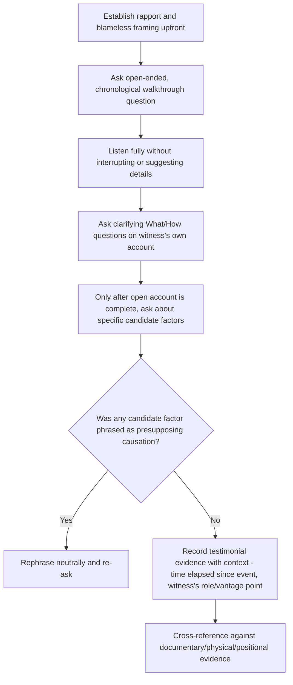

## Interviewing Witnesses Without Leading Questions

### Overview

Testimonial evidence (covered in the prior section) is uniquely vulnerable to distortion introduced by the interviewer, not just the witness's own memory limitations. A leading question — one that suggests or implies a particular answer — can contaminate testimonial evidence at the moment of collection, producing accounts that appear to confirm a hypothesis not because the hypothesis is correct, but because the question itself steered the witness toward that answer. This section details the mechanics of leading questions, why they undermine RCA rigor, and concrete techniques for conducting evidence-preserving interviews.

### Why Leading Questions Undermine RCA

**Key Points**

- Leading questions convert testimonial evidence from an independent data point into a reflection of the interviewer's pre-existing hypothesis — directly compounding the confirmation bias risk already present in evidence collection (discussed in the general RCA lifecycle content).
- This risk compounds with anchoring (discussed in the 5 Whys limitations content): if an interviewer has already formed a leading hypothesis early in the investigation, subsequent leading questions to witnesses can produce testimonial evidence that *appears* to independently corroborate that hypothesis, when in fact the corroboration is an artifact of question phrasing rather than a genuinely independent confirmation.
- **[Inference]** This risk is likely most severe precisely when an investigator is most confident in an early hypothesis, since confidence tends to reduce the perceived need for neutral, open-ended questioning — meaning interview discipline is arguably most important exactly when it feels least necessary to the interviewer.

### Anatomy of a Leading Question

A leading question typically does one or more of the following:

- **Presupposes a fact not yet established**: "When did you notice the server was overloaded?" (presupposes overload before confirming it)
- **Offers a limited/binary choice that excludes other possibilities**: "Was it the deployment or the traffic spike that caused this?" (excludes other candidate causes)
- **Embeds the interviewer's hypothesis in the phrasing**: "Don't you think the new caching layer might have caused this?"
- **Uses emotionally or causally loaded language**: "Why did you fail to catch this before it shipped?" (presupposes fault and framing before establishing facts)

### Leading vs. Neutral Question Comparison

| Leading Question | Problem | Neutral Alternative |
| --- | --- | --- |
| "Was the config change the reason the service crashed?" | Presupposes a specific cause | "Walk me through what happened leading up to the crash." |
| "Didn't you notice the error rate climbing before you left for lunch?" | Presupposes the witness should have noticed | "What were you monitoring or aware of before you stepped away?" |
| "Wasn't the deployment rushed because of the deadline pressure?" | Embeds a causal and motivational assumption | "What was the process for this deployment? Was there anything different about the timeline compared to usual?" |
| "So basically the root cause was insufficient testing, right?" | Asks for confirmation of a conclusion rather than eliciting independent testimony | "What testing was performed on this change before it was deployed?" |

### Techniques for Neutral, Evidence-Preserving Interviews

**1. Open-Ended Questions First**

Begin with broad, non-directive prompts that allow the witness to describe events in their own framing before narrowing to specific details.

**Example**: "Can you describe, in your own words, what you observed during that period?" rather than "Did you see the memory usage spike?"

**2. Chronological Walkthroughs**

Ask witnesses to reconstruct events in temporal sequence, which tends to surface more complete and less selectively-filtered accounts than jumping directly to the moment believed to be causally significant.

**Example**: "Starting from when your shift began, what do you remember happening, in order?" rather than "What happened right when the alert fired?"

**3. Avoid Presupposing Causation in Phrasing**

Describe observed events factually without embedding a causal claim the witness is being asked to confirm rather than independently report.

**Example**: "What did you do after seeing the alert?" rather than "What did you do to fix the problem you caused?"

**4. Use "What" and "How" Before "Why"**

Establishing factual, observable sequence (what happened, how it unfolded) before moving to interpretive "why" questions reduces the risk of the witness inferring what answer is expected and shaping their response to match.

**5. Separate Multiple Candidate Explanations Into Independent Questions**

Rather than offering a binary or short list of options (which implicitly excludes other possibilities and signals which answers are considered plausible), ask an open question first, and only introduce specific candidate explanations afterward, framed neutrally, if the witness's own account doesn't naturally surface them.

**Example**: First ask "What do you think might have contributed to this?" and let the witness respond freely; only afterward, if needed, ask separately and neutrally about a specific candidate factor: "Was there anything unusual about the network conditions that day, as far as you observed?"

**6. Allow Silence and Avoid Filling Gaps with Suggestions**

When a witness pauses while recalling events, resist the impulse to fill the silence with a suggested detail — doing so risks the witness incorporating the interviewer's suggestion into their reported memory, a well-documented phenomenon in cognitive interviewing research broadly (not RCA-specific, but directly applicable).

### Interview Structure

### Establishing Blameless Framing Before Questioning

**Key Points**

- Beyond question phrasing itself, the framing established at the outset of an interview substantially affects testimonial evidence quality — explicitly stating that the interview's purpose is systemic understanding, not fault assignment (connecting to blameless investigation culture discussed earlier), reduces the witness's incentive toward self-protective or defensive framing of their account.
- **Example framing statement**: "This conversation is to understand what happened from a systems perspective, not to evaluate anyone's individual performance — I'm interested in your firsthand observations, including anything that felt uncertain or that you're not fully sure about."

### Recording and Documenting Testimonial Evidence Appropriately

**Key Points**

- Testimonial evidence should be recorded with explicit context: how much time elapsed between the event and the interview (affecting memory reliability), the witness's vantage point/role (affecting what they were positioned to observe), and whether the account was elicited via open or more targeted questioning (affecting how much interviewer framing may have shaped the response).
- Direct quotations from witnesses should be distinguished from investigator paraphrasing or summarization in documentation, so later reviewers can assess whether an interpretive leap was made between what was actually said and how it was recorded.

### Common Interview Errors Beyond Question Phrasing

| Error | Description | Correction |
| --- | --- | --- |
| Interviewing too long after the event | Memory degrades significantly over time, especially under stress | Prioritize interviews as close to the event as feasible |
| Group interviews without individual accounts first | Witnesses may unconsciously conform their account to match others speaking first | Gather individual accounts independently before group discussion, where feasible |
| Interviewer visibly reacting to answers | Visible surprise, approval, or disappointment can shape how a witness continues their account | Maintain neutral affect throughout, regardless of whether an answer confirms or contradicts a hypothesis |
| Treating the first account as final | Witnesses may recall additional relevant details on reflection or when prompted by later evidence | Allow for follow-up, especially once documentary/physical evidence is available to prompt more specific recollection |

### Related Topics

- Categories of evidence: physical, documentary, testimonial, positional
- Common failure modes: single path bias, premature stopping, blame drift
- Blameless postmortem culture and psychological safety in investigation
- Confirmation bias and anchoring in investigative reasoning
- Cross-referencing evidence categories for corroboration