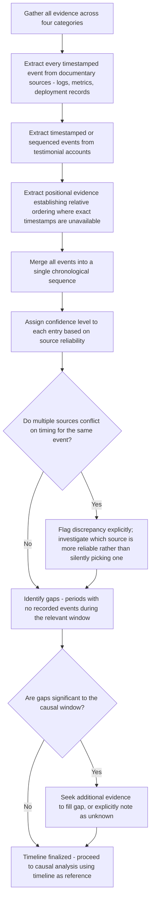

## Constructing an Incident Timeline

### Overview

An incident timeline is a chronologically ordered reconstruction of events, conditions, and actions leading up to, during, and following a problem. It serves as the structural backbone that integrates all four evidence categories (physical, documentary, testimonial, positional) into a single, coherent temporal sequence, making causal relationships and correlations visible in a way that isolated pieces of evidence cannot. A well-constructed timeline is often the single most valuable artifact produced during evidence collection, since it directly supports subsequent why-questioning, Is/Is Not comparison, and validation.

### Why Timelines Are Central to RCA

**Key Points**

- Causal reasoning fundamentally depends on temporal ordering — a candidate cause must precede its effect, and establishing precise timing is often what distinguishes a genuine causal relationship from mere coincidental correlation.
- Timelines make **gaps and inconsistencies** visible: a period with no recorded events, or two evidence sources reporting conflicting timing for the same event, becomes immediately apparent when evidence is arranged chronologically, whereas it might go unnoticed when evidence is reviewed in isolation, one document at a time.
- Timelines directly support the timeline-anchored cause mapping format discussed in the visual cause mapping content, distinguishing long-standing latent conditions from the specific triggering event.

### Core Components of a Timeline Entry

Each timeline entry should typically capture:

| Field | Purpose |
| --- | --- |
| Timestamp | Precise time (with timezone/UTC specified) the event occurred |
| Event description | Factual description of what happened, free of causal interpretation |
| Evidence source | Which evidence category and specific source supports this entry (e.g., "deployment log," "on-call engineer testimony," "monitoring dashboard screenshot") |
| Confidence level | How precisely the timestamp is known (exact vs. approximate) and how reliable the source is |
| Actor/component | Who or what was responsible for or involved in the event |

### Worked Example: Timeline Construction

**Example**

Problem: Checkout service outage lasting 22 minutes.

| Timestamp (UTC) | Event | Source | Confidence |
| --- | --- | --- | --- |
| 08:00 | Scheduled `monthly-analytics-export` job begins | Job scheduler logs | High (exact, automated) |
| 08:03 | `replica-db-03` CPU utilization begins rising | Infrastructure monitoring | High (exact, automated) |
| 08:11 | `replica-db-03` CPU reaches 95% | Infrastructure monitoring | High (exact, automated) |
| 08:12 | First checkout service connection timeout logged | Application logs | High (exact, automated) |
| ~08:12 | On-call engineer receives first alert | Alerting system + engineer testimony | Medium (alert timestamp exact; engineer's noticing time approximate) |
| 08:15 | On-call engineer begins investigating dashboards | Engineer testimony | Low-medium (self-reported, not independently logged) |
| 08:19 | Checkout error rate peaks at 40% | Application metrics | High (exact, automated) |
| 08:22 | Engineer identifies `replica-db-03` as the bottleneck | Engineer testimony + monitoring correlation | Medium |
| 08:24 | Engineer manually terminates `monthly-analytics-export` job | Job scheduler logs (job termination event) | High (exact, automated) |
| 08:26 | Checkout error rate begins declining | Application metrics | High (exact, automated) |
| 08:34 | Checkout error rate returns to baseline | Application metrics | High (exact, automated) |

Note how confidence levels vary meaningfully across entries — automated, documentary sources (job logs, metrics) carry high confidence, while testimonial entries describing an engineer's subjective process (when they "began investigating") carry lower confidence and should be treated accordingly during causal analysis.

### Construction Procedure

### Handling Timestamp Discrepancies

**Key Points**

- Different systems often have imperfectly synchronized clocks, different timezone handling, or different granularity (millisecond-precise automated logs vs. minute-approximate human recollection) — reconciling these is a necessary, non-trivial part of timeline construction, not an edge case to ignore.
- When sources conflict, the discrepancy itself should be documented rather than silently resolved by arbitrarily picking one source — a persistent, unexplained few-second-to-minute discrepancy between two systems might itself be diagnostically relevant (e.g., revealing a clock synchronization issue that is a contributing factor in its own right for some classes of distributed-systems incidents).
- **[Inference]** As a general heuristic, automated, machine-generated timestamps (documentary/positional evidence) are typically more reliable for precise timing than human testimonial recollection, but this is not an absolute rule — automated timestamps can themselves be affected by clock drift, logging delays, or timezone misconfiguration, so cross-checking multiple automated sources against each other, not just against testimony, adds confidence.

### Visualizing the Timeline

<svg xmlns="http://www.w3.org/2000/svg" viewBox="0 0 740 220">
<text x="370" y="20" text-anchor="middle" font-size="14" font-weight="bold" fill="#1a1a1a">Incident Timeline Visualization (svg_diagram)</text>
<line x1="40" y1="110" x2="700" y2="110" stroke="#333" stroke-width="2" />
<circle cx="80" cy="110" r="5" fill="#2874a6" />
<text x="80" y="95" text-anchor="middle" font-size="9" fill="#1b4f72">08:00</text>
<text x="80" y="135" text-anchor="middle" font-size="8.5" fill="#333">Job starts</text>
<circle cx="220" cy="110" r="5" fill="#2874a6" />
<text x="220" y="95" text-anchor="middle" font-size="9" fill="#1b4f72">08:03</text>
<text x="220" y="135" text-anchor="middle" font-size="8.5" fill="#333">CPU rising</text>
<circle cx="360" cy="110" r="5" fill="#c0392b" />
<text x="360" y="95" text-anchor="middle" font-size="9" fill="#7b241c">08:12</text>
<text x="360" y="135" text-anchor="middle" font-size="8.5" fill="#333">First timeout</text>
<circle cx="440" cy="110" r="5" fill="#c0392b" />
<text x="440" y="95" text-anchor="middle" font-size="9" fill="#7b241c">08:19</text>
<text x="440" y="135" text-anchor="middle" font-size="8.5" fill="#333">Error peak 40%</text>
<circle cx="540" cy="110" r="5" fill="#1e8449" />
<text x="540" y="95" text-anchor="middle" font-size="9" fill="#145a32">08:24</text>
<text x="540" y="135" text-anchor="middle" font-size="8.5" fill="#333">Job terminated</text>
<circle cx="660" cy="110" r="5" fill="#1e8449" />
<text x="660" y="95" text-anchor="middle" font-size="9" fill="#145a32">08:34</text>
<text x="660" y="135" text-anchor="middle" font-size="8.5" fill="#333">Baseline restored</text>
<rect x="220" y="160" width="140" height="25" fill="#fdebd0" stroke="#d68910" stroke-width="1" />
<text x="290" y="177" text-anchor="middle" font-size="8.5" fill="#7d5a0b">Latent buildup phase</text>
<rect x="360" y="160" width="180" height="25" fill="#fdedec" stroke="#943126" stroke-width="1" />
<text x="450" y="177" text-anchor="middle" font-size="8.5" fill="#641e16">Active incident phase</text>
<rect x="540" y="160" width="120" height="25" fill="#d5f5e3" stroke="#1e8449" stroke-width="1" />
<text x="600" y="177" text-anchor="middle" font-size="8.5" fill="#145a32">Recovery phase</text>
</svg>

### Distinguishing Timeline Phases

**Key Points**

- Mature timeline construction often benefits from explicitly labeling phases: a **latent buildup phase** (conditions developing before symptoms became visible), an **active incident phase** (from first observable symptom to peak impact and initial mitigation), and a **recovery phase** (from mitigation action to return to baseline).
- This phase labeling connects directly to the symptom/trigger/root-cause distinction covered earlier — the latent buildup phase often contains the trigger and early manifestations of the root cause, while the root cause itself frequently predates the entire visualized window (as in the timeline-anchored cause mapping example, where a root cause originated months before the incident).

### Common Timeline Construction Errors

| Error | Description | Correction |
| --- | --- | --- |
| Only including "important" events | Investigator pre-filters which events seem relevant before the causal analysis is complete | Include all available timestamped events initially; filter for relevance only after the full picture is assembled |
| Ignoring pre-incident window | Timeline starts only at the first symptom, omitting the latent buildup phase | Extend timeline backward far enough to capture plausible contributing conditions, per the temporal scoping boundary discussed earlier |
| Merging conflicting sources without flagging | Discrepancies between sources are silently resolved rather than documented | Explicitly flag and, where possible, investigate the cause of any timing discrepancy |
| No confidence/source annotation | All entries treated as equally reliable regardless of source type | Annotate each entry's source and confidence level, per the evidence categories distinction |
| Timeline construction after causal conclusion is drawn | Timeline is built to support an already-reached conclusion rather than preceding it | Construct the timeline as an early evidence-collection step, before committing to a specific causal hypothesis |

### Related Topics

- Categories of evidence: physical, documentary, testimonial, positional
- Root cause versus symptom versus trigger
- The Is/Is Not analysis technique
- Scoping the investigation boundary (temporal dimension)
- Combining 5 Whys with visual cause mapping (timeline-anchored variant)