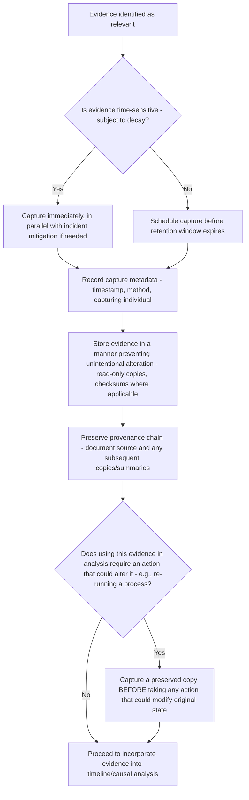

## Preserving Evidence Integrity

### Overview

Evidence integrity refers to the discipline of capturing, handling, and storing evidence in a way that preserves its accuracy, completeness, and trustworthiness throughout the investigation. Unlike evidence *collection* (gathering what exists) or evidence *categorization* (physical, documentary, testimonial, positional), integrity concerns what happens to evidence *after* it is identified — whether it remains an accurate representation of the original event or becomes degraded, altered, or lost before it can inform the causal analysis. Integrity failures can invalidate an otherwise sound investigation, since conclusions drawn from compromised evidence carry false confidence.

### Why Evidence Integrity Is a Distinct Concern

**Key Points**

- Even perfectly categorized, well-sourced evidence (per the physical/documentary/testimonial/positional framework) is only useful if it accurately reflects the original event — integrity failures can occur at capture (evidence lost before recording), during handling (evidence altered or corrupted after collection), or in storage (evidence becomes inaccessible or its provenance is lost over time).
- This concern connects directly to the time-sensitivity issue raised in the evidence categories content, particularly for physical evidence — but integrity extends beyond mere timing to cover accuracy and chain of custody as well.

### Threats to Evidence Integrity

**1. Time Decay**

**Key Points**

- Certain evidence types degrade or disappear if not captured promptly: system memory state is overwritten by subsequent processes, log retention windows expire, temporary files are cleaned up, and human memory (testimonial evidence) degrades with elapsed time.
- **[Inference]** Time-decay risk varies substantially by evidence type: automated documentary evidence (logs with defined retention) decays predictably and can often be proactively preserved before expiration, while physical evidence (in-memory state, transient system conditions) can decay within seconds to minutes, requiring immediate capture during active incident response rather than after the fact.

**2. Unintentional Alteration**

**Key Points**

- Evidence can be inadvertently modified during the investigation itself — e.g., an investigator restarting a service to "just check something," inadvertently clearing the very memory state that constituted key physical evidence; or re-running a process under investigation, altering log files that would otherwise show the original failure sequence.
- This risk is particularly acute during active incident response, when the same individuals responsible for evidence preservation are simultaneously under pressure to restore service — actions taken for legitimate mitigation purposes can unintentionally destroy evidence needed for subsequent root cause investigation.

**3. Intentional Alteration**

**Key Points**

- Though less common than unintentional alteration, evidence can be deliberately modified — e.g., under blame-oriented organizational pressure (connecting to the blame drift failure mode), an individual might be incentivized to alter records to obscure their own involvement.
- Blameless investigation culture (discussed earlier) is itself a mitigation for this risk: reducing the incentive for defensive evidence tampering is a more sustainable safeguard than relying solely on after-the-fact detection.

**4. Incomplete Capture**

**Key Points**

- Evidence captured only partially — a truncated log excerpt, a screenshot of only part of a relevant dashboard, a partial memory dump — can misrepresent the original event by omission, even without any alteration of the captured portion itself.
- Incomplete capture is often not immediately apparent to later reviewers, who may reasonably assume a captured piece of evidence is representative of the full original context unless explicitly told otherwise.

**5. Loss of Provenance**

**Key Points**

- Provenance refers to the traceable origin of a piece of evidence — where it came from, when it was captured, and by what method. Evidence that has been copied, forwarded, or summarized multiple times without preserving this chain of origin becomes progressively harder to verify or trust, since later reviewers cannot confirm it accurately reflects the original source.

### Integrity Preservation Procedure

### Practical Preservation Techniques by Evidence Category

| Evidence Category | Preservation Technique |
| --- | --- |
| Physical (system state) | Capture memory dumps, crash reports, or system snapshots immediately upon detection, before any restart or remediation action; store as read-only artifacts |
| Documentary (logs, metrics) | Export or archive relevant logs/metrics before automatic retention expiration; note exact query parameters used to retrieve them, so the extraction can be reproduced or verified |
| Testimonial (accounts) | Record interviews promptly (per the interviewing content) and preserve the original account (recording or verbatim notes) distinct from later summarized or paraphrased versions |
| Positional (topology, ordering) | Capture cluster/infrastructure state (which nodes were active, routing configuration) at the time of the incident, since this state is often dynamic and not retained by default once the system's configuration subsequently changes |

### The Tension Between Mitigation and Preservation

**Key Points**

- A recurring practical tension exists between the urgency of restoring service (mitigation) and the need to preserve evidence before it decays — this mirrors the reactive/proactive discussion's point that immediate stabilization remains necessary, but here specifically in tension with evidence integrity rather than with root cause investigation broadly.
- **[Inference]** Where feasible, organizations that formalize a brief evidence-capture step as a standard, expected part of incident response (e.g., "before restarting, capture a memory snapshot if the situation allows") are likely to preserve meaningfully more usable evidence than organizations where preservation is left to individual investigator judgment under time pressure — though the appropriate balance depends heavily on incident severity, since preservation steps that meaningfully delay service restoration during a severe, high-impact outage may not be justified.

### Documenting Chain of Custody

**Key Points**

- For evidence with significant weight in the final causal conclusion, documenting who captured it, when, by what method, and any subsequent handling (copies made, summaries produced) creates an auditable record — allowing later reviewers to assess evidence reliability rather than accepting it as an unquestionable given.
- This is analogous to (though generally less formal than) chain-of-custody practices in legal/forensic contexts, adapted proportionately to the stakes of a given RCA investigation — a low-severity internal software incident does not require forensic-grade custody documentation, while a safety-critical or externally-scrutinized investigation may warrant considerably more rigor.

### Integrity Checks Before Finalizing Analysis

Before evidence is used to support a causal conclusion, consider:

- [ ] Was this evidence captured close enough to the original event to be considered reliable, or has meaningful time elapsed that could have caused decay or memory distortion?
- [ ] Is there any indication the evidence may have been altered (intentionally or not) after the original event?
- [ ] Is the captured evidence complete, or could a partial capture be misrepresenting the full original context?
- [ ] Can the evidence's provenance be traced back to its original source, or has it passed through enough intermediary summarization that confidence in its accuracy should be reduced?
- [ ] Where feasible, has this evidence been cross-referenced against an independent source (per the evidence categories content) to corroborate its accuracy?

### Relationship to Overall Investigation Confidence

**Key Points**

- Evidence integrity directly determines how much confidence the final root cause conclusion can carry — a causal chain built on evidence with unresolved integrity concerns (significant time decay, unclear provenance, uncorroborated single-source testimony) should be documented with appropriately calibrated confidence rather than presented with the same certainty as a chain built on well-preserved, cross-corroborated evidence.
- This connects to the validation phase of the general RCA lifecycle: validating a root cause against evidence is only as meaningful as the integrity of the evidence being validated against.

### Related Topics

- Categories of evidence: physical, documentary, testimonial, positional
- Constructing an incident timeline
- Interviewing witnesses without leading questions
- The general RCA process lifecycle and validation phase
- Reactive versus proactive problem solving (mitigation vs. preservation tension)