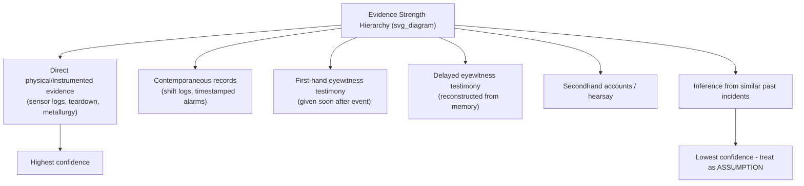

## Distinguishing Fact from Assumption

### Overview

Root Cause Analysis depends entirely on the quality of the evidence base underlying it. A 5 Whys chain built on unverified assumptions produces a root cause that is plausible-sounding but structurally unsound — the analysis will "work" syntactically (each Why appears to follow from the last) while being disconnected from what actually happened. Distinguishing fact from assumption is the discipline of tagging every piece of information entering the analysis with its epistemic status before it is allowed to influence the causal chain.

### Why This Distinction Matters in RCA

**Key Points**

- The 5 Whys method is a chain of causal claims; if any link in the chain is an unverified assumption rather than a verified fact, the entire downstream chain inherits that uncertainty
- Teams under schedule pressure tend to substitute plausible narratives for verified evidence because narratives are faster to produce
- An assumption that goes unchallenged in Why #1 does not just weaken that step — it silently converts every subsequent Why into a hypothesis about a hypothesis
- Corrective actions derived from assumption-based root causes frequently fail to prevent recurrence, because the actual mechanism was never confirmed

### Defining the Two Categories

**Fact**

A fact is a claim that is directly observable, measurable, or documented, and reproducible by another investigator examining the same evidence.

Characteristics of a fact:

- Traceable to a specific artifact: a log entry, a timestamp, a physical measurement, a signed document, a sensor reading
- Independent of who is reporting it — a second person examining the same source arrives at the same conclusion
- Falsifiable — there exists, at least in principle, a way to check it and be wrong

**Assumption**

An assumption is a claim that fills a gap in the evidence using inference, prior experience, convention, or intuition, without a direct source that can be independently checked.

Characteristics of an assumption:

- Often phrased with unconscious certainty ("the sensor was probably drifting")
- Frequently based on pattern-matching to a prior, unrelated incident
- Not traceable to a specific artifact — if asked "how do you know," the answer is a chain of reasoning rather than a pointer to evidence
- Not inherently wrong — assumptions are often correct — but their correctness is *unverified* at the time they are used

### The Core Diagnostic Test

For any statement entering the RCA, ask:

> "If I asked you to prove this to someone who was not present, could you point to an artifact, or would you have to explain your reasoning?"

- **Points to an artifact** (log file, interview transcript quoting a specific individual, photograph, work order, sensor trace) → **Fact**
- **Explains reasoning** ("it makes sense because," "in my experience," "it's usually") → **Assumption**

A secondary test is the **source attribution test**: a fact has a named, specific origin ("per the SCADA historian, valve V-12 closed at 14:32:07"). An assumption has a diffuse or absent origin ("the valve probably closed around then").

### Common Sources of Unlabeled Assumptions in RCA

1. **Memory reconstruction** — witnesses reconstruct sequences of events from memory hours or days after the incident; memory fills gaps with plausible defaults without the witness realizing it
2. **Normalcy bias** — investigators assume "nothing unusual happened" in periods where no one was specifically watching, when in fact no evidence exists either way
3. **Anchoring on a prior incident** — "this looks just like the failure we had last year," which imports that incident's causal chain without confirming it applies here
4. **Authority-based assumption** — a claim is accepted because a senior person stated it, not because it was independently verified
5. **Documentation gaps treated as confirmations** — the absence of a logged alarm is assumed to mean "the alarm did not fire," when it may mean "the alarm fired but was not logged"
6. **Causal language disguising temporal correlation** — "X caused Y" stated as fact when only "X preceded Y" has actually been observed

### A Practical Classification Workflow

**Step 1 — Extract atomic claims.** Break the incident narrative into single, indivisible statements. "The pump overheated because the bearing seized due to lack of lubrication" is three claims, not one.

**Step 2 — Tag each claim.** Apply one of three tags, not two:

- `[FACT]` — verified against a traceable source
- `[ASSUMPTION]` — plausible but unverified
- `[UNKNOWN]` — no evidence and no working hypothesis yet exists

Using a third `[UNKNOWN]` tag is deliberately important: it prevents the common failure mode of collapsing "we don't know" into "we assume," which happens when a team is uncomfortable leaving a gap open.

**Step 3 — Trace each `[FACT]` tag to its artifact.** Record the artifact reference alongside the claim (log line number, interview timestamp, work order ID). If no artifact can be named, the tag was applied incorrectly and the claim reverts to `[ASSUMPTION]`.

**Step 4 — Convert assumptions into verification tasks.** Every `[ASSUMPTION]` used in the 5 Whys chain generates an explicit action: "verify via [specific method]" before the analysis is finalized.

**Step 5 — Gate the 5 Whys chain.** A Why step may only be written into the final RCA chain if it is `[FACT]` or if it is `[ASSUMPTION]` explicitly labeled as such with its verification status noted. No unlabeled claims are permitted in the final document.

### Worked Example

**Incident:** A conveyor motor tripped on overcurrent during a night shift.

| # | Raw Statement | Tag | Basis |
| --- | --- | --- | --- |
| 1 | "The motor tripped at 02:14" | `[FACT]` | PLC alarm log, event ID 4471 |
| 2 | "The bearing was probably worn" | `[ASSUMPTION]` | No inspection performed yet |
| 3 | "No one greased it during the last PM" | `[ASSUMPTION]` | PM checklist not yet pulled |
| 4 | "The operator noticed unusual noise an hour before" | `[FACT]` | Operator statement, timestamped shift log entry |
| 5 | "The lubrication schedule was followed" | `[UNKNOWN]` | PM records not yet located |

Applying the 5 Whys directly on the raw narrative (treating 2, 3, and 5 as settled facts) would prematurely converge on "lubrication program failure" as the root cause — a conclusion that may be entirely wrong if the PM records (once pulled) show lubrication was performed on schedule and the actual cause was, say, a manufacturing defect in the bearing itself.

Only after `[ASSUMPTION]` #2 is converted via physical inspection, and `[UNKNOWN]` #5 is resolved via records retrieval, can the chain proceed with integrity:

**Why did the motor trip?** → Overcurrent from mechanical binding `[FACT: current trace shows gradual rise over 40 min, not instantaneous spike]`

**Why was there mechanical binding?** → Bearing found seized on inspection `[FACT: teardown report, photo evidence]`

**Why did the bearing seize?** → Bearing race shows spalling consistent with contamination, not lack of lubrication `[FACT: metallurgical inspection]`

**Why was contamination present?** → Bearing seal was damaged during installation 6 months prior `[FACT: installation work order shows seal replacement was not performed per spec]`

**Why was the seal not replaced per spec?** → Installation procedure did not specify seal replacement interval `[FACT: procedure document review]`

Note the root cause that emerges (a procedural gap) is entirely different from the initially assumed root cause (a lubrication PM failure) — the distinction between fact and assumption is what redirected the analysis to the correct systemic issue.

### Facilitator Techniques for Enforcing the Distinction

- **Ban unattributed causal verbs in session notes** — require every "caused," "led to," or "resulted in" statement to carry a source citation or an explicit `[ASSUMPTION]` tag
- **Ask "how do we know?" after every Why**, not just the first one — assumption creep typically happens at Why #3 or #4, after the team has built momentum
- **Separate the fact-gathering meeting from the analysis meeting** — collecting evidence and reasoning about it in the same session pressures participants to fill gaps with assumptions to keep the discussion moving
- **Use a visible artifact register** — a running list of every source document referenced, so any fact claim can be checked against it in real time
- **Rotate a designated skeptic** — one participant's explicit role is to challenge every claim with "what's the source?"

### Evidence-Strength Hierarchy (Reference)

Not all facts carry equal weight; ranking helps when facts conflict.

### Common Pitfalls

- **False precision** — an assumption stated with a specific number ("the temperature was 82°C") feels like a fact because of its specificity, but specificity is not the same as verification
- **Consensus mistaken for confirmation** — if three people independently *assume* the same thing, it is still an assumption; agreement is not evidence unless each person has an independent verifiable source
- **Treating "no contrary evidence" as confirmation** — absence of evidence against a claim is not evidence for it; this should be tagged `[UNKNOWN]`, not `[FACT]`
- **Retroactive fact-labeling** — once an assumption has been repeated several times in meeting notes, it can start to read like an established fact simply through repetition

**Related Topics**

- Interview techniques for extracting first-hand, contemporaneous testimony
- Chain-of-custody principles for physical and digital evidence in RCA
- Timeline reconstruction and event sequencing techniques
- Cognitive biases in incident investigation (confirmation bias, hindsight bias, anchoring)
- Building and maintaining an evidence/artifact register during an investigation
- Differentiating causation from correlation in the 5 Whys chain