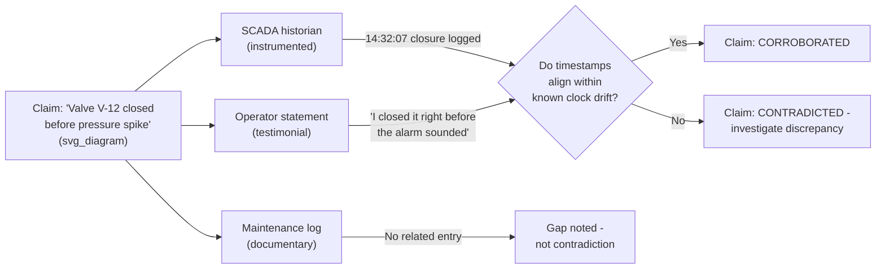

## Cross Referencing Multiple Evidence Sources

### Overview

Cross referencing is the practice of validating a piece of evidence by checking it against independent sources that would be expected to corroborate it if it is true. A single source, however credible it appears, carries the risk of recording error, bias, or incomplete context. In Root Cause Analysis, cross referencing converts isolated data points into a defensible evidence base by establishing convergence — or by exposing contradiction, which is often more diagnostically valuable than agreement.

### Why Single-Source Evidence Is Insufficient

**Key Points**

- Every individual evidence source has known failure modes: instruments drift or miscalibrate, logs can be incomplete or misconfigured, witnesses have limited vantage points and imperfect memory, and documentation can be outdated or aspirational rather than descriptive of actual practice
- A root cause supported by only one source is a hypothesis with a single point of failure — if that source is wrong, the entire conclusion collapses
- Contradictions between sources are not noise to be resolved by picking the "more credible" one; they are signals that point to where the real investigative work remains

### Categories of Evidence Sources

| Category | Examples | Typical Weaknesses |
| --- | --- | --- |
| Instrumented/digital | SCADA historians, PLC alarm logs, application logs, sensor traces, CCTV | Clock drift, sampling gaps, misconfigured thresholds, retention limits |
| Physical | Failed components, teardown findings, metallurgical samples, photographs | Chain-of-custody gaps, secondary damage obscuring primary cause |
| Documentary | Work orders, maintenance records, procedures, design specs, change logs | Documents may describe intended practice, not actual practice |
| Testimonial | Operator interviews, witness statements, shift handover notes | Memory decay, vantage point limits, social pressure to conform to a narrative |
| Temporal | Timestamps across all of the above | Different systems may use different clocks/time zones/sync intervals |

### The Triangulation Principle

A claim is considered corroborated when it is supported by at least two sources from **different categories** in the table above. Two testimonial sources agreeing with each other is weaker corroboration than one testimonial and one instrumented source agreeing, because testimonial sources are more likely to share common contamination (e.g., two operators who discussed the event before being interviewed separately).

### Step-by-Step Cross Referencing Process

**Step 1 — Build a source inventory.** List every available source before analysis begins: logs, documents, physical evidence, and the full list of individuals to interview. Analysis should not start until the inventory is reasonably complete, or gaps should be explicitly flagged.

**Step 2 — Establish a common timeline.** Normalize all timestamps to a single reference clock. This is frequently the single most error-prone step — different systems (PLC, SCADA, CCTV, radio logs, badge access systems) often run on unsynchronized clocks with drift measured in seconds to minutes.

**Step 3 — Plot each source's claims onto the timeline independently**, without yet trying to reconcile them. Premature reconciliation causes investigators to unconsciously adjust one source's timestamp to match another, destroying the independence of the comparison.

**Step 4 — Identify convergence, gaps, and contradictions:**

- **Convergence** — two or more independent sources agree within expected tolerance → treat as corroborated fact
- **Gap** — a source is silent on a claim (e.g., no log entry) → this is `[UNKNOWN]`, not disconfirmation; the absence must be explained (was the event outside logging scope, or did the event simply not happen?)
- **Contradiction** — sources disagree in a way that cannot be explained by known tolerances → this is the highest-priority item for further investigation, not a fact to be smoothed over

**Step 5 — Investigate every contradiction explicitly before proceeding.** Do not resolve a contradiction by defaulting to the source perceived as more authoritative (e.g., "the log must be right, the operator must be misremembering"). Determine *why* the sources disagree — this is frequently where the actual root cause is hiding.

**Step 6 — Document the corroboration status of every fact used in the 5 Whys chain**, alongside its supporting sources.

### Worked Example

**Incident:** A batch of product failed a quality check; RCA is investigating a suspected temperature excursion during curing.

| Claim | Source A | Source B | Source C | Status |
| --- | --- | --- | --- | --- |
| Oven reached 15°C above setpoint at 09:14 | Oven data logger: 09:14:03, +15.2°C | Quality inspector's handwritten log: "oven seemed hot around 9am" | Maintenance ticket filed 09:20 referencing "oven temp alarm" | **Corroborated** (3 independent categories align within tolerance) |
| Door seal was degraded | Visual inspection photo, post-incident | — | Prior PM record noted seal wear 2 months earlier | **Corroborated** (documentary + physical, no testimonial available — flagged as partial) |
| Operator adjusted setpoint manually | Change log: no manual override recorded | Operator states: "I don't recall touching it" | Access log: operator badge at control panel 09:10–09:12 | **Contradiction/Gap** — presence at panel is confirmed, but action taken is unconfirmed by any source; requires further investigation (e.g., HMI audit trail, if it exists) |

The third row illustrates the core value of cross referencing: it does not resolve the claim by assumption ("the operator probably did something since they were there") — it correctly identifies an evidentiary gap requiring a specific next action (pulling the HMI audit trail).

### Handling Contradictions Between Sources

When two credible sources genuinely conflict, apply a structured resolution approach rather than an intuitive one:

1. **Check for clock/timezone misalignment first** — the majority of apparent contradictions in RCA are timestamp artifacts, not substantive disagreements
2. **Check scope and vantage point** — a source may be accurately reporting something true but not the same thing (an operator reporting "the pump sounded fine" from 20 meters away is not necessarily contradicting a vibration sensor detecting an anomaly outside human hearing range)
3. **Check for source contamination** — did witnesses discuss the event before giving statements, potentially converging their accounts artificially?
4. **Escalate unresolved contradictions explicitly in the RCA report** rather than silently choosing one source — an unresolved contradiction is itself a finding, and may indicate an instrumentation or process gap worth correcting independent of the immediate incident

### Common Pitfalls

- **Confirmation shopping** — seeking additional sources only until one is found that agrees with the preferred hypothesis, then stopping
- **Treating documentary evidence as behavioral evidence** — a written procedure describes intended behavior, not necessarily what occurred; it must still be cross-referenced against records showing the procedure was actually followed
- **Over-trusting digital sources** — automated logs feel objective but are subject to sensor drift, sampling rate limitations, and configuration errors; digital does not automatically mean higher evidentiary weight
- **Skipping timeline normalization** — comparing raw timestamps across systems with unsynchronized clocks routinely produces false contradictions or false corroborations
- **Interviewing witnesses together** — destroys the independence required for testimonial corroboration to be meaningful

**Related Topics**

- Timeline reconstruction and clock synchronization techniques across disparate systems
- Chain-of-custody protocols for physical evidence
- Structured witness interview techniques (avoiding leading questions, individual vs. group interviews)
- Building an evidence/artifact register during an investigation
- Distinguishing fact from assumption (evidentiary tagging discipline)
- Statistical process control data as a corroborating evidence source