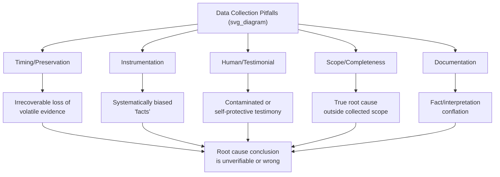

## Common Data Collection Pitfalls

### Overview

Data collection is the foundation phase of Root Cause Analysis, and errors introduced here propagate silently through every subsequent Why, since each step in the 5 Whys chain relies on the accuracy of the evidence gathered before analysis began. Unlike analytical errors, which are often visible in the logic of a causal chain, collection errors are frequently invisible — the analysis reads as coherent and well-reasoned while being built on a corrupted or incomplete data set. This item catalogs the recurring failure modes that undermine RCA at the collection stage, before cross-referencing or fact/assumption tagging even begins.

### Category 1 — Timing and Preservation Pitfalls

**Delayed evidence collection**

The longer the gap between the incident and data collection, the more evidence degrades: volatile logs roll over and are overwritten, physical evidence is disturbed by cleanup or continued operation, and memory-based testimony decays. Time-sensitive sources (network buffers, in-memory application state, short-retention logs) must be prioritized immediately, before longer-lived sources (permanent records, physical components).

**Scene disturbance before documentation**

Restarting equipment, clearing alarms, or resuming production before photographing, measuring, and recording the as-found state destroys the ability to verify claims about the failure condition later. Once a scene is "cleaned up" to resume operations, its evidentiary value for exact fault-state reconstruction is largely lost.

**Failure to freeze volatile/rolling logs**

Circular buffers, rolling application logs, and short-retention SCADA historians will silently overwrite the relevant window if not exported or frozen quickly. This is one of the most common irreversible pitfalls — once overwritten, this category of evidence cannot be recovered by any later effort.

### Category 2 — Instrumentation and Measurement Pitfalls

**Uncalibrated or drifted instruments**

Sensor readings collected without knowledge of the instrument's calibration status can introduce a systematic bias into the entire evidence base. A "fact" derived from an uncalibrated sensor is actually closer to an unverified assumption wearing the appearance of a fact.

**Sampling rate blindness**

An instrument sampling once per minute cannot detect a transient event lasting two seconds. Treating the absence of a spike in low-resolution data as proof the spike did not occur is a common and consequential pitfall — absence of detection is not evidence of absence when the sampling rate is coarser than the event duration.

**Unsynchronized clocks across systems**

Collecting timestamped data from multiple systems (PLC, SCADA, CCTV, badge readers, radio logs) without recording or correcting for clock drift produces evidence that appears to conflict or align by coincidence rather than by true correspondence. This should be checked and documented before any timeline is built.

### Category 3 — Human/Testimonial Collection Pitfalls

**Leading questions during interviews**

Questions framed around a preferred hypothesis ("so the bearing was probably making noise before it failed, right?") prompt witnesses to confirm the interviewer's expectation rather than report their independent observation. This contaminates testimonial evidence at the point of collection, and the contamination is generally undetectable after the fact.

**Group interviews allowing account convergence**

Interviewing multiple witnesses together, or sequentially without separation, allows earlier accounts to shape later ones. What appears to be multiple corroborating witnesses may actually be one account repeated three times.

**Blame-driven interview environment**

When witnesses believe the investigation is looking for someone to blame, testimony shifts toward self-protective narratives rather than accurate reporting. This is a collection-stage failure, not an analysis-stage one — the data itself becomes unreliable before any conclusions are drawn from it.

**Over-reliance on the most available witness**

Interviewing only the person easiest to reach (e.g., the day-shift supervisor) rather than the person with direct first-hand knowledge (e.g., the night-shift operator actually present) produces secondhand or reconstructed accounts labeled as if they were primary testimony.

### Category 4 — Scope and Completeness Pitfalls

**Premature scope narrowing**

Collecting data only for the specific component or step assumed to be at fault, before the causal chain has actually been established, risks missing evidence for the true root cause if the initial hypothesis is wrong. Data collection scope should start broader than the current leading hypothesis and narrow only as evidence supports it.

**Ignoring "boring" or routine data**

Skipping collection of data that seems unrelated to the presumed failure mode (e.g., ambient conditions, unrelated maintenance activity, concurrent system changes) can eliminate the only evidence that would reveal a contributing factor outside the initial frame of reference.

**Stopping collection once a plausible narrative emerges**

Confirmation-driven collection halts as soon as enough data exists to support a satisfying story, rather than continuing until the evidence set is genuinely sufficient to rule out alternative explanations. This is one of the most consequential pitfalls because it is largely invisible to the team committing it — the investigation *feels* complete.

### Category 5 — Documentation and Recording Pitfalls

**Paraphrasing instead of verbatim capture**

Summarizing a witness statement in the interviewer's own words during collection, rather than recording it verbatim (or as close to verbatim as practical), risks unconsciously converting testimony into a version that already fits the interviewer's mental model.

**Undocumented chain of custody for physical evidence**

Failing to record who collected a physical sample, when, and how it was handled and stored undermines its credibility as evidence, particularly when findings are later disputed or reviewed externally.

**Mixing raw data with interpretation in the same record**

Recording "the pump failed due to cavitation" instead of "pump discharge pressure showed intermittent drops to 0 psi at 3-second intervals" collapses the fact/interpretation distinction at the point of collection, making it difficult for later reviewers to separate what was observed from what was concluded.

### Pitfall-to-Consequence Map

### A Collection Checklist to Mitigate These Pitfalls

1. Freeze all volatile/rolling logs before anything else, regardless of perceived relevance
2. Photograph and measure the as-found state before any equipment is moved, reset, or restarted
3. Record instrument calibration status and sampling rate alongside every measurement collected
4. Normalize or document clock offsets across all systems before building a timeline
5. Interview witnesses individually, separately, and as soon as practical after the event
6. Use open, non-leading questions ("what did you observe?" rather than "did you notice X?")
7. Capture testimony close to verbatim, separating raw statements from the interviewer's interpretation
8. Set an initial collection scope broader than the current leading hypothesis
9. Define an explicit stopping criterion for collection in advance (e.g., "until every Why in the chain has at least one corroborating source"), rather than stopping when the narrative feels complete
10. Record chain of custody for any physical evidence retained

### Common Pitfalls (Meta-Level)

- **Treating this checklist as a one-time gate rather than an ongoing discipline** — new data often surfaces mid-analysis, and the same collection rigor must apply to it as to the initial evidence set
- **Assuming more data collection always helps** — collecting excessive volumes of low-relevance data can obscure the few high-value evidentiary items and slow the investigation without improving its rigor
- **Underestimating organizational/psychological pitfalls** — technical rigor in instrumentation and documentation is undermined if the interview environment is blame-driven, regardless of how well the technical checklist is followed

**Related Topics**

- Distinguishing fact from assumption (evidentiary tagging discipline)
- Cross referencing multiple evidence sources
- Structured, non-leading witness interview techniques
- Chain-of-custody protocols for physical evidence
- Timeline reconstruction and clock synchronization across systems
- Evidence preservation procedures for volatile digital data