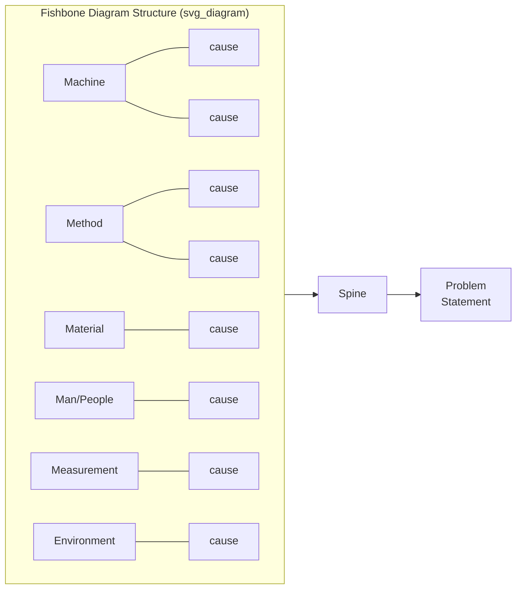

## Fishbone or Ishikawa Diagram Construction

### Overview

The Fishbone diagram (also called an Ishikawa diagram, after Kaoru Ishikawa, or a cause-and-effect diagram) is a structured visual tool used to organize potential causes of a problem into categories before drilling into any single branch with the 5 Whys. Where 5 Whys produces a single linear causal chain, the Fishbone diagram serves the earlier, broader purpose of ensuring the investigation has considered the full space of possible cause categories before committing to one line of questioning — reducing the risk that 5 Whys is applied prematurely to a plausible but incomplete hypothesis.

### Purpose in the RCA Workflow

**Key Points**

- The Fishbone diagram is a divergent tool (broadening the search for causes); the 5 Whys is a convergent tool (drilling down one identified branch)
- Used together, the standard sequence is: define the problem statement → build the Fishbone diagram to survey cause categories → select the most probable branch(es) → apply 5 Whys to that branch to reach a root cause
- The diagram's primary value is preventing tunnel vision — teams under pressure tend to jump to the first plausible cause, and the Fishbone's category structure forces consideration of categories that might otherwise be skipped entirely

### Diagram Structure

The diagram resembles a fish skeleton: a horizontal "spine" points to the problem statement (the fish's head), and diagonal "bones" branch off the spine representing major cause categories. Each category bone has smaller sub-branches representing specific contributing factors within that category.

### Standard Category Frameworks

Different domains use different standard category sets as starting scaffolds — these are prompts to ensure breadth, not a rigid requirement that every category must be populated.

**Manufacturing / Industrial — the "6 Ms"**

- **Machine** — equipment, tooling, technology
- **Method** — process, procedure, work instructions
- **Material** — raw materials, components, consumables
- **Man** (Manpower/People) — training, staffing, fatigue, skill
- **Measurement** — instrumentation, calibration, data collection accuracy
- **Mother Nature** (Environment) — temperature, humidity, ambient conditions

**Service / Administrative / Software — the "4 Ps" or "8 Ps"**

- **Policies** — governing rules and guidelines
- **Procedures** — the steps actually followed
- **People** — staffing, skills, roles
- **Plant/Technology** — systems, tools, infrastructure

  (Extended sets add: Price, Promotion, Place, Process)

**Marketing — the "4 Ps"**

- Product, Price, Promotion, Place

The category framework is a starting template; teams should relabel or add categories (e.g., "Software," "Data," "Communication") when the standard sets don't fit the domain naturally. Forcing a poor fit undermines the tool's purpose.

### Step-by-Step Construction Process

**Step 1 — Write a precise, specific problem statement.** Place it at the head of the fish. A vague statement ("quality issues") produces a shallow, unfocused diagram; a specific statement ("15% increase in weld porosity defects on Line 3, starting March") focuses the brainstorm.

**Step 2 — Draw the spine and select category bones.** Choose a category framework appropriate to the domain (6 Ms, 4 Ps, or a custom set), and draw each as a diagonal bone off the main spine.

**Step 3 — Brainstorm causes within each category.** For each category, ask: "What about [category] could contribute to [problem statement]?" Capture every plausible cause without filtering for likelihood at this stage — filtering prematurely narrows the search the diagram is meant to broaden.

**Step 4 — Add sub-branches for deeper contributing factors.** If a cause itself has contributing factors (e.g., under "Man," the cause "inadequate training" might have sub-causes "no refresher training," "new hire onboarding gap"), branch further off that cause line.

**Step 5 — Review for balance across categories.** A diagram with 15 items under "Method" and zero under every other category is a signal of groupthink or premature narrowing, not necessarily evidence that Method is truly the dominant category. Prompt the team explicitly on sparse branches.

**Step 6 — Cross-reference each candidate cause against the evidence base.** Apply fact/assumption tagging (see the related evidence-gathering item) to each branch item — a Fishbone diagram built purely from opinion, without evidence cross-referencing, risks the same evidentiary weaknesses as any other RCA step.

**Step 7 — Prioritize branches for further investigation.** Use team consensus, voting (e.g., multi-voting or dot-voting), or a supporting Pareto analysis of historical incident data to select which branch(es) warrant deeper investigation.

**Step 8 — Apply 5 Whys to the selected branch(es).** Take the specific cause identified as most probable and use it as the starting point ("Why #1") for a 5 Whys drill-down.

### Worked Example

**Problem statement:** "Conveyor Line 3 motor tripped on overcurrent at 02:14, halting production for 3 hours."

| Category | Candidate Causes |
| --- | --- |
| Machine | Bearing wear, misalignment, motor age/duty cycle exceeded |
| Method | No vibration-monitoring procedure exists for this motor class, PM interval too long |
| Material | Incorrect lubricant grade used, contaminated grease |
| Man | Night shift technician recently reassigned, unfamiliar with this line |
| Measurement | No current-trend alarm configured, only hard trip threshold |
| Environment | Elevated ambient temperature in that section of plant, poor ventilation near motor |

After team review, cross-referencing against maintenance and current-trace data (per the evidence-gathering process), the "Material" branch — contaminated grease traced to an installation six months prior — was cross-referenced as the strongest evidentiary lead and selected as the starting point for 5 Whys, producing the same procedural root cause reached in the earlier worked example under evidence cross-referencing.

### Facilitation Techniques

- **Silent brainstorming before group discussion** — have participants write candidate causes independently before sharing aloud, to reduce anchoring on the first or most senior voice in the room
- **Affinity clustering** — if categories feel forced for a novel problem type, generate causes freely first, then cluster them into categories afterward rather than forcing them into a predefined bone
- **Time-boxing each category** — allocate a fixed time (e.g., 5 minutes) per category to prevent the brainstorm from being dominated by whichever category the group finds most intuitive
- **"5 Whys within a branch" as a scoping technique** — briefly asking one or two Whys on a candidate cause during the brainstorm (without going deep) can help the team judge whether a branch is worth prioritizing for full investigation

### Common Pitfalls

- **Treating the diagram as the root cause analysis itself** — the Fishbone diagram identifies candidate cause *categories and branches*; it does not, by itself, establish a validated root cause. Skipping the subsequent 5 Whys drill-down and treating a Fishbone branch as "the" root cause is a frequent and significant misuse of the tool
- **Filling branches with unverified opinions and stopping there** — a Fishbone diagram populated entirely from brainstorm without any evidence cross-referencing produces a well-organized list of assumptions, not validated causes
- **Overloading one category due to recency or availability bias** — the most recently discussed or most memorable prior incident tends to dominate brainstorming unless the facilitator actively balances category coverage
- **Using a category framework that doesn't fit the domain** — forcing a software incident into the "6 Ms" (Machine, Material) framework designed for manufacturing produces awkward, low-value branches; a custom category set is often more effective
- **Skipping the prioritization step** — generating a large diagram and then investigating every branch with equal depth is inefficient; explicit prioritization is necessary to focus limited 5 Whys effort on the most evidentially supported branch

**Related Topics**

- 5 Whys methodology and drill-down technique
- Distinguishing fact from assumption (evidentiary tagging discipline)
- Cross referencing multiple evidence sources
- Pareto analysis for prioritizing cause categories
- Affinity diagrams and clustering techniques for brainstorming
- Multi-voting and consensus-building facilitation techniques