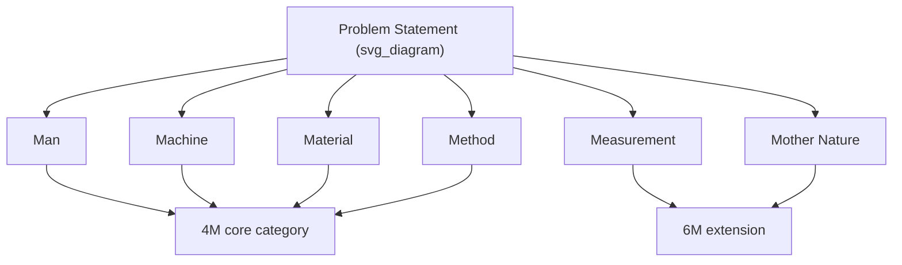

## The 6M and 4M Categorization Frameworks

### Overview

The 4M and 6M frameworks are standardized sets of cause categories used to structure Fishbone/Ishikawa diagrams and, more broadly, to scaffold brainstorming during any divergent phase of Root Cause Analysis. They originated in manufacturing quality management and provide a checklist-like structure to ensure a team surveys the full breadth of possible cause domains rather than fixating on the first plausible explanation. The frameworks are prompts for completeness, not a rigid taxonomy that every cause must be forced into.

### Origin and Purpose

**Key Points**

- The frameworks were developed within Total Quality Management (TQM) practice, closely associated with Kaoru Ishikawa's work on cause-and-effect diagrams in Japanese manufacturing
- Their core function is to counteract tunnel vision — investigators naturally gravitate toward the category most familiar to their own role (an operator suspects equipment, a manager suspects process compliance), and the framework forces explicit consideration of categories outside that default lens
- 4M is the original, more compact framework; 6M is an extension adding two further categories as quality practice matured and recognized additional systemic failure domains
- Neither framework is prescriptive about depth — they define *where* to look for causes, not the specific causes themselves within a given investigation

### The 4M Framework

The 4M framework covers the four most fundamental inputs to virtually any production or operational process:

| Category | Definition | Example Cause Domains |
| --- | --- | --- |
| **Man** (Manpower) | The human element performing or overseeing the process | Training gaps, fatigue, skill mismatch, staffing levels, communication breakdown, procedural non-compliance |
| **Machine** | Equipment, tooling, and technology used in the process | Equipment wear, miscalibration, design limitations, maintenance history, age, capacity constraints |
| **Material** | Inputs consumed or transformed by the process | Raw material variability, supplier quality, incorrect specification, contamination, storage/handling damage |
| **Method** | The documented or actual procedure followed | Missing or outdated procedures, unclear instructions, process design flaws, deviation from standard work |

### The 6M Framework (Extended)

6M adds two categories that address systemic and environmental factors not fully captured by the original four:

| Additional Category | Definition | Example Cause Domains |
| --- | --- | --- |
| **Measurement** | The accuracy and reliability of data used to monitor and evaluate the process | Instrument calibration drift, inadequate sampling rate, incorrect metrics, measurement system variation, inspection error |
| **Mother Nature** (Environment) | External environmental conditions surrounding the process | Temperature, humidity, vibration, dust/contamination, lighting, seasonal variation, ambient noise |

### Why Measurement and Environment Were Added

**Measurement** was added because early cause-and-effect analysis frequently overlooked the possibility that the *data used to detect and diagnose the problem itself* was flawed — a "defect" identified through a miscalibrated gauge, or a trend missed due to insufficient sampling rate, is not a defect in the process being measured but a defect in the measurement system. Explicitly separating Measurement from Machine (the equipment producing the output) prevents this category of cause from being conflated with equipment failure in the process itself.

**Mother Nature / Environment** was added to capture causes external to the immediate process, equipment, and personnel — factors that are often outside direct operational control but still materially affect outcomes, such as seasonal humidity affecting material properties or ambient temperature affecting equipment tolerances.

### Applying the Framework: Category-Specific Prompt Questions

A practical technique for populating each category during a Fishbone brainstorm is to use a standard prompt question per category:

- **Man** — "Could a person's action, inaction, skill level, or judgment have contributed?"
- **Machine** — "Could equipment condition, design, or capability have contributed?"
- **Material** — "Could a property, quality, or availability of an input have contributed?"
- **Method** — "Could the documented or actual procedure have contributed?"
- **Measurement** — "Could the way we detect, monitor, or quantify the problem itself be inaccurate or misleading?"
- **Mother Nature** — "Could an external environmental condition have contributed?"

### Domain Adaptations Beyond Manufacturing

The 4M/6M structure is manufacturing-native; when applied outside that domain, categories are frequently relabeled or supplemented rather than discarded, since the underlying principle (breadth across human, technical, procedural, and input-quality domains) still transfers.

| Domain | Typical Adaptation |
| --- | --- |
| Software/IT | Man → People/Team; Machine → Infrastructure/Systems; Material → Data/Inputs; Method → Process/Code; Measurement → Monitoring/Observability; Mother Nature → External dependencies (third-party APIs, network conditions) |
| Healthcare | Man → Staff; Machine → Equipment/Devices; Material → Supplies/Medication; Method → Clinical protocol; Measurement → Diagnostic accuracy; Mother Nature → Facility/environmental conditions |
| Administrative/Service | Often shifted to the "4 Ps" framework (Policies, Procedures, People, Plant) instead, as raw "Material" and "Mother Nature" categories may not map cleanly |

[Inference] The specific relabelings above are common industry adaptations rather than a single standardized alternate framework; different organizations customize category names to fit their operational vocabulary.

### Worked Example Using 6M

**Problem statement:** "API response latency increased 40% over the past week."

| 6M Category | Candidate Causes |
| --- | --- |
| Man | Recent on-call rotation change, reduced senior engineer coverage |
| Machine | Underlying compute instance resource contention, autoscaling misconfiguration |
| Material | Increased payload size from a recent client-side change, upstream data volume growth |
| Method | Recent deployment introduced an inefficient database query pattern |
| Measurement | Latency dashboard aggregation window recently changed, masking a real spike as gradual drift |
| Mother Nature | Increased traffic due to an external, unrelated seasonal demand spike |

This example illustrates the framework's transferability outside manufacturing, and shows how the Measurement category specifically catches a class of cause (a monitoring configuration change) that a narrower "Machine vs. Process" split might miss entirely.

### Relationship to the Fishbone Diagram and 5 Whys

The 4M/6M framework supplies the category bones of the Fishbone diagram structure. Once branches are populated and prioritized using this framework (see the Fishbone construction item for the full process), the selected branch becomes the entry point for the 5 Whys drill-down. The framework's role ends at cause *identification and categorization* — it does not itself establish causal depth or a validated root cause; that is the function of the subsequent 5 Whys application.

### Common Pitfalls

- **Forcing every cause into a category it doesn't naturally fit** — some causes span multiple categories (e.g., "operator skipped a calibration step due to unclear procedure" touches both Man and Method); rigid single-category assignment can obscure this, so allowing dual-tagging is often more useful than forcing a single bucket
- **Treating sparse categories as evidence of irrelevance** — a category with no brainstormed causes may reflect team blind spots rather than genuine irrelevance; sparse categories warrant an explicit prompt rather than being silently skipped
- **Using 4M/6M as a substitute for evidence-based validation** — the framework organizes *candidate* causes; it does not validate them. Every category item still requires fact/assumption tagging and cross-referencing before being treated as established
- **Applying the manufacturing-native labels rigidly in non-manufacturing domains** — using "Material" and "Mother Nature" unmodified in a pure software or service context often produces forced, low-value entries; relabeling to domain-appropriate terms (see adaptation table) typically produces more useful brainstorming
- **Conflating Measurement-category causes with Machine-category causes** — a flawed sensor or dashboard should be classified under Measurement, not Machine, since the failure mode (inaccurate detection) is fundamentally different from equipment malfunction in the process itself

**Related Topics**

- Fishbone or Ishikawa diagram construction
- 5 Whys methodology and drill-down technique
- Distinguishing fact from assumption (evidentiary tagging discipline)
- The 4 Ps and 8 Ps frameworks for service/administrative RCA
- Pareto analysis for prioritizing categorized causes
- Measurement system analysis and gauge calibration verification