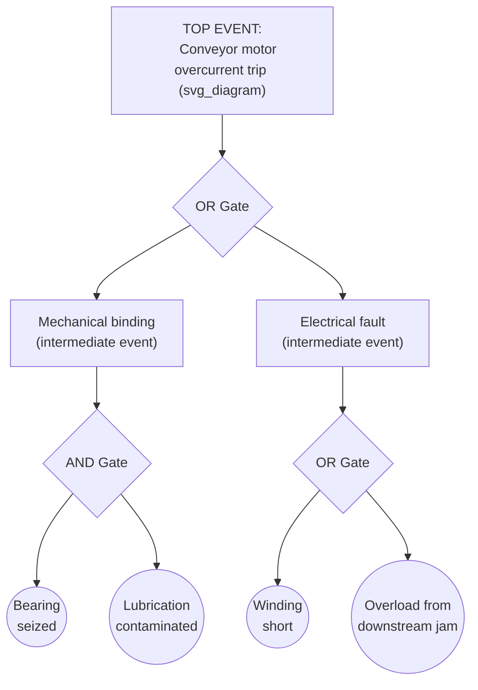

## Fault Tree Analysis Fundamentals

### Overview

Fault Tree Analysis (FTA) is a deductive, top-down cause-and-effect mapping technique that starts from a defined undesired event (the "top event") and systematically decomposes it into the combinations of lower-level faults that could cause it, using formal logic gates to represent how those lower-level faults combine. Where the Fishbone diagram organizes causes by category and 5 Whys drills down a single linear chain, FTA explicitly models the *logical relationships* between multiple contributing causes — capturing whether a failure requires several conditions to occur together (AND) or whether any one of several conditions is sufficient alone (OR). This makes FTA particularly valuable for RCA involving safety-critical systems or incidents with multiple interacting contributing factors.

### Origin and Purpose

**Key Points**

- FTA was developed at Bell Laboratories in 1962 for the U.S. Air Force Minuteman missile launch control system, and was subsequently adopted extensively in aerospace, nuclear, and process safety industries
- FTA is fundamentally deductive: it starts with a known top event ("what could cause this to happen") and works backward toward causes, in contrast to inductive techniques like FMEA (Failure Mode and Effects Analysis), which start from component failure modes and work forward toward consequences
- Its core strength over simpler tools (Fishbone, basic 5 Whys) is formal representation of causal logic — specifically, whether contributing factors must combine (AND) or any single one suffices (OR) — which allows the analysis to expose single points of failure and calculate failure probabilities when component failure rates are known

### Core Symbols and Notation

| Symbol | Name | Meaning |
| --- | --- | --- |
| Rectangle | Event (intermediate) | An event resulting from a combination of lower-level events via a logic gate |
| Circle | Basic event | A root-level fault requiring no further decomposition (a component failure, human error, etc.) |
| Diamond | Undeveloped event | An event not further analyzed, either because it is outside scope or insufficient data exists to decompose it further |
| House | External event | An event expected to occur normally (not a fault itself, but a condition contributing to the top event) |
| AND gate | Logic gate | Output event occurs only if **all** input events occur |
| OR gate | Logic gate | Output event occurs if **any one** of the input events occurs |

### Step-by-Step Construction Process

**Step 1 — Define the top event precisely.** The top event must be a specific, well-bounded undesired outcome, not a vague category. "Conveyor motor tripped on overcurrent at 02:14" is a valid top event; "production problems" is not.

**Step 2 — Identify immediate, necessary-and-sufficient causes of the top event.** Ask: "What are the immediate conditions that, if present, directly produce the top event?" These become the first tier of intermediate events, connected to the top event through the appropriate gate.

**Step 3 — Determine the correct logic gate at each level.** This is the step most distinct from other RCA tools, and the most common source of construction error:

- Use an **AND gate** when the intermediate/top event genuinely requires *all* child events to occur together (e.g., a failure requires both a worn seal AND a specific contamination exposure to result in bearing seizure)
- Use an **OR gate** when *any single* child event alone is sufficient to produce the intermediate/top event (e.g., either mechanical binding OR an electrical fault alone could independently cause an overcurrent trip)

**Step 4 — Continue decomposing each branch until reaching basic events.** A basic event is a fault at the level of granularity where further decomposition is not useful or not supported by available data — typically a single component failure, a specific human error, or an external condition.

**Step 5 — Mark undeveloped events explicitly.** If a branch cannot be decomposed further due to lack of data or being out of scope for the current investigation, terminate it with a diamond symbol rather than forcing an artificial basic event — this preserves honesty about the analysis's current evidentiary limits.

**Step 6 — Validate each gate and event against the evidence base.** As with every RCA tool, each basic event asserted in the tree should be tagged and cross-referenced per the fact/assumption discipline established during evidence gathering — an FTA built on unverified branches has the same reliability weaknesses as any other RCA method built on assumption.

**Step 7 — Identify minimal cut sets.** A cut set is a combination of basic events that, if they all occur, causes the top event. A *minimal* cut set is the smallest such combination — removing any single event from it would prevent the top event from occurring through that path. Identifying minimal cut sets reveals which combinations of failures are most critical, and particularly, whether any single basic event alone (a minimal cut set of size 1) constitutes a single point of failure.

### Worked Example: Minimal Cut Sets

For the tree above, the minimal cut sets are:

- {Bearing seized, Lubrication contaminated} — both required (AND gate) — cut set size 2
- {Winding short} — alone sufficient (OR gate below IE2) — cut set size 1
- {Overload from downstream jam} — alone sufficient (OR gate below IE2) — cut set size 1

This immediately surfaces a finding that a simple linear 5 Whys chain would not: there are two independent single points of failure (winding short; downstream jam) that alone can trip the motor, in addition to the two-factor bearing failure path. An RCA that only pursued the bearing branch (as in earlier worked examples) would have left two entirely separate failure pathways uninvestigated and uncorrected.

### Quantitative Fault Tree Analysis (Overview)

When failure probabilities or rates are known for basic events, FTA supports quantitative calculation of the top event's probability:

- **OR gate probability** (for independent events): $P(A \cup B) = P(A) + P(B) - P(A)P(B)$, commonly approximated as $P(A) + P(B)$ when probabilities are small
- **AND gate probability** (for independent events): $P(A \cap B) = P(A) \times P(B)$

[Inference] Quantitative FTA is most commonly applied in safety-critical and reliability engineering contexts (e.g., nuclear, aerospace, process safety) where component failure rate data is systematically tracked; in general industrial or IT RCA, FTA is frequently used qualitatively — for its logical structuring value — without a full probabilistic calculation, since reliable failure-rate data for every basic event is often unavailable.

### FTA Compared to Other Cause-and-Effect Tools

| Aspect | 5 Whys | Fishbone/Ishikawa | Fault Tree Analysis |
| --- | --- | --- | --- |
| Structure | Single linear chain | Categorized branches (divergent survey) | Hierarchical logic tree with formal AND/OR gates |
| Captures combined causes | No — assumes one cause per level | Partially — branches are listed, not logically combined | Yes — explicitly, via AND gates |
| Reveals single points of failure | Not directly | Not directly | Yes — via minimal cut set analysis |
| Supports probability calculation | No | No | Yes, when failure data available |
| Typical use point in RCA workflow | Convergent drill-down on one identified cause | Divergent brainstorm across categories | Either divergent structuring or formal safety-critical analysis, especially where multiple interacting causes are suspected |
| Relative complexity/effort | Low | Low-medium | Medium-high |

### When to Use FTA Versus Simpler Tools

FTA is particularly warranted when:

- The incident is safety-critical, or regulatory/compliance requirements call for formal, auditable causal logic
- Preliminary evidence suggests the top event may have multiple, independently sufficient causes (an OR relationship) that a single linear 5 Whys chain would fail to capture
- The team suspects a failure required the *combination* of several conditions (an AND relationship) rather than one dominant cause
- Failure probability data exists and a quantitative risk assessment is a deliverable alongside the root cause finding

For lower-stakes, single-apparent-cause incidents, a Fishbone diagram followed by 5 Whys is typically sufficient and faster to execute.

### Common Pitfalls

- **Misapplying AND/OR logic** — the single most consequential construction error; an AND gate used where an OR relationship actually exists (or vice versa) produces a tree that is internally consistent but factually wrong, and this error is not self-evident from looking at the tree alone
- **Conflating intermediate events with basic events** — terminating a branch too early (treating something that itself has further contributing causes as a basic event) truncates the analysis and can hide the true root cause
- **Building the tree from assumption rather than evidence** — as with Fishbone diagrams, FTA organizes and formalizes causal *logic*, but each basic event still requires the same fact/assumption tagging and cross-referencing discipline used elsewhere in RCA
- **Treating quantitative outputs as more certain than the input data supports** — a calculated top-event probability is only as reliable as the failure-rate data feeding it; presenting a precise-looking probability derived from rough estimates can create false confidence
- **Skipping minimal cut set analysis** — constructing the tree without identifying cut sets forfeits much of FTA's distinct analytical value over simpler tools, since the cut sets are what reveal single points of failure and the most critical combinations

**Related Topics**

- Fishbone or Ishikawa diagram construction
- 5 Whys methodology and drill-down technique
- Failure Mode and Effects Analysis (FMEA) as an inductive complement to FTA
- Minimal cut set and single point of failure analysis
- Distinguishing fact from assumption (evidentiary tagging discipline)
- Quantitative reliability engineering and failure rate data sources