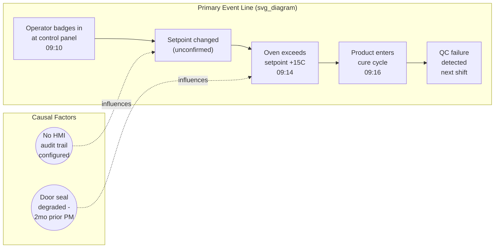

## Event and Causal Factor Charting

### Overview

Event and Causal Factor Charting (ECFC) is a time-sequenced, graphical RCA technique that maps the chronological sequence of events leading to an incident alongside the conditions and causal factors that influenced each event. Unlike the Fishbone diagram (which is category-organized and non-temporal) or a simple linear 5 Whys chain (which represents a single causal thread), ECFC explicitly preserves the *timeline* and shows how multiple parallel event sequences and background conditions converged to produce the incident. It is widely used in formal, high-consequence investigations (aviation, nuclear, process safety, major industrial accidents) where reconstructing precisely what happened, in what order, and under what conditions is as important as identifying the ultimate root cause.

### Purpose in the RCA Workflow

**Key Points**

- ECFC answers "what happened, in what sequence, and under what conditions" before the investigation moves to "why did each of those things happen" — it is primarily a fact-organization and sequencing tool, with root cause analysis (via 5 Whys or FTA) typically applied afterward to specific events or causal factors identified on the chart
- Its central value is disambiguating between an **event** (something that happened, at a specific point in time) and a **condition/causal factor** (a state of affairs that influenced how or whether an event occurred, but was not itself a discrete happening)
- Because it forces explicit timestamps and sourcing for every event, ECFC construction naturally enforces the fact/assumption and cross-referencing discipline established during evidence gathering — an event without a verifiable timestamp and source cannot properly be placed on the chart

### Core Components and Notation

| Element | Symbol Convention | Definition |
| --- | --- | --- |
| Event | Rectangle, placed on the primary timeline | A discrete occurrence at a specific point in time — something that happened |
| Conditional/Causal factor | Oval, connected to the event(s) it influenced | A state, circumstance, or condition that existed and influenced an event, but was not itself a discrete happening (e.g., "ambient temperature was elevated," "procedure XYZ was out of date") |
| Primary event line | Horizontal sequence of rectangles | The main chronological chain of events directly leading to the incident |
| Secondary/parallel event line | Additional horizontal sequence, time-aligned with the primary line | A concurrent sequence of events (e.g., a different system, shift, or actor) that intersects with or influences the primary line |
| Presumptive/unconfirmed event or factor | Dashed border | An event or factor suspected but not yet confirmed by evidence — analogous to the `[ASSUMPTION]` or `[UNKNOWN]` tags used in evidence gathering |
| Connecting arrow | Solid line between elements | Indicates a direct causal or temporal link between an event and the next event, or between a causal factor and the event it influenced |

### Distinguishing Events from Causal Factors

This distinction is the conceptual core of the technique and is frequently the source of construction difficulty for teams new to the method:

- **Event test:** "Did this happen at an identifiable point in time, and could it be plotted as a single point on the timeline?" If yes, it is an event.
- **Causal factor test:** "Was this a standing condition or state of affairs that existed across a span of time and influenced how an event unfolded, rather than being a discrete happening itself?" If yes, it is a causal factor.

Example: "The door seal was degraded" is a causal factor (a condition existing over a span of time). "The oven temperature exceeded setpoint by 15°C at 09:14" is an event (a discrete, timestamped occurrence). The degraded seal did not itself "happen" at 09:14 — it was a pre-existing condition that influenced why the temperature excursion event occurred when it did.

### Step-by-Step Construction Process

**Step 1 — Establish the timeline boundaries.** Determine the start point (typically the earliest point relevant to the causal chain, sometimes extending back to a maintenance action or design decision well before the incident) and end point (typically the point of incident detection or resolution).

**Step 2 — Populate the primary event line using verified facts only.** Using the evidence base built during data collection (with fact/assumption tags already applied), place each confirmed event on the primary timeline at its correct time. Events without a corroborated timestamp should be placed with the dashed "unconfirmed" notation rather than asserted as fixed points.

**Step 3 — Add parallel event lines for concurrent actors or systems.** If multiple people, shifts, or systems were involved concurrently, represent each as its own horizontal line, time-aligned with the primary line, and connect them where their sequences intersect.

**Step 4 — Attach causal factors to the specific events they influenced.** For each event, ask: "What standing conditions made this event possible, more likely, or shaped how it unfolded?" Attach these as ovals connected to the relevant event, rather than placing them on the timeline itself.

**Step 5 — Validate every event and factor against the evidence base.** Each element on the chart should be traceable to a specific source (log entry, interview statement, document) per the cross-referencing discipline — an ECFC chart is only as reliable as the fact/assumption rigor applied to each of its elements.

**Step 6 — Review the completed chart for logical and temporal gaps.** A gap where the sequence "jumps" without an intervening event, or a causal factor with no connected event, typically indicates either a missing piece of evidence still to be collected, or a genuine open question that becomes a follow-up investigative task.

**Step 7 — Select specific events or factors for deeper root cause drill-down.** The completed chart identifies *what* happened and *what conditions* were present; it does not by itself establish *why* those conditions existed. Individual events or causal factors — particularly ones that appear as recurring or pivotal points across multiple branches — become the entry points for subsequent 5 Whys or Fault Tree analysis.

### Worked Example: Building on the Fishbone/5 Whys Example

Using the same conveyor motor incident referenced in earlier items, an ECFC would represent it as:

**Primary event line:**

1. Bearing installed with replacement seal (6 months prior) — `[FACT: work order #4471]`
2. Contaminant ingress begins (ongoing, low-level) — `[UNKNOWN: exact onset time, inferred from teardown pattern]`
3. Vibration/noise noted by operator (1 hour before trip) — `[FACT: shift log entry, timestamped]`
4. Current begins gradual rise (40 min before trip) — `[FACT: current trace data]`
5. Motor trips on overcurrent, 02:14 — `[FACT: PLC alarm log]`

**Causal factors attached:**

- To event 1: "Installation procedure did not specify seal replacement interval" — `[FACT: procedure document review]`
- To event 2: "No vibration-monitoring alarm configured for this motor class" — `[FACT: instrumentation audit]`

This chart makes visible something the linear 5 Whys chain alone does not emphasize as clearly: the roughly six-month gap between the causal factor (procedural gap) and the ultimate event (the trip), and the presence of an intervening detectable warning sign (operator-noted noise one hour prior) that was not acted upon — itself a candidate branch for further investigation that a simpler tool might not have surfaced as distinctly.

### Comparison to Other Cause-and-Effect Mapping Tools

| Aspect | Fishbone/Ishikawa | Fault Tree Analysis | Event and Causal Factor Charting |
| --- | --- | --- | --- |
| Primary organizing dimension | Cause category | Logical relationship (AND/OR) | Chronological sequence |
| Preserves timing/sequence | No | No (structural, not temporal) | Yes — this is its defining feature |
| Distinguishes events from standing conditions | No | Partially (basic events can be either) | Yes, explicitly and centrally |
| Best suited for | Broad divergent brainstorming across categories | Multi-cause, safety-critical, or probabilistic analysis | Complex incidents with multiple concurrent actors/systems, or where sequence itself is disputed or unclear |
| Typical position in workflow | Early divergent phase | Formal structuring of complex or safety-critical causation | Fact organization and sequencing, often before or alongside 5 Whys/FTA on specific elements |

### Common Pitfalls

- **Conflating events and causal factors** — placing a standing condition (e.g., "poor lighting") directly on the timeline as if it were a discrete event misrepresents its nature and can distort the sequence logic of the chart
- **Populating the chart with unverified claims presented as confirmed events** — because the chart's visual format lends an appearance of authority and precision, teams may be tempted to assert timestamps or sequences that are not actually corroborated; the dashed/unconfirmed notation exists specifically to prevent this and must be used consistently
- **Building the chart in isolation from the evidence-gathering process** — ECFC is not a substitute for rigorous fact/assumption tagging and cross-referencing; it is a structured presentation layer for evidence that must already meet that bar
- **Treating chart completion as equivalent to root cause identification** — as with the Fishbone diagram, ECFC organizes and sequences the evidence; it does not itself produce a validated root cause. That still requires a subsequent drill-down (5 Whys or FTA) applied to specific chart elements
- **Omitting parallel lines for concurrent actors or systems** — collapsing multiple concurrent sequences onto a single line can obscure interactions between them that are often where contributing factors are found

**Related Topics**

- 5 Whys methodology and drill-down technique
- Fault tree analysis fundamentals
- Fishbone or Ishikawa diagram construction
- Distinguishing fact from assumption (evidentiary tagging discipline)
- Cross referencing multiple evidence sources
- Timeline reconstruction and clock synchronization across systems