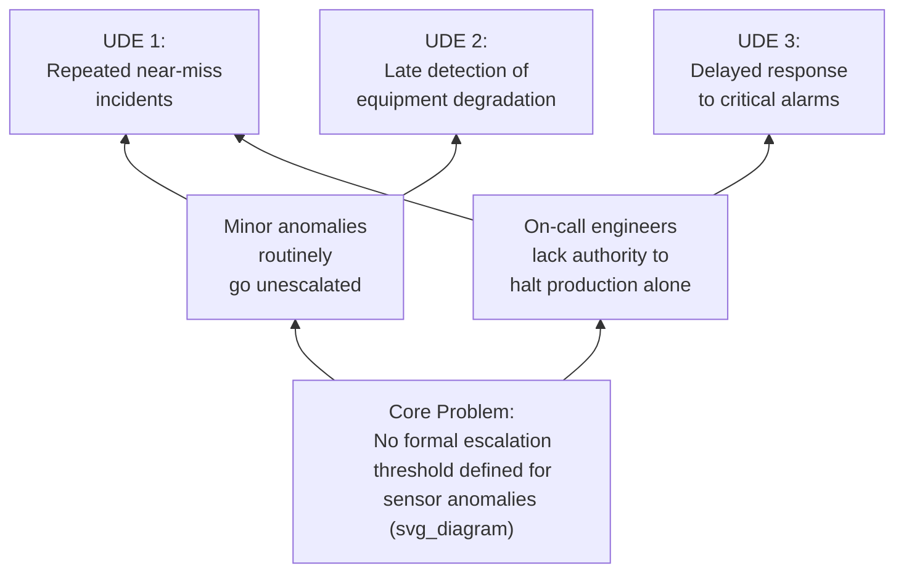

## Current Reality Tree from Theory of Constraints

### Overview

The Current Reality Tree (CRT) is a logical diagramming technique from Eliyahu Goldratt's Theory of Constraints (TOC), used to map the causal logic connecting a set of observed undesirable effects (UDEs) back to a small number of root causes. Where the Fishbone diagram surveys causes by category and ECFC preserves chronological sequence, the CRT's distinguishing feature is its focus on **systemic causality across multiple symptoms simultaneously** — it is built specifically to answer "what single or small set of root causes explains most or all of the undesirable effects we are observing," rather than analyzing one incident's causal chain in isolation.

### Origin and Purpose

**Key Points**

- The CRT is one of Goldratt's "Thinking Processes," developed as part of the Theory of Constraints methodology introduced in his 1984 book *The Goal*, and formalized further in subsequent TOC literature
- It is designed for situations with **multiple, seemingly unrelated undesirable effects** — the premise is that in a complex system, many apparently distinct symptoms often trace back to a small number of shared underlying root causes (often just one or two), called **core problems**
- Its primary use case differs from single-incident RCA tools: rather than "why did this one failure occur," it addresses "why do we keep experiencing this recurring pattern of multiple problems," making it well suited to systemic or organizational-level RCA rather than a single discrete event
- Structurally, the CRT reads bottom-to-top: root causes at the bottom, connected upward through intermediate effects, converging on the observed undesirable effects at the top — the inverse orientation from a Fault Tree, which reads top-down from the undesired event

### Core Building Blocks

| Element | Definition |
| --- | --- |
| Undesirable Effect (UDE) | An observed symptom or negative outcome in the current system — the starting data points for the analysis |
| Entity | A causal statement/box in the tree — either a UDE, an intermediate cause, or a root cause |
| Causality arrow | A connection indicating "this entity contributes to producing that entity" |
| Ellipse (AND connector) | Used when two or more entities must combine together to produce an effect — analogous to an AND gate in Fault Tree Analysis |
| Core problem | A root-level entity (or small set of them) from which a large proportion of the UDEs can be traced, typically appearing as a convergence point feeding multiple branches upward |
| Negative branch | A causal chain traced from a lower-level cause up to one or more UDEs |

### The Necessity/Sufficiency Test

A core discipline in CRT construction is the **categorical necessity test**, used to validate each causal arrow before it is accepted into the tree:

> "Is entity A, by itself, sufficient to cause entity B? Or is A only necessary but not sufficient — meaning another condition must also be present?"

- If A alone is sufficient → a single arrow from A to B
- If A is necessary but not sufficient (something else must also be true) → an ellipse connecting A and the additional necessary condition(s), both feeding into B via AND logic

This test performs a function directly analogous to the AND/OR gate selection in Fault Tree Analysis, and is subject to the same construction risk: incorrectly treating a necessary-but-insufficient cause as if it were independently sufficient produces a logically invalid tree, even if it appears coherent on inspection.

### Step-by-Step Construction Process

**Step 1 — List all observed undesirable effects.** Gather the full set of UDEs relevant to the system under analysis — these should be evidence-based observations, tagged and cross-referenced per the standard fact/assumption discipline, not impressions or generalized complaints.

**Step 2 — Identify immediate, verifiable causes of each UDE.** For each UDE, ask "what directly causes this to occur?" and place those causes as entities one level below, connected by causality arrows.

**Step 3 — Apply the necessity/sufficiency test at each connection.** Determine whether each cause is independently sufficient or requires an AND-connected co-condition, using the ellipse notation where appropriate.

**Step 4 — Continue tracing each branch downward, looking for convergence.** As branches are traced deeper, watch for points where multiple branches (originating from different UDEs) begin pointing to the same underlying entity — this convergence is the signal that a shared core problem may be emerging.

**Step 5 — Read each connection aloud as a full causal statement and check it against evidence and logic ("read and check").** TOC practice emphasizes verbally reading each arrow as "if [cause], then [effect]" and asking whether this reads as valid, sufficient, and evidence-supported — this catches both logical gaps and unverified assumptions smuggled into the tree.

**Step 6 — Continue downward until reaching one or a small number of root-level entities that are not themselves the effect of anything else meaningfully within scope.** These become candidate core problems.

**Step 7 — Verify the core problem(s) against the full UDE list.** A validated core problem should, when traced upward through the tree, explain a substantial majority of the listed UDEs — if a core problem only explains one or two UDEs while several others remain unconnected, either the tree is incomplete or more than one core problem exists.

### Worked Example

**Observed UDEs at a manufacturing plant over the past quarter:**

1. Repeated near-miss incidents on Line 3
2. Late detection of bearing degradation events
3. Delayed response to critical vibration alarms
4. Increasing unplanned downtime hours

Tracing each UDE downward using the necessity/sufficiency test surfaces two recurring intermediate causes: "minor anomalies routinely go unescalated" and "on-call engineers lack authority to halt production alone." Both of these, in turn, trace to a single deeper entity: **no formal escalation threshold is defined for sensor anomalies** — meaning individual engineers must use ad hoc judgment about when a reading warrants escalation, producing inconsistent and often delayed responses.

This core problem, once identified, explains three of the four UDEs directly and plausibly contributes to the fourth (unplanned downtime, via delayed responses allowing degradation to progress further before intervention) — meeting the CRT's validation criterion of explaining a substantial majority of observed symptoms from a single systemic cause, rather than requiring four separate, unrelated investigations.

### CRT Compared to Other Cause-and-Effect Mapping Tools

| Aspect | Fishbone/Ishikawa | Fault Tree Analysis | Event and Causal Factor Charting | Current Reality Tree |
| --- | --- | --- | --- | --- |
| Scope | Single problem, categorized causes | Single top event, logical decomposition | Single incident, chronological | Multiple undesirable effects, systemic |
| Direction | Category-branch (non-directional) | Top-down (event → causes) | Left-to-right (time-ordered) | Bottom-up (causes → effects) |
| Logic formalization | None | Formal AND/OR gates | Implicit causal links | Necessity/sufficiency test, AND ellipses |
| Best suited for | Broad single-incident brainstorming | Safety-critical, multi-cause single events | Complex single-incident sequencing | Recurring, systemic, multi-symptom problems |
| Typical output | Categorized candidate causes | Minimal cut sets, single points of failure | Validated event/condition sequence | One or few core problems explaining many symptoms |

### When to Use a CRT Versus Single-Incident RCA Tools

A CRT is particularly appropriate when:

- Multiple distinct incidents or recurring symptoms are being investigated together, and there is reason to suspect a shared underlying cause rather than independent unrelated causes
- Previous single-incident RCA efforts (5 Whys, Fishbone) on individual symptoms have each produced a different apparent root cause, suggesting those analyses may have stopped at intermediate, symptom-specific causes rather than reaching a shared systemic one
- The goal is prioritizing limited improvement resources — since addressing a validated core problem is more resource-efficient than independently addressing each symptom

For a single, well-bounded incident with no clear connection to other recurring problems, the simpler single-incident tools (5 Whys, Fishbone, ECFC, or FTA) are typically more appropriate and less resource-intensive.

### Common Pitfalls

- **Failing to apply the necessity/sufficiency test rigorously** — accepting a causal arrow because it "sounds right" rather than explicitly testing whether the stated cause is truly sufficient alone often smuggles unvalidated assumptions into the tree, undermining the same evidentiary rigor required elsewhere in RCA
- **Stopping at the first convergence point rather than continuing to the deepest shared cause** — an intermediate entity that explains several UDEs may still itself have a further, deeper cause; premature stopping can identify a symptom of the true core problem rather than the core problem itself
- **Constructing the tree from generalized impressions rather than evidence-based UDEs** — as with every RCA tool, the quality of the output is bounded by the quality and verification status of the inputs; UDEs should be specific, evidence-based observations, not vague complaints
- **Assuming a single core problem must always exist** — while TOC practice often finds that a small number of core problems explain most symptoms, forcing convergence onto a single cause when the evidence genuinely does not support it can produce a distorted tree; some UDEs may legitimately have independent causes
- **Confusing the CRT with a solution-generation tool** — the CRT's function ends at diagnosing the core problem(s); TOC's subsequent Thinking Process tools (e.g., the Future Reality Tree) address solution design, which is a distinct step from the root cause identification the CRT performs

**Related Topics**

- 5 Whys methodology and drill-down technique
- Fault tree analysis fundamentals
- Event and causal factor charting
- Fishbone or Ishikawa diagram construction
- Theory of Constraints and the Five Focusing Steps
- Distinguishing fact from assumption (evidentiary tagging discipline)