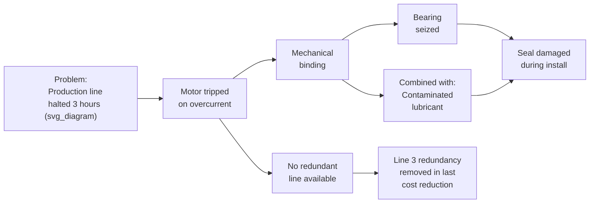

## Cause Mapping versus Linear Why Chains

### Overview

Cause Mapping is a visual RCA method, most closely associated with Mark Galley and ThinkReliability, that represents causation as a branching network diagram rather than a single sequential chain. It directly addresses a structural limitation of the traditional linear 5 Whys format: real incidents are rarely the product of one cause leading to exactly one next cause in a straight line; they typically involve multiple contributing causes at each level, some of which combine, and some of which are independent alternate pathways. This item compares the branching Cause Map structure against the linear Why-chain format directly, since understanding when each is appropriate — and how to convert between them — is a core skill in selecting the right cause-and-effect tool for a given incident.

### The Structural Difference

**Linear Why Chain**

A strict sequence: each Why has exactly one answer, which becomes the next Why. The output is a single path from the problem statement to one root cause.



```
Problem → Why? → Cause 1 → Why? → Cause 2 → Why? → Cause 3 → Why? → Cause 4 → Why? → Root Cause
```

**Cause Map**

A branching, left-to-right (or top-to-bottom) network. Each effect can have multiple contributing causes, drawn as parallel branches. Causes that combine (all required together) are marked distinctly from causes that are independent alternate pathways (any one alone sufficient) — a distinction directly analogous to AND/OR logic in Fault Tree Analysis, though Cause Mapping typically expresses it through simpler visual conventions rather than formal gate symbols.



### Key Points of Comparison

**Key Points**

- A linear Why chain implicitly assumes each effect has exactly one cause worth pursuing; a Cause Map explicitly represents the reality that most effects have multiple contributing causes, some combining and some independent
- The linear format is faster to construct and easier to communicate for simple, single-threaded incidents; the branching format takes longer to build but is more resistant to the single most common linear 5 Whys failure mode: prematurely committing to one cause per level and missing parallel contributing factors
- Cause Mapping typically starts from the same "why did this happen" question used in 5 Whys, but instead of accepting the first plausible answer and moving to the next Why, it explicitly asks "what **else** contributed to this?" at every level before moving deeper — this single procedural difference is what produces the branching structure
- Both techniques still terminate in the same place conceptually: one or more root causes suitable for corrective action; Cause Mapping simply avoids foreclosing on parallel causes along the way

### Why Linear Chains Fail on Multi-Causal Incidents

The core risk of a strict linear Why chain is that at each step, the investigator (or team) must select a single answer to continue the chain, even when the honest answer to "why did this happen" is "more than one thing contributed." Two common failure patterns result:

1. **Premature single-cause commitment** — the team picks the most obvious or most available answer at a given Why and proceeds, leaving other genuine contributing causes uninvestigated and therefore unaddressed by any resulting corrective action
2. **Conflation of independent and combined causes** — a linear chain cannot represent that two different, unrelated failure pathways could each independently have produced the same problem (an OR relationship); it forces them into an artificial single sequence, which can misrepresent the actual causal structure of the incident

The bearing/lubrication branch used in earlier examples in this series is itself an AND relationship (bearing seizure required both mechanical wear *and* contamination); a strict single-answer linear chain applied to "why did the bearing seize" would have to arbitrarily pick one of these two co-required factors and might never surface the other.

### When a Linear Why Chain Is Sufficient

Linear chains remain appropriate and efficient when:

- The incident has a genuinely single dominant causal pathway with no meaningful parallel contributing factors
- Speed and simplicity are prioritized over completeness (e.g., a low-severity, low-recurrence-risk incident where a "good enough" root cause is an acceptable tradeoff)
- The team is confident, based on prior evidence review, that branching investigation would not surface additional actionable contributing causes

[Inference] In practice, many RCA practitioners use a hybrid approach: beginning with a linear 5 Whys pass to establish the dominant pathway quickly, then explicitly revisiting each Why with "what else contributed?" to convert it into a Cause Map only where the initial pass suggests multiple factors were present — rather than always defaulting to full Cause Map construction regardless of incident complexity.

### Step-by-Step Process for Converting a Linear Chain into a Cause Map

**Step 1 — Start with the existing linear Why chain**, if one has already been built, or with the problem statement if starting fresh.

**Step 2 — At each level, explicitly ask "what else contributed to this, in addition to the cause already identified?"** rather than accepting the first answer as complete.

**Step 3 — For each additional cause identified, determine whether it combines with the existing cause (AND) or represents an independent alternate pathway (OR).** Mark combined causes as joined branches feeding the same downstream effect; mark independent causes as separate parallel branches.

**Step 4 — Continue this branching process at every level**, not just the first — parallel contributing causes are just as likely to appear at Why #3 or #4 as at Why #1, and stopping the branching discipline partway through reintroduces the same risk the technique is meant to prevent.

**Step 5 — Cross-reference every branch against the evidence base**, exactly as required for any other cause-and-effect mapping tool — a Cause Map with more branches is not inherently more rigorous than a linear chain if those branches are built from assumption rather than verified evidence.

**Step 6 — Identify all terminal root causes across all branches**, since a Cause Map frequently produces more than one valid root cause requiring separate corrective actions, rather than the single root cause a linear chain is structured to produce.

### Worked Example: Same Incident, Two Formats

**Linear 5 Whys (as used in the evidence-gathering example earlier in this series):**

1. Why did the motor trip? → Overcurrent from mechanical binding
2. Why was there binding? → Bearing seized
3. Why did the bearing seize? → Contamination
4. Why was contamination present? → Seal damaged during installation
5. Why was the seal not replaced properly? → Procedure gap

**Cause Map treatment of the same incident**, applying "what else contributed?" at each level:

- Why did the motor trip? → (a) Mechanical binding **and** (b) No redundant line was available to absorb the outage — two independent contributing causes to the *production impact*, not just the trip itself
- Why was there binding? → Bearing seized, which itself required **both** (a) mechanical wear from normal duty cycle **and** (b) contamination — an AND relationship the linear chain compressed into a single step
- Why was line redundancy unavailable? → A separate, parallel branch: redundancy was removed during a prior cost-reduction initiative — an entirely independent root cause from the procedural gap identified in the bearing branch

The Cause Map version surfaces a second, independent root cause (the redundancy removal decision) that the linear chain never reached, because the linear format's single-path structure had no mechanism for representing it once the investigation committed to following the mechanical binding thread.

### Comparison Table

| Aspect | Linear Why Chain | Cause Map |
| --- | --- | --- |
| Structure | Single sequential path | Branching network |
| Handles multiple contributing causes at one level | No — forces single-answer selection | Yes — explicit parallel branches |
| Distinguishes combined (AND) vs. independent (OR) causes | Not natively | Yes, typically via visual convention |
| Construction speed | Fast | Slower — requires "what else?" discipline at every level |
| Risk of premature single-cause commitment | High | Low, if branching discipline is maintained throughout |
| Typical output | One root cause | One or more root causes across branches |
| Best suited for | Simple, single-threaded, low-complexity incidents | Complex incidents with plausible multiple contributing factors |

### Common Pitfalls

- **Applying "what else contributed?" only at the first Why and reverting to linear form afterward** — parallel causes are not more likely to occur early in the chain than late; the branching discipline must be applied consistently at every level to be effective
- **Branching without applying the AND/OR distinction** — a Cause Map that lists multiple contributing causes at a level without clarifying whether they combine or represent independent pathways loses much of the additional analytical value over a linear chain, and can misrepresent the incident's actual causal structure
- **Treating a wider map as inherently more rigorous** — a Cause Map built from unverified assumptions across many branches is not more reliable than a well-evidenced linear chain; breadth does not substitute for the same fact/assumption and cross-referencing discipline required of every branch
- **Failing to pursue every terminal branch to a genuine root cause** — a common shortcut is fully drilling down the first-identified branch while leaving parallel branches only partially developed, which reintroduces the same premature-commitment risk the Cause Map format is meant to avoid
- **Choosing Cause Mapping by default regardless of incident complexity** — for genuinely single-threaded, low-stakes incidents, the additional construction time of a full Cause Map may not be justified; tool selection should match investigation complexity and stakes

**Related Topics**

- 5 Whys methodology and drill-down technique
- Fault tree analysis fundamentals
- Fishbone or Ishikawa diagram construction
- Event and causal factor charting
- Distinguishing fact from assumption (evidentiary tagging discipline)
- Prioritizing and sequencing multiple identified root causes for corrective action