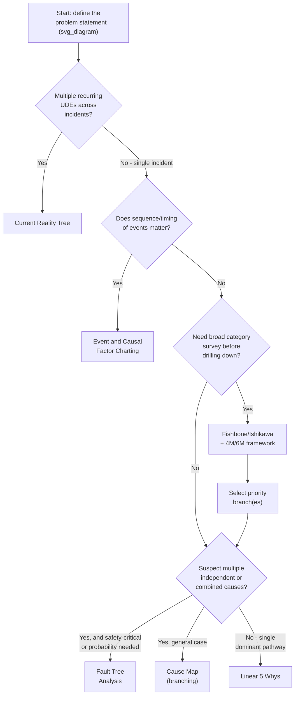

## Choosing the Right Visual Tool for the Problem Type

### Overview

Every cause-and-effect mapping tool covered in this chapter — Fishbone diagrams, the 6M/4M frameworks, Fault Tree Analysis, Event and Causal Factor Charting, Current Reality Trees, and Cause Maps versus linear Why chains — solves a structurally different problem. Selecting the wrong tool for a given incident does not necessarily produce a wrong answer, but it frequently produces an incomplete one: a tool built for single-threaded causation will not surface multi-causal AND/OR structure, and a tool built for categorized brainstorming will not preserve chronological sequence. This item consolidates the preceding tools into a single decision framework so the appropriate technique can be selected deliberately, rather than defaulted to out of habit.

### The Core Selection Dimensions

Three questions, asked in sequence, determine which tool (or combination of tools) fits a given problem:

1. **Is the goal to survey a broad space of candidate causes, or to drill down a specific one?** (Divergent vs. convergent)
2. **Does the incident plausibly involve multiple, independently sufficient causes, or causes that must combine?** (Simple vs. logically complex)
3. **Does the sequence and timing of events matter to understanding the incident, or is only the causal structure relevant?** (Time-sensitive vs. structure-only)

A fourth, cross-cutting question applies specifically when multiple recurring incidents are involved rather than a single one:

4. **Is this one discrete incident, or a recurring pattern across multiple symptoms?** (Single-incident vs. systemic)

### Decision Framework

### Tool Selection Matrix

| Situation | Recommended Tool | Why |
| --- | --- | --- |
| Single incident, clearly one dominant causal thread, low stakes | Linear 5 Whys | Fastest to construct; sufficient when branching complexity is genuinely absent |
| Single incident, unclear where to start looking for causes | Fishbone/Ishikawa with 4M/6M | Broad divergent survey prevents tunnel vision before committing to a drill-down path |
| Single incident, multiple plausible causes that may combine or act independently | Cause Map | Represents AND/OR branching without requiring formal logic-gate notation |
| Single incident, safety-critical, or quantitative failure probability needed | Fault Tree Analysis | Formal AND/OR gates support minimal cut set analysis and probabilistic calculation |
| Single incident, sequence and concurrent actors/systems are central to understanding what happened | Event and Causal Factor Charting | Only tool in this set that explicitly preserves chronology and distinguishes events from standing conditions |
| Multiple recurring incidents or symptoms suspected to share underlying causes | Current Reality Tree | Purpose-built to trace many undesirable effects to a small number of shared core problems |

### Tools Are Frequently Combined, Not Mutually Exclusive

**Key Points**

- The most common real-world pattern is sequential combination, not single-tool selection: Fishbone diagram (divergent survey) → prioritized branch selection → 5 Whys or Cause Map (convergent drill-down) on the selected branch
- ECFC is frequently used as a fact-organization layer *before* any of the other tools, since a validated, sequenced set of events and causal factors is useful input regardless of which drill-down technique follows
- FTA and Cause Mapping address a very similar underlying need (representing AND/OR causal logic); the choice between them is largely about formality and audience — FTA for safety-critical/regulatory audiences requiring auditable logic and possibly quantitative risk figures, Cause Mapping for faster, less formal internal investigations
- A Current Reality Tree's identified core problem frequently becomes the starting point for a focused 5 Whys or Cause Map investigation into *why that specific core problem exists* — the CRT operates one level above the other tools, not as a full replacement for them

### A Practical Combined Workflow

**Step 1 — If the incident is part of a recurring pattern across multiple symptoms, start with a Current Reality Tree** to identify whether a shared core problem explains multiple undesirable effects, before investing in single-incident tools for each symptom separately.

**Step 2 — If sequence, timing, or multiple concurrent actors/systems are central to the incident, build an Event and Causal Factor Chart first**, using it to organize verified facts chronologically before any causal drill-down begins.

**Step 3 — If the causal landscape is not yet clear, use a Fishbone diagram with an appropriate 4M/6M (or domain-adapted) category framework** to survey the full breadth of candidate cause categories and avoid premature narrowing.

**Step 4 — Prioritize the most evidentially supported branch(es)** from the Fishbone diagram using cross-referencing against the evidence base.

**Step 5 — Select the drill-down tool based on suspected causal complexity:**

- Single dominant pathway, no combining factors suspected → **linear 5 Whys**
- Multiple contributing causes, some combining and some independent, general context → **Cause Map**
- Safety-critical context, or quantitative probability/minimal cut set analysis needed → **Fault Tree Analysis**

**Step 6 — Validate every element of the chosen tool against the evidence base**, applying the same fact/assumption tagging and cross-referencing discipline regardless of which visual tool is used — tool selection affects structure and completeness, not the underlying evidentiary rigor required.

### Worked Example: Tool Selection Walkthrough

**Scenario:** A plant has experienced three seemingly unrelated problems over the past quarter: repeated near-misses on Line 3, late detection of bearing degradation, and delayed response to critical alarms.

**Selection reasoning:**

- Question 4 (recurring pattern across multiple symptoms?) → **Yes** → start with a **Current Reality Tree**, which (as shown in the CRT item's worked example) traces all three symptoms to a shared core problem: no formal escalation threshold for sensor anomalies
- With the core problem identified, a follow-up investigation into *why no escalation threshold exists* is a single, well-bounded question
- Question 2/3 for this follow-up investigation (sequence matters? multiple combining causes?) → sequence is not central, and the cause appears to be a single dominant pathway (a procedural gap, not a multi-factor combination) → a **linear 5 Whys** is sufficient for this specific follow-up drill-down

This illustrates the layered use of tools: CRT operates at the systemic level across three incidents, while a simple linear chain suffices for the specific follow-up question the CRT surfaced — using CRT alone would have stopped at the core problem without exploring its own origin, while jumping straight to 5 Whys on each of the three original symptoms would have missed the shared systemic cause entirely.

### Anti-Patterns in Tool Selection

- **Defaulting to whichever tool is most familiar, regardless of problem type** — a team fluent in 5 Whys but unfamiliar with Cause Mapping may force multi-causal incidents into an artificial linear structure, silently dropping parallel contributing factors
- **Selecting a more complex tool than the problem warrants** — applying full Fault Tree Analysis with quantitative probability calculation to a low-stakes, clearly single-threaded incident consumes investigative resources disproportionate to the problem's complexity and risk
- **Treating tool selection as permanent for the duration of the investigation** — new evidence uncovered mid-investigation may reveal that a problem initially assumed single-threaded is actually multi-causal (or vice versa); the tool in use should be revisited if the emerging evidence no longer matches the assumptions that justified the original selection
- **Using a single tool for what is actually a systemic, multi-incident pattern** — applying 5 Whys independently to each of several related symptoms, without first checking for a shared core problem via a Current Reality Tree, risks generating several different "root causes" for what is actually one underlying systemic issue

**Related Topics**

- 5 Whys methodology and drill-down technique
- Fishbone or Ishikawa diagram construction
- The 6M and 4M categorization frameworks
- Fault tree analysis fundamentals
- Event and causal factor charting
- Current reality tree from theory of constraints
- Cause mapping versus linear why chains
- Distinguishing fact from assumption (evidentiary tagging discipline)