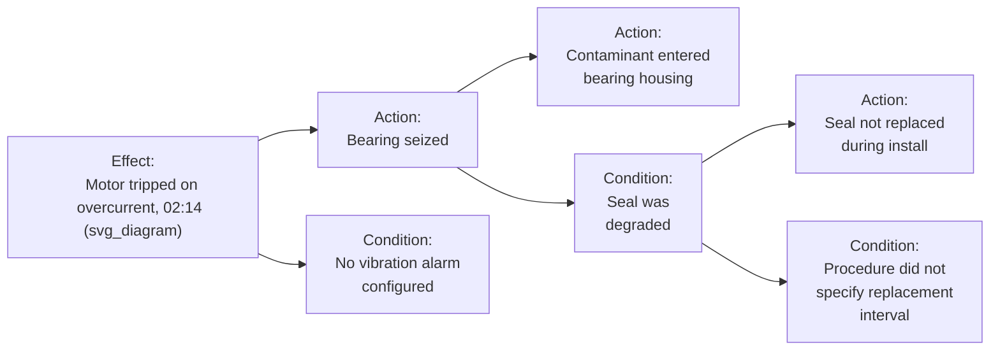

## Apollo Root Cause Analysis Method

### Overview

The Apollo Root Cause Analysis method (also called RealityCharting, its associated software brand) was developed by Dean Gano and is built around a single, deliberately strict logical rule: **every effect has at least two causes, in the form of actions and conditions, and these causes exist simultaneously.** Where a linear 5 Whys chain asks "why did this happen" and accepts one answer per level, the Apollo method treats that single-answer habit as the primary structural weakness it is designed to correct — every box in an Apollo chart must be justified by explicit evidence, and every effect must be decomposed into the specific action(s) and condition(s) that combined to produce it, rather than a single freeform cause.

### Origin and Purpose

**Key Points**

- Developed by Dean Gano beginning in the 1990s, formalized in his book *Apollo Root Cause Analysis: A New Way of Thinking*, and commercialized through RealityCharting software
- Its foundational principle, often called the **Action/Condition rule**, states that no effect has a single cause — every effect results from at least one *action* (something that happens or is done) combining with at least one *condition* (a pre-existing state that was present when the action occurred); both together are necessary to produce the effect
- The method's central discipline is that **every cause box in the chart must be supported by evidence**, explicitly connecting Apollo construction to the same fact/assumption rigor established earlier in this series — Gano's approach treats an unevidenced cause box as a methodological error, not a minor gap to be filled in later
- Apollo charts read left-to-right, with the primary effect (the problem) on the left and increasingly granular causes branching to the right — the reverse orientation from the Current Reality Tree, though conceptually closer to a Cause Map in its branching structure

### The Action/Condition Rule in Detail

This is the method's defining logical requirement and the primary way it differs from a linear Why chain:

- An **action** is something that happens at a discrete point — an event, a decision, a physical occurrence (e.g., "operator opened the wrong valve," "bearing seized")
- A **condition** is a state of affairs that exists over a span of time, present at the moment the action occurred, without which the action alone would not have produced the effect (e.g., "no interlock prevented the wrong valve from being opened," "lubricant was contaminated")
- **Neither an action nor a condition alone is sufficient** — Gano's framework insists that stating only "the operator opened the wrong valve" as a root cause is incomplete, because it does not explain why that action was able to produce the effect; the condition ("no interlock existed") must be identified alongside it

This structurally mirrors the AND-gate logic used in Fault Tree Analysis and the necessity/sufficiency test used in Current Reality Trees, but Apollo applies it as a **mandatory, universal rule at every single node of the chart**, rather than as a technique applied selectively where multi-causality is suspected.

### Step-by-Step Construction Process

**Step 1 — State the primary effect precisely**, following the same specificity discipline used across all tools in this series (a well-bounded, evidence-based problem statement, not a vague category).

**Step 2 — For the primary effect, identify at least one action and at least one condition that combined to produce it.** Reject any single-cause statement offered for the primary effect — per the Action/Condition rule, ask explicitly "what else had to be true, alongside this action, for the effect to occur?"

**Step 3 — For each action and condition identified, ask "why did this exist or occur?" and repeat the Action/Condition decomposition at that level.** Every node in the chart — not just the top-level effect — must itself be decomposed into its own action(s) and condition(s), continuing the branching pattern to progressively deeper levels.

**Step 4 — Require explicit evidence for every box before it is accepted into the chart.** Gano's methodology treats this as a non-negotiable construction rule rather than a best practice: a box without a cited evidentiary source is flagged as unverified and must be either confirmed or removed before the chart is considered complete — directly operationalizing the fact/assumption discipline established during evidence gathering.

**Step 5 — Continue decomposition until reaching root causes: conditions or actions that are either outside the scope of the investigation to address, or that represent a genuine systemic/organizational-level cause (e.g., a missing policy, an absent standard) rather than a further decomposable technical cause.**

**Step 6 — Identify all root-level causes across the full chart, not just one.** Because every node requires at least two parents (an action and a condition), and because both are pursued to their own root causes, an Apollo chart typically produces multiple root causes rather than the single terminus a linear Why chain is structured to produce — a property it shares with the Cause Map format, though arrived at through a stricter, rule-enforced branching discipline.

**Step 7 — Select solutions that address root causes, prioritizing conditions where possible.** Gano's framework specifically favors solutions targeting **conditions** over actions, on the reasoning that conditions are typically more controllable and more effective to change than trying to prevent a specific human action from ever recurring (e.g., adding an interlock is generally more reliable than solely retraining an operator not to make an error).

### Worked Example

Continuing the bearing failure scenario used throughout this series: applying strict Action/Condition decomposition (as partially diagrammed above) to "why did the seal fail" produces:

- **Action:** Seal was not replaced during the installation six months prior — `[FACT: installation work order, no seal replacement line item]`
- **Condition:** The installation procedure did not specify a seal replacement interval — `[FACT: procedure document review]`

Applying the rule again to the condition ("why did the procedure not specify this"):

- **Action:** The procedure was last revised two years before this motor class was introduced to the plant — `[FACT: document revision history]`
- **Condition:** No formal process exists for reviewing existing procedures against newly introduced equipment classes — `[FACT: confirmed via engineering change management review]`

This produces two distinct, evidence-supported root causes — an immediate procedural gap (missing seal-replacement specification) and a deeper systemic gap (no procedure-review trigger for new equipment) — both of which would need to be addressed for a complete corrective action, illustrating how the mandatory two-parent branching rule surfaces systemic causes that a single-threaded linear chain, stopping at the first procedural gap, might not have reached.

### Apollo Compared to Other RCA Tools

| Aspect | Linear 5 Whys | Cause Map | Fault Tree Analysis | Apollo Method |
| --- | --- | --- | --- | --- |
| Minimum causes per effect | 1 (by construction) | Variable (as many as evidence supports) | Variable, governed by AND/OR gate choice | Exactly 2 minimum, always (1 action + 1 condition), by rule |
| Rule enforcement | None — single-answer format | Informal — team judgment | Formal, but only where AND/OR logic is explicitly modeled | Formal and universal — every single node, no exceptions |
| Evidence requirement | Recommended, not structurally enforced | Recommended, not structurally enforced | Recommended, not structurally enforced | Structurally mandatory — an unevidenced box is a flagged construction error |
| Typical output | One root cause | One or more root causes | Minimal cut sets, single points of failure | Multiple root causes, explicitly split into action-type and condition-type |
| Solution guidance | None built into the method | None built into the method | None built into the method | Explicit preference for condition-based solutions over action-based ones |

### When Apollo Is Particularly Effective

The Apollo method is well suited to:

- Investigations where teams have a demonstrated pattern of settling for single-cause explanations, and a structurally enforced multi-cause rule is needed to counteract that habit
- Environments requiring a highly auditable, evidence-linked chart where every claim's source can be checked by an external reviewer (the mandatory evidence-citation discipline supports this directly)
- Situations where the team needs explicit guidance not just on finding root causes but on **which type of solution to prioritize** (the condition-over-action solution preference is a distinguishing practical feature not present in most other tools in this series)

### Common Pitfalls

- **Treating a single action as sufficient and skipping the paired condition** — the most common construction error, and the one the method's rule exists specifically to prevent; a chart with any node showing only one parent cause violates the Action/Condition rule and should be revisited
- **Confusing actions and conditions** — misclassifying a standing state as an action (or vice versa) can distort which branch gets pursued further and which solution type (condition-based vs. action-based) is ultimately recommended
- **Accepting unevidenced boxes "to keep momentum" during initial construction** — while a draft chart may reasonably contain provisional entries, the method's discipline requires these to be explicitly marked as unverified and resolved before the chart is finalized, not silently treated as equivalent to evidenced entries
- **Stopping decomposition at the first systemic-sounding cause without testing whether it too has an identifiable action/condition pair** — genuine organizational root causes (e.g., "no procedure-review process exists") are still often decomposable further; premature stopping can miss a deeper, more addressable cause
- **Defaulting to action-based solutions despite the method's explicit condition-preference guidance** — retraining or disciplinary responses targeting the action-side cause are often proposed by default, even when a condition-based solution (e.g., an engineering control) would be more reliable per the method's own stated solution philosophy

**Related Topics**

- Cause mapping versus linear why chains
- Fault tree analysis fundamentals
- Current reality tree from theory of constraints
- 5 Whys methodology and drill-down technique
- Distinguishing fact from assumption (evidentiary tagging discipline)
- Corrective and preventive action (CAPA) systems