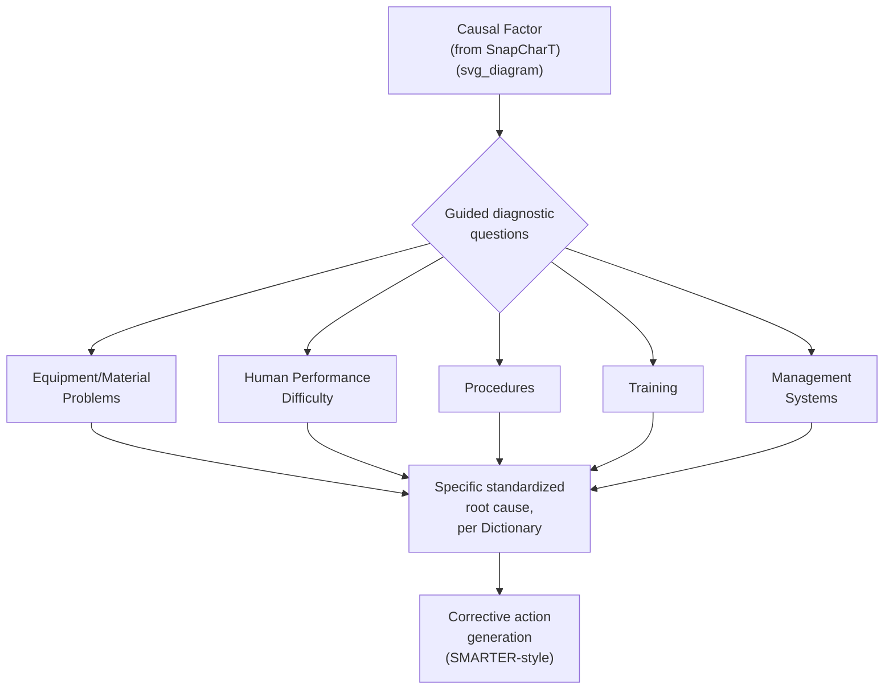

## TapRooT Investigation System

### Overview

TapRooT is a proprietary, comprehensive root cause investigation system developed by System Improvements, Inc. (founded by Mark Paradies), combining a structured investigative process, a standardized taxonomy of root cause categories (the Root Cause Tree), and dedicated software tooling. Where the tools covered elsewhere in this chapter are largely generic techniques (a diagramming method, a comparison framework, a logical rule) that a team applies using its own judgment to generate causes, TapRooT's distinguishing feature is a **pre-built, standardized dictionary of root causes** — the Root Cause Tree — that investigators navigate through guided questioning rather than open-ended brainstorming. This makes TapRooT particularly suited to organizations that need investigation consistency across many investigators and incidents, such as regulated industries with formal incident-investigation obligations.

### Origin and Purpose

**Key Points**

- Developed beginning in the late 1980s/1990s by Mark Paradies and colleagues, initially informed by human factors and safety research, and commercialized as a complete investigation methodology with associated training, software, and certification programs
- TapRooT's core innovation relative to the other complementary methodologies in this chapter is **standardization of the root cause vocabulary itself** — rather than each investigator or team generating and naming candidate causes freely (as in Fishbone, Cause Mapping, or Apollo), TapRooT provides a fixed taxonomy of Basic Cause Categories and specific Root Causes within them, ensuring different investigators across an organization converge on comparable, aggregatable terminology
- Heavily adopted in high-hazard, safety-regulated industries — process safety, oil and gas, power generation, mining — where trending root causes across many incidents over time (which requires consistent categorization) is a regulatory or safety-management priority, not just a single-incident concern
- TapRooT integrates several of the other techniques covered in this series as component steps within its broader process, rather than replacing them — notably using a SnapCharT (its own variant of event and causal factor charting) as its sequencing front-end

### Core Components of the TapRooT System

| Component | Function |
| --- | --- |
| **SnapCharT** | A sequencing and evidence-organization diagram, functionally similar to Event and Causal Factor Charting, used to map the incident timeline and identify Causal Factors before root cause analysis begins |
| **Causal Factors** | Specific deviations from expected performance identified on the SnapCharT, each of which becomes a separate entry point for root cause analysis |
| **Root Cause Tree** | A standardized, hierarchical taxonomy/dictionary of root causes, organized into major Basic Cause Categories, navigated via guided questions for each identified Causal Factor |
| **Root Cause Tree Dictionary** | Detailed definitions and guidance for each specific root cause in the tree, ensuring consistent interpretation across investigators |
| **Corrective Action Helper / SMARTER guidance** | A structured approach (built into the TapRooT process) for generating corrective actions targeted at the identified root causes, evaluated against criteria analogous to SMART objective criteria (adapted within TapRooT's own framework) |

### The Root Cause Tree's Basic Cause Categories

[Inference] The Root Cause Tree's exact category structure and specific root cause entries are proprietary to System Improvements, Inc. and are accessed through licensed TapRooT training, software, and documentation; the following reflects the general category structure as it is publicly described in TapRooT program materials, but the complete tree with its full set of specific root causes and diagnostic questions is not reproduced here.

Broadly, the Root Cause Tree organizes causes under major categories addressing:

- **Equipment/Material Problems** — equipment or material-related root causes (design issues, defective/failed parts, wear)
- **Human Performance Difficulty** — root causes related to how a task was performed, distinct from *why* the person performed it that way
- **Procedures** — root causes related to the existence, accuracy, or usability of procedures
- **Training** — root causes related to whether adequate knowledge or skill was provided
- **Management Systems** — organizational and system-level root causes, often the deepest and most systemic category, addressing policies, quality assurance, and organizational oversight

Each Basic Cause Category branches into specific, named root causes, and the investigator reaches a specific root cause by answering a structured sequence of guided Yes/No-style diagnostic questions rather than by open brainstorming — this guided-questioning mechanism is the practical implementation of the standardization principle described above.

### Step-by-Step Process Overview

**Step 1 — Build a SnapCharT of the incident.** Sequence the confirmed events chronologically, similar in structure and purpose to Event and Causal Factor Charting covered earlier in this series — events are placed on the timeline, and each is supported by cited evidence per the fact/assumption discipline established during evidence gathering.

**Step 2 — Identify Causal Factors on the SnapCharT.** A Causal Factor in TapRooT terminology is a specific deviation from expected or desired performance visible on the chart — analogous to identifying which branches or events warrant deeper investigation in the other charting tools covered in this chapter.

**Step 3 — For each Causal Factor, navigate the Root Cause Tree using its guided questions.** Rather than asking an open "why did this happen" (as in 5 Whys) or brainstorming freely by category (as in Fishbone), the investigator answers a structured sequence of diagnostic questions that lead to a specific, standardized root cause entry.

**Step 4 — Consult the Root Cause Tree Dictionary to confirm correct classification.** Because multiple root causes in the tree can sound similar, the Dictionary provides precise definitions to ensure the investigator selects the classification that actually matches the evidence, rather than the one that sounds closest.

**Step 5 — Validate the selected root cause against the evidence base.** As with every RCA tool in this series, arriving at a standardized classification does not substitute for evidentiary support — the selected root cause should be traceable to specific facts gathered during the investigation.

**Step 6 — Generate corrective actions targeted at each identified root cause**, using TapRooT's structured corrective-action guidance to ensure actions are specific, targeted at the actual root cause (rather than only the immediate Causal Factor), and evaluated for effectiveness before implementation.

**Step 7 — Aggregate and trend root causes across multiple investigations over time.** Because every investigation using the system draws from the same standardized tree, an organization can meaningfully compare and trend root cause categories across many separate incidents — a capability not directly supported by tools that allow investigators to name causes freely in their own words.

### TapRooT Compared to Other RCA Tools in This Chapter

| Aspect | 5 Whys / Fishbone / Cause Map | Apollo Method | Kepner-Tregoe | TapRooT |
| --- | --- | --- | --- | --- |
| Cause vocabulary | Free-form, investigator-generated | Free-form, but rule-structured (Action/Condition) | Free-form, generated from IS/IS NOT distinctions | Standardized, fixed taxonomy (Root Cause Tree) |
| Consistency across investigators/incidents | Low-to-moderate — depends on team and facilitator | Moderate — structural rule enforced, vocabulary still free | Moderate — structured process, vocabulary still free | High — designed explicitly for this purpose |
| Supports organization-wide trending of root causes | Difficult, without additional normalization effort | Difficult | Difficult | Native capability — a core design goal |
| Requires licensed training/software | No | No (though RealityCharting software exists as a commercial aid) | No | Yes — proprietary system with associated certification |
| Sequencing/timeline component | Only if combined with ECFC | Not built in | Not built in | Built in (SnapCharT) |

### When TapRooT Is Particularly Effective

TapRooT is well suited to:

- Organizations conducting **many** investigations over time where consistent categorization enables meaningful trend analysis (e.g., identifying that "Management Systems" root causes are increasing organization-wide, which a collection of independently-worded 5 Whys or Fishbone investigations would not readily reveal)
- **Regulated, high-hazard industries** where formal, auditable, standardized investigation methodology may be an explicit regulatory or corporate safety-management expectation
- Organizations with **many different investigators** (across sites, shifts, or business units) where a standardized vocabulary reduces the variability that comes from each investigator independently naming and categorizing causes in their own terms

### Common Pitfalls

- **Forcing evidence into the nearest-sounding tree category rather than the correct one** — because the Root Cause Tree's categories can appear similar without consulting the Dictionary carefully, a rushed investigation risks selecting a plausible-sounding but incorrect classification, which then corrupts both the specific investigation's corrective action and any organization-wide trending built on it
- **Treating the standardized tree as a substitute for evidence gathering** — as with every RCA tool in this series, reaching a Root Cause Tree classification does not itself constitute proof; the selected root cause must still be supported by verified facts from the investigation
- **Skipping the SnapCharT sequencing step** — attempting to jump directly to Root Cause Tree navigation without first establishing a validated, evidence-based sequence of events risks misidentifying which deviations are genuine Causal Factors worth pursuing
- **Under-investing in investigator training on the Dictionary's specific definitions** — because the value of standardization depends on investigators applying the same definitions consistently, inadequate training undermines the cross-investigation comparability that is TapRooT's primary distinguishing benefit
- **Using TapRooT for its taxonomy without leveraging its trending capability** — organizations that adopt the standardized classification system but never aggregate or trend results across investigations forgo much of the system's distinctive value relative to simpler, free-form RCA tools

**Related Topics**

- Event and causal factor charting
- Apollo root cause analysis method
- Distinguishing fact from assumption (evidentiary tagging discipline)
- Failure mode and effects analysis
- Corrective and preventive action (CAPA) systems
- Human factors and human performance investigation techniques