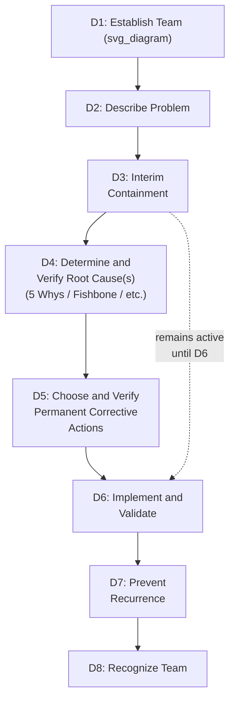

## 8D Problem Solving Process

### Overview

8D (Eight Disciplines) is a structured, team-based problem-solving methodology originally developed at Ford Motor Company, distinguished from the other tools in this chapter by its scope: where Fishbone diagrams, Fault Trees, 5 Whys, Apollo, TapRooT, and Kepner-Tregoe are primarily *cause identification* techniques, 8D is a **complete problem-resolution framework** that wraps root cause analysis inside a broader process spanning immediate containment, team formation, verified corrective action, and prevention of recurrence. Root cause identification (Discipline 4, typically using tools like 5 Whys or Fishbone) is one step within 8D, not the entirety of it — making 8D a natural organizing structure for combining several of this series' other tools into a single end-to-end investigation and resolution process.

### Origin and Purpose

**Key Points**

- Originated at Ford Motor Company in the late 1980s (formalized in Ford's "Team Oriented Problem Solving" manual), and became widely adopted across automotive and broader manufacturing supply chains, often as a required format for supplier corrective action requests
- 8D's defining structural feature is the explicit separation of **immediate containment** (Discipline 3: protecting the customer right now) from **root cause elimination** (Disciplines 4–6) — recognizing that stopping the bleeding and fixing the underlying disease are different problems requiring different urgency and different validation
- Because 8D is a process framework rather than a specific cause-identification technique, it is commonly used as a container that incorporates other tools from this chapter — a Fishbone diagram or 5 Whys chain is frequently the specific technique used within Discipline 4 to identify the root cause
- 8D reports are a standard supplier-quality deliverable format in automotive and other manufacturing supply chains, meaning proficiency with the format itself (not just the underlying RCA technique) is often a practical business requirement

### The Eight Disciplines

| Discipline | Name | Function |
| --- | --- | --- |
| **D1** | Establish the Team | Assemble a cross-functional team with the process/product knowledge, authority, and time to resolve the problem |
| **D2** | Describe the Problem | Define the problem precisely, typically using structured problem-description techniques (comparable in spirit to the IS/IS NOT specification used in Kepner-Tregoe) |
| **D3** | Develop Interim Containment Actions | Implement immediate actions to protect the customer/downstream process from the problem's effects while root cause work is ongoing — explicitly *not* a fix, but a temporary shield |
| **D4** | Determine and Verify Root Causes | Identify the root cause(s) using an appropriate cause-and-effect technique, and — critically — verify the identified cause with evidence rather than accepting it on plausibility alone |
| **D5** | Choose and Verify Permanent Corrective Actions | Select corrective actions targeting the verified root cause(s), and verify (typically through testing or piloting) that the action actually resolves the problem before full implementation |
| **D6** | Implement and Validate Permanent Corrective Actions | Roll out the corrective action, remove interim containment, and validate the fix's effectiveness with ongoing monitoring/data |
| **D7** | Prevent Recurrence | Update systems, procedures, standards, or FMEAs to prevent the same root cause from producing this or similar problems elsewhere in the organization |
| **D8** | Recognize the Team | Formally close out the investigation and acknowledge the team's contribution |

### Discipline-by-Discipline Detail

**D1 — Establish the Team.** Team composition should include members with direct process knowledge (not only management), and sufficient authority to approve containment and corrective actions without excessive delay. A poorly composed team is a common root cause of 8D process failure itself, independent of the technical problem being solved.

**D2 — Describe the Problem.** Precise problem description at this stage directly affects the quality of every subsequent discipline; many organizations use a structured technique (5W2H — What, Where, When, Who, Why, How, How Many — or a Kepner-Tregoe-style IS/IS NOT specification) explicitly within D2 to avoid the vague problem statements that undermine every RCA tool covered in this series.

**D3 — Interim Containment Actions.** These actions must be explicitly verified to actually contain the problem (e.g., 100% inspection, temporary process change) and are understood by the team to be temporary — a critical discipline, since interim containment is sometimes mistaken for or substituted for genuine root cause resolution if D4–D6 are rushed or skipped.

**D4 — Determine and Verify Root Causes.** This is where 8D directly draws on the other tools in this chapter: 5 Whys, Fishbone/Ishikawa with 4M/6M categories, Fault Tree Analysis, Cause Mapping, or Apollo's Action/Condition method may all be used here depending on the suspected causal complexity (per the tool-selection framework covered earlier in this series). The critical addition 8D makes explicit is the **verification requirement** — a candidate root cause must be confirmed with evidence (e.g., reproducing the failure by reintroducing the suspected cause, or removing it and confirming the problem stops) before the team proceeds to D5, rather than accepted on causal plausibility alone.

**D5 — Choose and Verify Permanent Corrective Actions.** Corrective actions should map directly to the verified root cause(s) from D4. Verification here means testing the proposed action's effectiveness (e.g., through a pilot, simulation, or controlled trial) before full-scale implementation — distinguishing a *proposed* fix from a *proven* fix.

**D6 — Implement and Validate.** Full rollout follows successful D5 verification. Validation continues with monitoring data after implementation, and interim containment actions from D3 are formally removed only once this validation confirms the permanent fix is effective.

**D7 — Prevent Recurrence.** This discipline extends the specific investigation's findings to systemic prevention — updating design standards, procedures, training, or an existing FMEA (connecting directly to the FMEA methodology covered earlier in this chapter) so that the same root cause cannot produce a similar problem elsewhere in the organization, not just in the specific instance investigated.

**D8 — Recognize the Team.** Formal closure, including documentation of lessons learned and acknowledgment of team contribution — a discipline sometimes underemphasized but relevant to sustaining organizational engagement with future 8D efforts.

### Worked Example (Structural Walkthrough)

Applying 8D structure to the bearing/motor-trip incident used throughout this series:

- **D1:** Cross-functional team formed — maintenance lead, reliability engineer, line supervisor, procurement (seal supplier relationship)
- **D2:** Problem described precisely — "Conveyor Line 3 motor tripped on overcurrent at 02:14, 3-hour production halt, root traced to bearing seizure"
- **D3:** Interim containment — increased manual vibration checks on this motor class pending permanent fix; spare motor staged
- **D4:** Root cause determined via 5 Whys/Fishbone (as detailed in earlier items in this series) — traced to a procedural gap in seal replacement specification during installation; **verified** by confirming the same gap exists in the procedure documentation and is absent from procedures for motor classes that have not experienced this failure mode
- **D5:** Corrective action — revise installation procedure to specify seal replacement interval; verified via a controlled installation following the revised procedure with post-installation inspection confirming proper seal seating
- **D6:** Revised procedure implemented across all installations of this motor class; interim manual vibration checks phased out once validation data confirms no recurrence
- **D7:** FMEA for this motor class updated to reflect the newly identified failure mode and its now-corrected cause (directly connecting to the FMEA item covered earlier in this chapter); procedure-review trigger added for new equipment introductions generally
- **D8:** Team recognized; 8D report closed and filed as a reference for future similar investigations

### 8D Compared to the Other Tools in This Chapter

| Aspect | 5 Whys / Fishbone / FTA / etc. | FMEA | 8D |
| --- | --- | --- | --- |
| Scope | Cause identification only | Proactive risk assessment | Complete process — containment through prevention |
| Includes verification of root cause | Not inherently — added by practitioner discipline | N/A (proactive, not investigative) | Explicit, mandatory discipline (D4) |
| Includes immediate containment | Not addressed | Not addressed | Explicit, mandatory discipline (D3) |
| Includes corrective action verification | Not addressed | Addressed via RPN recalculation after action | Explicit, mandatory discipline (D5) |
| Includes organizational prevention step | Not addressed directly | Is itself often the D7-equivalent output | Explicit, mandatory discipline (D7) |
| Relationship to other tools in this chapter | Standalone techniques | Standalone, but updated by D7 outputs | Container framework — typically incorporates 5 Whys/Fishbone/FTA within D4 |

### Common Pitfalls

- **Skipping or rushing D3 (interim containment)** — moving directly to root cause investigation without protecting the customer/downstream process in the meantime can allow continued harm while the (often longer) root cause process is underway
- **Treating a plausible root cause from D4 as sufficient without verification** — 8D's explicit verification requirement exists specifically because RCA tools can produce plausible-sounding but unconfirmed causes; skipping verification reintroduces the same risk that the fact/assumption discipline covered earlier in this series is meant to prevent
- **Confusing interim containment (D3) with permanent correction (D5/D6)** — declaring the problem "solved" once containment is in place, without completing root cause verification and permanent corrective action, leaves the underlying cause unaddressed and the containment as a permanent (and often costly or fragile) workaround
- **Skipping D7 (prevent recurrence)** — resolving the specific instance without extending the finding to other locations, product lines, or FMEA updates where the same root cause could recur allows the same failure mode to reappear elsewhere in the organization
- **Assembling a team in D1 without sufficient authority or process knowledge** — an 8D team lacking the authority to approve containment/corrective actions, or lacking direct process knowledge, tends to produce delayed or superficial outcomes regardless of which cause-identification tool is used within D4

**Related Topics**

- 5 Whys methodology and drill-down technique
- Fishbone or Ishikawa diagram construction
- Failure mode and effects analysis
- Kepner Tregoe problem analysis
- Distinguishing fact from assumption (evidentiary tagging discipline)
- Corrective and preventive action (CAPA) systems