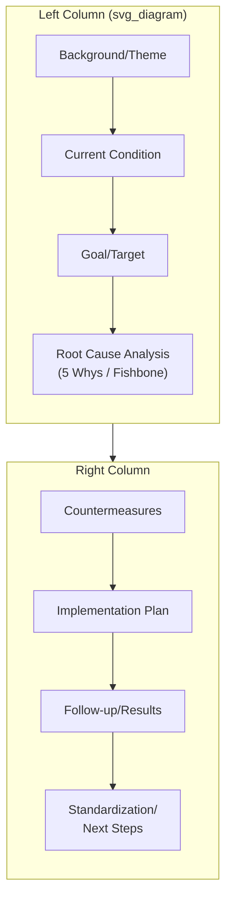

## A3 Problem Solving Reports

### Overview

A3 is a structured, one-page problem-solving report format originating in Toyota's lean management system, named for the A3-size paper (roughly 11" × 17") it was traditionally constrained to. Where 8D is a multi-discipline *process* spanning containment through team recognition, A3 is best understood as a **compact reporting and thinking discipline** — a single-page format that forces the same essential problem-solving logic (current state, root cause, countermeasure, results) into a constrained space, making the entire reasoning chain visible and reviewable at a glance. Its value in this chapter is largely as a *communication and thinking discipline* that can house the output of any of the cause-identification tools covered earlier (5 Whys, Fishbone, etc.), rather than as a distinct root-cause-finding technique in itself.

### Origin and Purpose

**Key Points**

- The A3 format originates in Toyota's lean production system, associated closely with the PDCA (Plan-Do-Check-Act) cycle and popularized more broadly through John Shook's writing on Toyota's management practices
- Its defining constraint — fitting the entire problem-solving narrative on a single page — is deliberate, not merely a space-saving convenience: the constraint forces the author to distill reasoning down to its essential logic, which Toyota's practice treats as a discipline in *thinking clearly*, not just *reporting concisely*
- A3 is typically used as a **communication and mentorship tool** as much as an analytical one — in Toyota's practice, the A3 process itself (the back-and-forth between a problem-solver and a mentor/coach reviewing drafts) is considered as valuable as the final document, emphasizing iterative refinement of the underlying thinking over simply filling in a template
- Unlike 8D or TapRooT, A3 does not prescribe a specific root-cause-identification technique — the "root cause analysis" section of an A3 commonly uses 5 Whys or a simplified Fishbone diagram, but the format itself is agnostic to which specific tool from this chapter is used to generate that content

### Standard A3 Structure

While specific templates vary by organization, a typical Problem-Solving A3 follows this general section structure, usually arranged in a left-to-right, top-to-bottom flow mirroring the PDCA cycle:

| Section | Content | PDCA Phase |
| --- | --- | --- |
| **Background/Theme** | Why this problem matters; business context | Plan |
| **Current Condition** | Facts about the current state, often with a simple diagram or data visualization | Plan |
| **Goal/Target** | The specific, measurable target condition | Plan |
| **Root Cause Analysis** | The causal investigation — typically 5 Whys or a compact Fishbone-style diagram | Plan |
| **Countermeasures** | Proposed actions addressing the identified root cause(s) | Plan/Do |
| **Implementation Plan** | Who, what, when — the specific plan to execute countermeasures | Do |
| **Follow-up/Results** | Actual results after implementation, compared against the target | Check |
| **Standardization/Next Steps** | How the fix is made permanent, and what remains to be addressed | Act |

### Step-by-Step Construction Process

**Step 1 — State the background and business significance.** Establish why the problem matters in terms connected to organizational goals, not just as an isolated technical issue — this framing section is distinctive to A3 relative to the more technically-focused tools elsewhere in this chapter.

**Step 2 — Document the current condition using verified facts.** As with every tool in this series, this section should reflect evidence-based observations rather than assumptions — often supported by a simple diagram, chart, or the current-state portion of a value stream map.

**Step 3 — Define a specific, measurable goal/target condition.** The target should be concrete enough that the Follow-up/Results section can later make an unambiguous comparison against it.

**Step 4 — Conduct root cause analysis using an appropriate tool from this chapter, condensed to fit the space.** A full linear 5 Whys chain or a simplified Fishbone diagram is typically used here; more complex tools (Fault Tree Analysis, full TapRooT Root Cause Tree navigation) are generally too detailed to fit A3's space constraint directly and are more often referenced or summarized rather than fully reproduced on the page.

**Step 5 — Propose countermeasures directly targeting the identified root cause(s).** As with 8D's D5, countermeasures should map specifically to root causes rather than to symptoms, and ideally distinguish immediate/interim measures from permanent ones.

**Step 6 — Detail an implementation plan with clear ownership and timing.** This section operationalizes the countermeasures, typically in a simple table or Gantt-style format compact enough to remain on the single page.

**Step 7 — Return to the document after implementation to record actual follow-up results against the original target.** This step closes the PDCA loop (Check) and is often the section most frequently neglected in practice — an A3 left incomplete at the countermeasures stage has only completed "Plan," not the full cycle.

**Step 8 — Document standardization and remaining next steps.** Capture how the fix is embedded into standard work, procedures, or training (connecting conceptually to 8D's D7, Prevent Recurrence) and what, if anything, remains open.

### A3's Relationship to Other Tools in This Chapter

**Key Points**

- A3 is a **reporting container**, not a competing root-cause-identification technique — it most commonly houses a 5 Whys chain or simplified Fishbone diagram within its Root Cause Analysis section, drawing on the same evidentiary and construction discipline covered earlier in this series
- Compared to 8D, A3 covers a broadly similar end-to-end arc (background through follow-up/standardization) but is deliberately more compact and less procedurally prescriptive — 8D mandates eight specific disciplines with explicit containment and verification steps; A3 relies on the space constraint and mentorship process to enforce rigor rather than a fixed checklist
- A3's PDCA framing distinguishes it from the other tools in this chapter, most of which focus solely on the "Plan" phase (finding the cause); A3 explicitly carries the investigation through Do, Check, and Act phases within the same single-page artifact

### Worked Example (Condensed)

Applying the A3 format to the recurring bearing/motor-trip and related incidents used throughout this series:

- **Background:** Unplanned downtime on Line 3 is tracking above the plant's reliability target for the quarter, with three related incidents in the period
- **Current Condition:** Conveyor motor tripped 02:14, 3-hour halt; two related near-miss/delayed-detection incidents also occurred this quarter (connecting to the Current Reality Tree worked example used earlier in this series)
- **Goal:** Reduce Line 3 unplanned downtime hours by target percentage within the quarter
- **Root Cause Analysis (condensed 5 Whys):** Bearing seizure → contamination → seal not replaced per spec → procedure gap (five-step chain as developed in earlier items)
- **Countermeasures:** Revise installation procedure to specify seal replacement interval; add vibration-monitoring alarm for this motor class
- **Implementation Plan:** Reliability engineer to revise procedure by [date]; instrumentation team to install monitoring by [date]
- **Follow-up/Results:** [Completed after implementation — actual downtime hours compared against target]
- **Standardization:** Procedure-review trigger added for new equipment introductions plant-wide; FMEA updated (connecting to the FMEA item earlier in this chapter)

### Common Pitfalls

- **Treating A3 as a template-filling exercise rather than a thinking discipline** — Toyota's original practice emphasizes the iterative coaching conversation around drafting the A3 as much as the document itself; reducing it to a form completed once without review undermines the format's core intent
- **Skipping the Follow-up/Results section** — many A3 efforts stop once countermeasures are implemented, without returning to document actual results against the target; this leaves the PDCA cycle incomplete (Plan and Do without Check and Act) and forfeits the verification discipline present in more prescriptive frameworks like 8D
- **Cramming a full Fault Tree or TapRooT Root Cause Tree navigation into the space-constrained Root Cause Analysis section** — attempting to fit a highly detailed technique into the single-page format tends to either overflow the format's intent or oversimplify the underlying analysis to the point of losing rigor; a summary with reference to a fuller supporting analysis is often more appropriate
- **Populating the Current Condition section with impressions rather than verified facts** — as with every tool in this series, an A3 built on unverified assumptions in its early sections propagates that weakness through the root cause analysis and countermeasures that follow
- **Using A3 for problems that genuinely require the fuller structure of 8D** — the format's compactness can be a poor fit for complex, multi-causal, or safety-critical investigations that benefit from 8D's explicit containment and verification disciplines; A3 is generally better suited to more contained, single-threaded improvement problems

**Related Topics**

- 5 Whys methodology and drill-down technique
- Fishbone or Ishikawa diagram construction
- 8D problem solving process
- Distinguishing fact from assumption (evidentiary tagging discipline)
- PDCA and continuous improvement cycles
- Corrective and preventive action (CAPA) systems