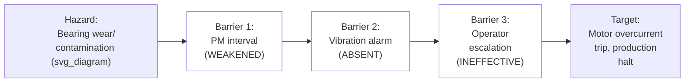

## Barrier Analysis and Change Analysis

### Overview

Barrier Analysis and Change Analysis are two complementary, comparatively lightweight RCA techniques frequently used together, each addressing a specific question the other tools in this chapter do not directly target. **Barrier Analysis** asks "what protections were supposed to prevent this, and why did they fail or not exist?" **Change Analysis** asks "what was different about this situation compared to when things worked normally, and did that difference cause the problem?" Both are widely used in safety-critical and process-industry investigations (nuclear, process safety, aviation, healthcare) as either standalone techniques for straightforward incidents or as structured inputs feeding into a broader framework like TapRooT or 8D.

### Barrier Analysis

**Key Points**

- Barrier Analysis is grounded in the safety-engineering principle that hazards are normally contained by a series of protective **barriers** — physical, procedural, or administrative — and an incident occurs when a hazard successfully passes through or around a sequence of these barriers, often referred to by the "Swiss Cheese Model" popularized by James Reason
- The core analytical questions are: "What barriers existed or should have existed between the hazard and the target?", "Which barriers failed, were absent, or were bypassed?", and "Why did each specific barrier fail?"
- Barrier types are commonly categorized as **physical** (a guard, a containment wall, a fence), **procedural/administrative** (a required sign-off, a lockout/tagout procedure, a checklist step), and **human** (an operator's trained response, a supervisor's verification) — each category tends to have distinct failure characteristics worth analyzing separately

**Barrier Analysis Worksheet Structure**

| Barrier | Type | Intended Function | Status at Time of Incident | Why It Failed/Was Absent |
| --- | --- | --- | --- | --- |
| Vibration-monitoring alarm | Physical/Instrumented | Detect abnormal bearing vibration before failure | Not present | Never configured for this motor class |
| Preventive maintenance interval | Procedural | Replace wearing components before failure | Present but insufficient | Interval did not account for this failure mode; installation procedure lacked seal-replacement specification |
| Operator response to noise | Human | Escalate abnormal noise for investigation | Present but ineffective | No formal escalation threshold defined (connecting to the Current Reality Tree worked example used earlier in this series) |

**Step-by-Step Construction Process**

**Step 1 — Identify the hazard and the target it threatens.** Define what harmful condition existed (a mechanical wear process, a contamination source, an energy release) and what it threatens (equipment, personnel, product quality, production continuity).

**Step 2 — List every barrier that existed, or should have existed, between the hazard and the target.** This includes barriers that were functioning correctly, not only ones suspected of failure — a complete barrier inventory is necessary to understand the full protective system, not just the point of failure.

**Step 3 — For each barrier, determine its status at the time of the incident:** functioning as intended, degraded/weakened, absent, or bypassed.

**Step 4 — For each non-functioning barrier, investigate why it failed, was absent, or was bypassed**, using evidence-based investigation consistent with the fact/assumption discipline established earlier in this series — a barrier's failure reason is itself a root-cause question that may require further drill-down (via 5 Whys or another tool from this chapter).

**Step 5 — Identify barriers that functioned correctly and analyze why**, since understanding what worked is valuable both for confirming the analysis and for identifying barriers worth reinforcing or replicating elsewhere.

**Step 6 — Recommend barrier-strengthening or barrier-addition actions.** Corrective actions from Barrier Analysis often take the specific form of restoring, strengthening, or adding a barrier — a solution category distinct from, but complementary to, the root-cause-elimination actions produced by tools like 5 Whys or Apollo.

### Change Analysis

**Key Points**

- Change Analysis is built on the premise that most problems in a previously stable system are associated with **something that changed**, and systematically comparing the problem situation against a known-good prior state (or an unaffected comparable situation) surfaces that change
- This is conceptually related to, but more narrowly focused than, the IS/IS NOT comparison used in Kepner-Tregoe Problem Analysis — Change Analysis specifically emphasizes the **temporal dimension** (what changed over time), whereas KT's IS/IS NOT framework spans all four dimensions (What, Where, When, Extent) more broadly
- Change categories commonly considered include: equipment/technology changes, procedure/process changes, personnel changes, material/supplier changes, environmental changes, and organizational/management changes — a categorization scheme closely related to the 4M/6M framework covered earlier in this chapter

**Change Analysis Worksheet Structure**

| Dimension | Before (Known-Good State) | At Time of Problem | Change Identified |
| --- | --- | --- | --- |
| Equipment | Original seal specification | Same equipment, but seal replaced during 6-month-prior installation | Seal replacement occurred without specification of correct interval/type |
| Procedure | Installation procedure last revised 2 years before this motor class introduced | Same procedure still in use, unmodified for this equipment class | Procedure never updated for new equipment class (no review trigger existed) |
| Personnel | N/A — no personnel change identified | N/A | No relevant change identified in this dimension |
| Monitoring | No vibration alarm on this motor class (unchanged) | No vibration alarm on this motor class (unchanged) | No relevant change identified — this is a longstanding gap, not a recent change |

**Step-by-Step Construction Process**

**Step 1 — Establish the known-good reference state.** This may be an earlier time period when the system operated without the problem, or a comparable unaffected system/location operating currently — structurally similar to the IS NOT comparison in Kepner-Tregoe.

**Step 2 — Systematically compare the problem state against the reference state across standard change categories** (equipment, procedure, personnel, material, environment, management systems), documenting each dimension even where no change is found — a "no change identified" entry is itself informative, since it rules out that dimension as a contributing factor.

**Step 3 — For each identified change, assess whether it is plausibly connected to the problem.** Not every change coinciding with a problem is causally relevant; this step requires cross-referencing the change against the evidence base (per the cross-referencing discipline covered earlier in this series) rather than assuming correlation implies causation.

**Step 4 — Investigate the most plausible change(s) further**, typically using 5 Whys or another appropriate tool from this chapter to determine why the change occurred and how it produced the observed effect.

**Step 5 — Distinguish changes that are the root cause from changes that are merely coincidental or contributing.** A change analysis can surface multiple differences between the problem state and the reference state; not all of them are causally significant, and this distinction requires the same evidentiary rigor applied throughout this series.

### Barrier Analysis and Change Analysis Used Together

The two techniques address different but complementary questions and are frequently combined: Change Analysis identifies *what was different* about the situation that allowed the hazard to reach the target, while Barrier Analysis identifies *which specific protective layer* failed to stop it once that hazard was present. In the worked example above, Change Analysis identifies that the installation procedure was never updated for this equipment class, while Barrier Analysis identifies that this specific gap manifested as a weakened PM-interval barrier, an absent vibration-alarm barrier, and an ineffective operator-escalation barrier — together explaining not just *why the underlying condition existed* but *why none of the system's protective layers caught it before the incident occurred*.

### Comparison to Other Tools in This Chapter

| Aspect | 5 Whys | Kepner-Tregoe | Barrier Analysis | Change Analysis |
| --- | --- | --- | --- | --- |
| Core question | Why did this happen? (sequential) | What distinguishes affected from unaffected cases? | What protections failed or were absent? | What was different from the known-good state? |
| Requires a comparable "good" reference | No | Yes (IS NOT column) | No (analyzes barriers directly, not by comparison) | Yes (known-good state) |
| Primary output | A causal chain | A validated candidate cause | A map of protective failures | A list of candidate changes to investigate further |
| Typically used standalone or combined | Standalone or combined | Standalone or combined | Frequently combined with Change Analysis | Frequently combined with Barrier Analysis |

### Common Pitfalls

**Barrier Analysis**

- **Listing only failed barriers and omitting functioning ones** — an incomplete barrier inventory that excludes barriers that worked correctly loses valuable context about which parts of the protective system remain reliable and worth reinforcing elsewhere
- **Treating "barrier was absent" as a complete answer** — identifying that a barrier did not exist is a description, not a root cause; the investigation must continue to ask *why* that barrier was never established (often connecting to a systemic/management-level cause, as in the Apollo and TapRooT methodologies covered earlier in this chapter)

**Change Analysis**

- **Assuming every identified change is causally significant** — coincidental timing between an unrelated change and the problem's onset can mislead an investigation if changes are not cross-referenced against evidence before being treated as causal
- **Choosing a reference state that is not genuinely comparable** — as with the IS NOT comparison in Kepner-Tregoe, an ill-chosen "known-good" reference (too dissimilar in relevant respects) produces a change list cluttered with irrelevant differences rather than the meaningful one
- **Stopping at the first identified change without investigating why it occurred** — the change itself is often only an intermediate finding; a full root cause requires understanding why the change was made or allowed to occur in the first place

**Related Topics**

- Kepner Tregoe problem analysis
- Distinguishing fact from assumption (evidentiary tagging discipline)
- Cross referencing multiple evidence sources
- The 6M and 4M categorization frameworks
- TapRooT investigation system
- Fault tree analysis fundamentals