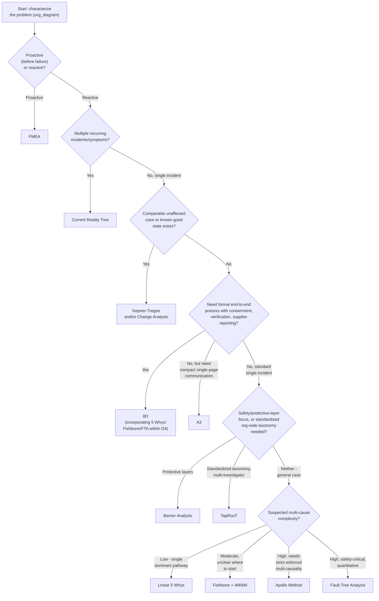

## Selecting a Methodology Based on Problem Complexity

### Overview

This chapter has covered nine complementary methodologies — FMEA, Kepner-Tregoe, the Apollo method, TapRooT, 8D, A3, Barrier Analysis, and Change Analysis — alongside the cause-and-effect mapping tools from the previous chapter (5 Whys, Fishbone/Ishikawa, Fault Tree Analysis, Event and Causal Factor Charting, Current Reality Tree, Cause Mapping). Each solves a distinct structural problem, and none is universally superior; selecting the wrong one for a given situation's complexity typically produces either wasted investigative effort (over-engineering a simple problem) or an incomplete, unreliable finding (under-engineering a complex one). This item consolidates the full toolset into a single complexity-based selection framework.

### The Core Complexity Dimensions

Four dimensions determine which methodology (or combination) fits a given problem, extending the three-question framework introduced when selecting among visual mapping tools:

1. **Timing** — is this proactive risk assessment (before failure) or reactive investigation (after an incident)?
2. **Causal structure** — is this single-threaded, or does it plausibly involve multiple combining or independent causes?
3. **Comparability** — does a genuinely comparable "unaffected" case or "known-good" prior state exist to compare against?
4. **Organizational scope** — is this a single, contained incident, or does it require standardized process, cross-investigation trending, or formal supplier/regulatory reporting?

### Full Toolset Complexity Map

| Methodology | Timing | Causal Structure Handled | Requires Comparable Case | Organizational Scope |
| --- | --- | --- | --- | --- |
| Linear 5 Whys | Reactive | Single-threaded only | No | Single incident, informal |
| Fishbone/Ishikawa (4M/6M) | Reactive | Broad divergent survey, not logically formalized | No | Single incident, informal |
| Fault Tree Analysis | Reactive (or proactive, safety-critical) | Multi-cause, formal AND/OR logic | No | Single incident/system, formal, often safety-critical |
| Event and Causal Factor Charting | Reactive | Sequential/chronological, not logic-focused | No | Single incident, formal-leaning |
| Current Reality Tree | Reactive | Systemic, multiple UDEs to shared core problem(s) | No (uses multiple UDEs instead) | Multiple recurring incidents/symptoms |
| Cause Mapping | Reactive | Multi-cause, branching, informal AND/OR | No | Single incident, informal-to-moderate |
| Kepner-Tregoe Problem Analysis | Reactive | Comparative distinction-based | **Yes — required** | Single incident, moderate formality |
| FMEA | **Proactive** | Component/function-level, inductive | No | Design/process-wide risk register |
| Apollo Method | Reactive | Mandatory multi-cause (Action/Condition rule) | No | Single incident, formal, evidence-linked |
| TapRooT | Reactive | Standardized taxonomy-driven | No | Multi-incident, organization-wide trending |
| 8D | Reactive (with proactive D7) | Uses other tools within D4 | Depends on tool used in D4 | Single incident, full lifecycle, supplier/formal reporting |
| A3 | Reactive (with proactive Act phase) | Uses other tools within its RCA section | Depends on tool used | Single incident, compact, communication-focused |
| Barrier Analysis | Reactive | Protective-layer-focused | No | Single incident, safety-oriented |
| Change Analysis | Reactive | Temporal-comparison-focused | **Yes — required** | Single incident, moderate formality |

### Decision Framework

### Worked Walkthrough: Applying the Full Framework

Returning to the recurring examples used throughout this series — the Line 3 motor trip and its related near-misses:

**Question 1 (proactive or reactive)?** The specific 02:14 trip is reactive (already occurred); however, this chapter's FMEA item showed that a *proactive* FMEA on this motor class, performed before the incident, would have anticipated the same failure mode — illustrating that the two are not mutually exclusive across an organization's overall reliability program, even though any single investigation is one or the other.

**Question 2 (multiple recurring symptoms)?** Yes — as shown in the Current Reality Tree worked example, three related symptoms (near-misses, late detection, delayed alarm response) existed this quarter, so a **Current Reality Tree** was the appropriate starting point at the systemic level, identifying a shared core problem (no formal escalation threshold).

**Question 3, applied to the specific follow-up investigation into the core problem's origin:** No comparable unaffected case was central to that specific sub-investigation, and no highly formal cross-organizational reporting requirement was in play, so a **linear 5 Whys** was sufficient for that narrow follow-up question, as shown in the tool-selection item earlier in this chapter.

**If this incident had instead occurred in a supplier relationship requiring formal customer-facing corrective action reporting**, the appropriate structure would shift to **8D**, incorporating the same underlying 5 Whys/Fishbone content within its Discipline 4, but adding the explicit containment (D3) and verification (D4/D5) steps the standalone tools do not enforce.

**If the plant needed to compare this incident's causes against similar incidents at other Line 3-equivalent installations across multiple sites**, a **TapRooT**-style standardized taxonomy would offer trending capability that an ad hoc 5 Whys or Fishbone investigation, conducted independently at each site, would not.

This walkthrough illustrates the central principle of this consolidated framework: **most real investigations are not a single tool choice, but a layered selection across multiple dimensions**, often combining a systemic tool (CRT), a process framework (8D or A3), and a specific cause-identification technique (5 Whys, Fishbone, FTA, Apollo) within it.

### Quick Reference: Matching Complexity Signals to Methodology

| If the situation shows... | Consider... |
| --- | --- |
| A new design or process not yet in operation | FMEA |
| Several seemingly unrelated recurring symptoms | Current Reality Tree |
| A single incident, intermittent or localized, with a clear unaffected comparison available | Kepner-Tregoe or Change Analysis |
| A need for supplier-facing or highly formal, auditable process documentation | 8D |
| A need for compact, reviewable, single-page communication tied to PDCA | A3 |
| A safety-critical system where protective layers are the analytical focus | Barrier Analysis |
| Many investigators across an organization needing consistent, trendable categorization | TapRooT |
| A team with a demonstrated habit of settling for single-cause explanations | Apollo Method (mandatory Action/Condition rule) |
| A straightforward, single-threaded, low-stakes problem | Linear 5 Whys |
| Unclear where to even begin looking for causes | Fishbone/Ishikawa with 4M/6M |
| Suspected multiple independent or combining causes, safety-critical or quantitative needs | Fault Tree Analysis |

### Common Pitfalls in Methodology Selection

- **Defaulting to the most familiar tool regardless of problem fit** — an organization fluent only in 5 Whys will tend to force every problem, including systemic multi-symptom patterns better suited to a Current Reality Tree, into a single-threaded linear format
- **Selecting maximum formality regardless of stakes** — applying full 8D or TapRooT process to a low-stakes, clearly single-cause problem consumes disproportionate investigative resources relative to the problem's actual risk and complexity
- **Treating methodology selection as static for the life of an investigation** — new evidence uncovered mid-investigation (e.g., discovering the incident is one of several related symptoms) may warrant escalating from a single-incident tool to a systemic one like the Current Reality Tree, and the selection should be revisited when the evidence changes
- **Conflating a process framework with a cause-identification technique** — 8D and A3 are containers, not standalone RCA methods; treating "we used 8D" as equivalent to "we identified the root cause" skips the actual analytical work that must occur within Discipline 4 or the A3's Root Cause Analysis section
- **Ignoring the evidentiary discipline regardless of tool chosen** — every methodology in this series, from the simplest linear 5 Whys to the most structured TapRooT taxonomy, depends on the same underlying fact/assumption tagging and cross-referencing rigor established in the evidence-gathering chapter; tool sophistication does not substitute for evidentiary rigor

**Related Topics**

- Choosing the right visual tool for the problem type
- 5 Whys methodology and drill-down technique
- Failure mode and effects analysis
- 8D problem solving process
- Current reality tree from theory of constraints
- Distinguishing fact from assumption (evidentiary tagging discipline)