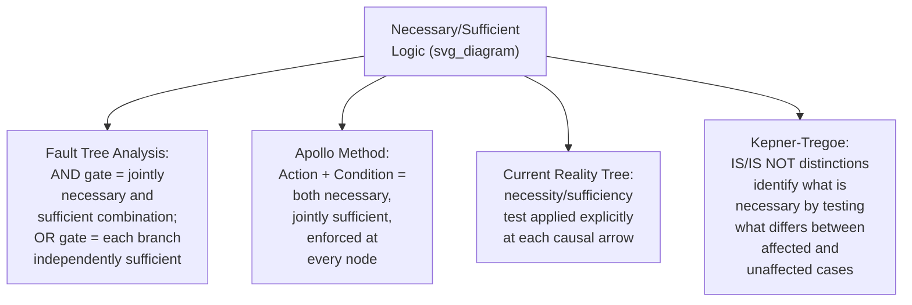

## Necessary Conditions versus Sufficient Conditions

### Overview

The distinction between necessary and sufficient conditions is the formal logical foundation underlying nearly every multi-cause technique covered in this series: the AND/OR gate logic of Fault Tree Analysis, the Action/Condition rule of the Apollo method, the necessity/sufficiency test of the Current Reality Tree, and the IS/IS NOT comparison of Kepner-Tregoe all rest on this single logical distinction, applied through different notations and procedures. Understanding it explicitly, independent of any one tool's specific notation, clarifies why these tools sometimes disagree in structure and equips an investigator to correctly reason about causation even when using the simplest tools, like linear 5 Whys, that do not formalize the logic explicitly.

### Formal Definitions

**Necessary condition:** X is necessary for Y if Y cannot occur without X. Formally, $Y \implies X$ — if Y happened, X must have been present. However, X being present does not guarantee Y occurs; other conditions may also be required.

**Sufficient condition:** X is sufficient for Y if X alone guarantees Y occurs. Formally, $X \implies Y$ — if X is present, Y will happen, regardless of what else is or is not present.

**Necessary and sufficient:** X is both necessary and sufficient for Y if $X \iff Y$ — X occurring guarantees Y, and Y occurring guarantees X was present. This is the strongest and least common causal relationship in real-world incident investigation; most real causes are one or the other, but not both.

### The Four Logical Categories

| Category | Definition | Real-World Frequency in RCA |
| --- | --- | --- |
| Necessary but not sufficient | X must be present for Y, but X alone doesn't guarantee Y — other conditions are also required | Very common — most individual contributing factors fall here |
| Sufficient but not necessary | X alone guarantees Y, but Y can also occur through other, entirely different pathways without X | Common in systems with multiple independent failure pathways (as in FTA's OR-gate branches) |
| Necessary and sufficient | X alone is both required for, and guarantees, Y | Rare — represents a true single point of failure with no alternate pathway and no additional required conditions |
| Neither necessary nor sufficient | X sometimes contributes to Y but is neither required nor alone adequate | Common for background or environmental factors that increase likelihood without being decisive |

### Worked Example, Using This Series' Running Scenario

Returning to the bearing seizure incident used throughout this series:

- **Bearing wear from normal duty cycle** — **necessary but not sufficient**: the motor had run its duty cycle without seizing for years before this incident, meaning wear alone was not sufficient; but some baseline wear was necessary for the seizure to become possible at all
- **Lubricant contamination** — **necessary but not sufficient**, in combination with wear: per the AND-gate structure established in the Fault Tree Analysis item earlier in this series, both wear AND contamination were required together; neither alone was sufficient
- **Winding short** (from the same Fault Tree example) — **sufficient but not necessary**: this OR-gate branch, if it had occurred, would alone have been enough to trip the motor on overcurrent, entirely independent of whether the bearing ever seized — it represents a wholly separate sufficient pathway to the same top event
- **No vibration-monitoring alarm** — **neither necessary nor sufficient** for the seizure itself, but it is necessary for the *specific severity and timing* of the resulting effect (an undetected, escalating failure rather than an early, contained catch) — illustrating that necessity/sufficiency must always be evaluated **relative to a specific, precisely stated effect**, not causation in the abstract

This last point is critical: "no vibration alarm" is not a cause of "bearing seizure" in the necessity/sufficiency sense at all — the seizure would have occurred with or without the alarm. It is, however, a **necessary condition for the specific effect actually observed** (an unmitigated, severe, undetected failure) as opposed to a different, less severe effect (an early-detected, contained anomaly). Precision about *which* effect is being analyzed is essential to applying this framework correctly.

### How This Framework Underlies Other Tools in This Series

**Key Points**

- **Fault Tree Analysis's AND gate** directly encodes "these inputs are jointly necessary and sufficient" — all listed inputs must be present (each is necessary relative to that gate) and together they guarantee the output (jointly sufficient); the **OR gate** encodes "each input alone is sufficient, and none is necessary" — since any one branch alone can produce the output
- **The Apollo method's Action/Condition rule** is a mandatory, universal application of "necessary but not sufficient alone" logic — by requiring both an action and a condition at every node, Gano's framework structurally enforces that no single factor is ever treated as independently sufficient without an explicitly identified accompanying necessary condition
- **The Current Reality Tree's necessity/sufficiency test**, introduced earlier in this chapter, is this exact framework applied explicitly as a validation step: "is this entity, by itself, sufficient? Or merely necessary, requiring an AND-connected co-condition?"
- **Kepner-Tregoe's IS/IS NOT comparison** operationalizes necessity empirically rather than through a priori logical reasoning: a distinction that reliably separates every IS case from every IS NOT case is behaving as a necessary condition for the observed effect within that specific comparison set

### Why Confusing Necessary and Sufficient Causes Misleads Corrective Action

A common and consequential RCA error is proposing a corrective action that addresses a **necessary but not sufficient** cause as though it were sufficient on its own — eliminating a necessary condition does prevent the specific causal pathway analyzed, but if an alternate sufficient pathway exists (as an OR-gate branch would reveal), the undesired effect can still occur through that alternate route. Conversely, treating a **sufficient but not necessary** cause as though addressing it eliminates the entire risk ignores that other independently sufficient pathways remain untouched.

**Illustrative case:** In the Fault Tree Analysis worked example from earlier in this series, addressing only the bearing/contamination AND-gate branch (a necessary-condition pair) — even completely eliminating it — would not prevent the top event, because the winding-short and downstream-jam branches remain independently *sufficient* alternate pathways. A corrective action plan informed only by the single most obvious causal thread, without the necessity/sufficiency mapping that Fault Tree Analysis or Current Reality Tree explicitly provide, risks declaring the problem solved while leaving equally capable alternate causal routes completely unaddressed.

### Practical Diagnostic Questions

When evaluating any candidate cause identified through any tool in this series, two questions operationalize this framework without requiring formal notation:

1. **"If I remove only this cause, and nothing else, does the effect still become impossible — or could it still occur through some other route?"** (Tests sufficiency of the *absence* of the cause — i.e., tests whether the cause was necessary)
2. **"If I imagine only this cause present, with everything else at its normal/baseline state, would the effect definitely occur?"** (Tests sufficiency of the *presence* of the cause)

A "yes" to question 1 (removing it prevents the effect through this pathway) indicates necessity relative to that pathway. A "yes" to question 2 (its presence alone guarantees the effect) indicates sufficiency. Many real causes yield "yes" to question 1 and "no" to question 2 — the most common category in practice, as shown in the worked example above.

### Common Pitfalls

- **Treating every identified cause as sufficient by default** — the most frequent error across tools that do not formally distinguish necessity from sufficiency (a plain linear 5 Whys chain, an unstructured Fishbone brainstorm); a cause that is merely necessary is presented, and corrective action is designed, as though eliminating it alone eliminates the entire risk
- **Failing to search for alternate sufficient pathways** — a corrective action that thoroughly addresses one AND-connected (jointly necessary) branch can still leave the underlying risk fully intact if an independent OR-connected (sufficient) branch was never investigated; this is precisely what minimal cut set analysis in Fault Tree Analysis is designed to surface
- **Evaluating necessity/sufficiency against an imprecisely stated effect** — as the vibration-alarm example above illustrates, a cause can be necessary for one specific effect (severity/timing of detection) while being entirely irrelevant to necessity/sufficiency for a different, related effect (the seizure itself); vague problem statements (addressed earlier in this series under evidence gathering) make this framework impossible to apply correctly
- **Assuming necessary-and-sufficient (single point of failure) causation is the norm** — most real incidents involve multiple necessary-but-insufficient contributing factors combining, or multiple independently sufficient pathways; assuming a single, fully necessary-and-sufficient cause exists can lead investigators to stop searching once one plausible explanation is found, missing the true causal structure
- **Confusing correlation with either necessity or sufficiency** — a factor that is merely correlated with the effect (present in many but not all instances, absent in many but not all comparison cases) may be neither necessary nor sufficient; the IS/IS NOT and change-analysis techniques covered earlier in this series exist specifically to test candidate causes against this confusion rather than accepting correlation as proof

**Related Topics**

- Root cause versus contributing cause versus proximate cause
- Fault tree analysis fundamentals
- Apollo root cause analysis method
- Current reality tree from theory of constraints
- Kepner Tregoe problem analysis
- Distinguishing fact from assumption (evidentiary tagging discipline)