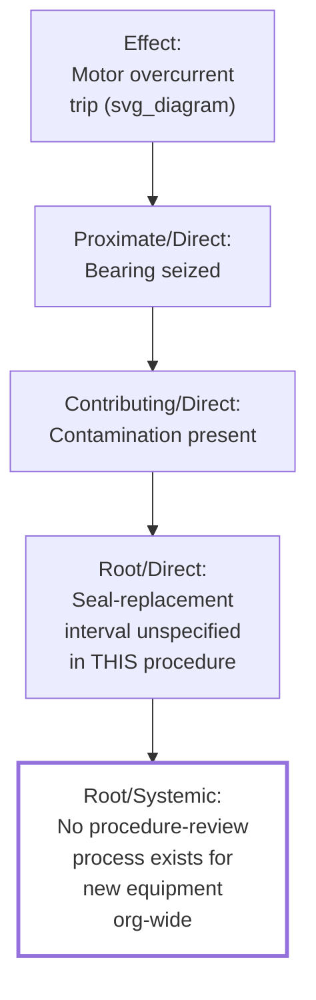

## Direct Causes versus Systemic Causes

### Overview

The direct/systemic cause distinction is a different axis of classification than the proximate/contributing/root cause vocabulary and the necessary/sufficient logical framework covered earlier in this chapter — those two frameworks classify causes by their *position in the causal chain* and their *logical relationship to the effect*, respectively, while the direct/systemic distinction classifies causes by their **organizational origin and scope of impact**: whether a cause is a discrete technical or human failure specific to the incident at hand, or a structural, organizational-level condition capable of producing failures across many different incidents through many different specific mechanisms. This distinction is what separates a corrective action that fixes *this* incident from one that improves the organization's underlying reliability more broadly.

### Core Definitions

**Direct cause:** A specific, discrete technical, procedural, or human factor immediately responsible for producing the effect in this particular incident — typically corresponds closely to what the proximate-cause and immediate-contributing-cause layers identify in a single investigation.

**Systemic cause:** An underlying organizational, structural, or cultural condition — typically involving policy, resource allocation, organizational design, management practice, or embedded norms — that creates the *conditions under which* direct causes of this type are able to occur, often repeatedly and across multiple, superficially different incidents.

### The Core Distinguishing Test

> "If I imagine this incident had happened in a completely different department, on a completely different piece of equipment, with different specific people involved — would this cause still plausibly be present, or is it specific to this exact situation?"

A cause that would plausibly transfer to a different, unrelated incident within the same organization is systemic. A cause specific to the particular equipment, procedure, or individuals involved in this exact incident is direct.

### Worked Example, Using This Series' Running Scenario

| Cause Statement | Classification | Reasoning |
| --- | --- | --- |
| Bearing seized due to contamination | **Direct** | Specific to this motor, this bearing, this contamination event — would not transfer to an unrelated incident in a different department |
| Installation procedure lacked seal-replacement specification | **Direct-to-systemic boundary** | Specific to this procedure, but already broader than the single incident — affects every installation of this motor class |
| No formal process exists for reviewing existing procedures against newly introduced equipment classes | **Systemic** | This is an organizational gap in change management/document control that could plausibly produce failures across entirely different equipment types, departments, and failure mechanisms — not specific to bearings or Line 3 at all |
| No formal escalation threshold defined for sensor anomalies | **Systemic** | As established in the Current Reality Tree worked example earlier in this series, this single systemic cause explained three superficially unrelated symptoms across the plant — the hallmark signature of a systemic, rather than direct, cause |

This table illustrates a useful diagnostic pattern: a cause is more confidently classified as systemic to the extent it can be shown (as in the Current Reality Tree example) to explain multiple, otherwise unrelated incidents — this is precisely why the CRT methodology, introduced earlier in this series specifically for multi-symptom analysis, is disproportionately effective at surfacing systemic causes that single-incident tools tend to miss.

### Relationship to Other Frameworks in This Chapter

**Key Points**

- The proximate/contributing/root distinction and the direct/systemic distinction are **not the same axis** and can be combined: a "root cause" (per the earlier item's elimination test) can be either direct (if fixing it only prevents recurrence of this specific failure mechanism) or systemic (if fixing it prevents a broader class of failures across the organization) — the root-cause test asks "would fixing this prevent recurrence," while the systemic test asks "how broadly would fixing this apply"
- Several tools in this series are structurally biased toward one end of this spectrum: **linear 5 Whys**, when applied without discipline, tends to terminate at direct causes because each Why naturally stays within the scope of the specific incident thread being followed; **TapRooT's Management Systems category** and the **Apollo method's explicit preference for condition-based solutions** both actively push investigations toward the systemic end; the **Current Reality Tree** is purpose-built for systemic-cause identification, since it operates across multiple incidents by design
- Systemic causes are typically **harder to identify, harder to gain organizational buy-in to address, and slower to fix** than direct causes — this creates a persistent organizational pressure to stop an investigation at the direct-cause level, since direct-cause corrective actions (replace the bearing, retrain the operator) are visibly actionable in the short term, while systemic corrective actions (establish a procedure-review process, formalize an escalation policy) require sustained organizational commitment
- A **direct cause investigated without ever considering its systemic origin is a missed opportunity**, and conversely, an investigation that jumps straight to systemic-level generalizations without first establishing the specific direct-cause mechanism risks a systemic conclusion that is not actually grounded in the evidence of what happened in this incident

### A Layered Model Combining Both Frameworks

This layered view shows that the proximate/contributing/root axis and the direct/systemic axis can both apply to the *same causal chain* simultaneously, at different depths — a single investigation frequently transitions from direct causes near the effect to systemic causes at greater depth, though (as the earlier item on root-versus-contributing-versus-proximate causes noted) not every chain necessarily reaches a systemic cause, and not every systemic cause requires the deepest possible chain to surface.

### Why Both Direct and Systemic Corrective Actions Are Typically Needed

**Key Points**

- Addressing only the **direct cause** (replace the bearing, fix this one procedure) resolves the immediate incident but leaves the systemic condition (no procedure-review process) intact — meaning a structurally similar failure, involving different equipment or a different procedure gap, remains fully possible
- Addressing only the **systemic cause** without also resolving the direct cause in the specific incident under investigation leaves the immediate, already-identified problem unaddressed while the broader systemic fix is implemented — a gap that interim containment actions (as in 8D's Discipline 3, covered earlier in this chapter) are specifically designed to bridge
- This is directly analogous to 8D's structural separation of interim containment (D3, addressing the immediate/direct situation) from root cause elimination and prevention of recurrence (D4–D7, which should extend to systemic causes where the evidence supports them) — a complete corrective action plan typically addresses both direct and systemic levels, on different timelines

### Common Pitfalls

- **Stopping at the direct cause because it is easier to fix**ic — organizational pressure toward quick resolution frequently causes investigations to terminate at a direct, immediately actionable cause without asking whether a systemic condition enabled it, especially when time or resource constraints are present
- **Over-generalizing to a systemic cause without sufficient evidence** — declaring a broad, sweeping systemic conclusion ("our whole maintenance culture is broken") based on a single incident's specific direct cause, without the kind of multi-incident evidence base that the Current Reality Tree methodology explicitly requires, produces an unsupported and often demoralizing systemic claim rather than a validated one
- **Treating direct and systemic corrective actions as mutually exclusive** — an organization that debates whether to "fix the bearing" or "fix the procedure-review process," as though only one is the correct target, misses that both are typically necessary, addressing different timescales and different scopes of risk
- **Failing to distinguish which classification a stated cause belongs to when communicating findings** — presenting a systemic cause using language that sounds like a direct, incident-specific finding (or vice versa) can lead stakeholders to misjudge the scope of the corrective action actually required, and can under- or over-state the organizational significance of the investigation's findings
- **Assuming every direct cause traces to a systemic one** — some direct causes genuinely are isolated, one-off occurrences (a truly random material defect, an isolated and non-recurring human error under otherwise sound conditions) without a deeper systemic origin; forcing every investigation to conclude with a systemic finding, when the evidence does not support one, produces unwarranted organizational-level claims

**Related Topics**

- Root cause versus contributing cause versus proximate cause
- Current reality tree from theory of constraints
- TapRooT investigation system
- Apollo root cause analysis method
- 8D problem solving process
- Necessary conditions versus sufficient conditions