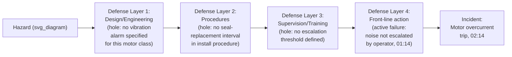

## Active Failures versus Latent Conditions

### Overview

The active failure/latent condition distinction comes from James Reason's safety-science work — most notably the "Swiss Cheese Model" of organizational accidents, first developed in his 1990 book *Human Error* — and it adds a **temporal and visibility** dimension that the frameworks covered earlier in this chapter do not directly address. Where the direct/systemic distinction classifies causes by organizational scope, and necessary/sufficient classifies them by logical structure, active/latent classifies them by **when they entered the system relative to the incident, and how detectable they were before the incident occurred**. This framework directly underlies the Barrier Analysis technique covered earlier in this series, and is essential vocabulary for understanding why incidents often appear to occur "suddenly" despite having been enabled by conditions present for months or years beforehand.

### Core Definitions

**Active failure:** An unsafe act or error committed by a person at the "sharp end" of a system — typically a front-line operator, technician, or other individual directly interacting with the process — whose effects are felt almost immediately. Active failures are usually short-lived and specific to the moment of the incident.

**Latent condition:** A condition, decision, or gap introduced into the system well before the incident — often by designers, managers, or organizational processes far removed in time and role from the "sharp end" — that lies dormant, often undetected, until it combines with an active failure (or with another latent condition) to produce an incident. Reason's own phrasing describes these as **"resident pathogens"** within the system, present long before any harm occurs.

### The Swiss Cheese Model

Reason's model represents each layer of organizational defense (procedures, training, supervision, engineered safeguards) as a slice of cheese with holes — the holes representing latent conditions (systemic weaknesses) and momentary active failures. An incident occurs only when the holes in multiple layers momentarily align, allowing a trajectory of accident opportunity to pass through all defenses simultaneously.

This diagram makes explicit that Barrier Analysis, introduced earlier in this series, is functionally an application of the Swiss Cheese Model — each "barrier" in that technique corresponds to a defense layer here, and a barrier's failure or absence corresponds to a "hole" in that layer.

### Distinguishing Active Failures from Latent Conditions

| Dimension | Active Failure | Latent Condition |
| --- | --- | --- |
| **Who typically introduces it** | Front-line personnel (operator, technician) | Designers, managers, procedure writers, organizational decision-makers |
| **Timing relative to incident** | Immediately before, often within minutes or hours | Often months or years before |
| **Visibility before the incident** | Usually not visible until it occurs | Frequently invisible or dormant — no symptom until combined with an active failure or another latent condition |
| **Typical corresponding classification (from earlier items)** | Proximate or immediate contributing cause; direct cause | Root cause; systemic cause |
| **Ease of attribution after the fact** | High — often the most visible and immediately blamed factor | Low — requires deliberate investigation to trace back through organizational layers |

### Worked Example, Using This Series' Running Scenario

Returning to the conveyor motor incident:

- **Active failure:** The operator's noise observation one hour before the trip was not escalated — an act (or omission) occurring at the sharp end, close in time to the incident, immediately attributable to a specific individual's action in the moment
- **Latent conditions:**
  - No vibration-monitoring alarm was ever configured for this motor class (introduced at the design/engineering stage, potentially years before this specific motor's installation)
  - The installation procedure never specified a seal-replacement interval (introduced when the procedure was originally written, well before this specific installation)
  - No formal escalation threshold existed for sensor anomalies (an organizational/management-level gap, as identified in the Current Reality Tree worked example earlier in this series — itself a latent condition that made the operator's specific active failure far more likely to occur, since no clear threshold existed to guide the decision)

This example illustrates Reason's central insight: the **active failure** (not escalating the noise) is the most immediately visible and often the first thing investigators and organizations focus blame on — but it occurred within a system already riddled with latent conditions (no alarm, no procedure specification, no escalation policy) that had been present for far longer and made an active failure of this type substantially more likely, if not close to inevitable, regardless of which specific individual happened to be on shift.

### Why This Distinction Matters for Corrective Action and Organizational Learning

**Key Points**

- **Focusing corrective action solely on the active failure** (retraining or disciplining the operator who failed to escalate) addresses the most visible element but leaves every latent condition untouched — meaning a different operator, on a different shift, facing the same latent conditions, remains similarly likely to produce a comparable active failure in the future
- **Latent conditions are frequently the more consequential target for corrective action**, precisely because they persist across many potential active failures and many potential individuals — this mirrors the direct/systemic distinction covered earlier in this chapter, since latent conditions are disproportionately (though not exclusively) systemic in nature, while active failures are disproportionately direct
- Reason's original work specifically emphasized this framework as a corrective to **"blame culture"** investigative practices that stop at identifying and punishing the active failure without ever surfacing the latent conditions that made the failure likely — a concern directly relevant to the interview and evidence-gathering techniques covered earlier in this series, since a blame-driven interview environment (a pitfall noted in the data-collection item) makes latent-condition discovery substantially harder, as front-line personnel become less willing to discuss the systemic pressures and gaps they operate under
- Latent conditions are, by definition, harder to detect proactively — this is precisely the gap that **FMEA**, covered earlier in this chapter, is designed to address: a well-executed FMEA is an attempt to proactively surface latent conditions (design gaps, missing controls) before they combine with a future active failure to produce an incident

### Relationship to Other Frameworks Covered in This Series

| Concept from Elsewhere in This Series | Relationship to Active/Latent Framework |
| --- | --- |
| Barrier Analysis | A barrier's "hole" (per the Swiss Cheese Model) is typically a latent condition; the point where a hazard passes through despite/because of an active failure combines both concepts directly |
| Direct causes vs. systemic causes | Active failures are typically direct; latent conditions are typically (though not always) systemic |
| Root cause vs. proximate cause | An active failure is frequently the proximate cause; latent conditions are frequently where the true root cause resides |
| FMEA | A proactive attempt to identify latent conditions (design/process weaknesses) before they combine with a future active failure |
| TapRooT's Management Systems category | Frequently captures the organizational-level latent conditions that TapRooT's guided questioning is specifically designed to surface, rather than stopping at the active-failure level |

### Common Pitfalls

- **Stopping investigation at the active failure** — the single most common and consequential application error, directly paralleling the "stopping at the proximate cause" pitfall from earlier in this chapter; an investigation that identifies "operator error" and concludes there produces a corrective action (retraining, discipline) that addresses only the most visible and least durable element of the causal picture
- **Treating active failures as random or purely individual, rather than as symptoms of latent conditions** — an active failure is rarely produced in a vacuum; the same latent conditions that enabled this specific active failure typically make similar active failures more likely across other individuals and situations, a pattern the Current Reality Tree technique is well suited to surface across multiple incidents
- **Using "latent condition" language to diffuse individual accountability inappropriately** — while this framework rightly shifts investigative and corrective emphasis toward systemic/latent factors, it does not eliminate the relevance of active failures entirely; a complete investigation documents both, and the framework's purpose is avoiding premature stopping at the active-failure level, not avoiding any acknowledgment of it
- **Assuming latent conditions are always older or more distant than active failures** — while typically true, a latent condition can be introduced relatively recently (e.g., a recent, poorly-designed process change) and still function as a "resident pathogen" awaiting a future active failure to combine with; the defining characteristic is dormancy and detectability, not strictly age
- **Conducting interviews in a manner that suppresses latent-condition discovery** — as noted in the evidence-gathering chapter of this series, a blame-driven interview environment discourages front-line personnel from discussing the systemic pressures, workarounds, and gaps they navigate daily, which are often the clearest first-hand evidence of latent conditions present in the system

**Related Topics**

- Direct causes versus systemic causes
- Root cause versus contributing cause versus proximate cause
- Barrier analysis and change analysis
- Failure mode and effects analysis
- Common data collection pitfalls
- TapRooT investigation system